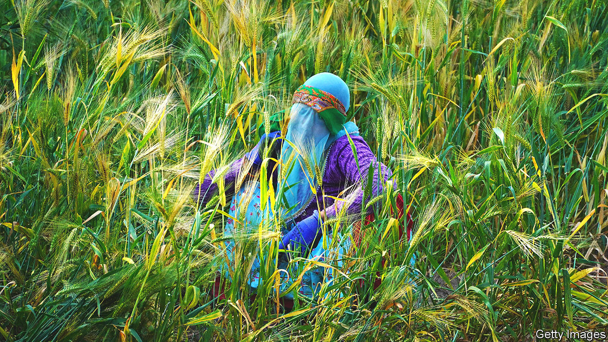

###### Making hay

# India’s journey from agricultural basket case to breadbasket 

##### Technology and market forces are overcoming the heavy hand of the state 

 

> Jun 22nd 2023 

Indian agriculture has a poor reputation, which is not unfair. About half the country’s workforce toils on the land. Their labour unfolds in the brutal heat and tends to be done by hand or in unsheltered, rudimentary vehicles. Seasonal financing often comes through informal channels, with lending at annual rates approaching 30%. Paralysing debts are not uncommon. Production efficiency is low; yields for corn, rice, wheat and other crops are a fraction of those in America, China and Europe. In Punjab, the country’s agricultural heartland, roadside signs forgo typical advertisements for cars, films and phones, and instead hawk foreign-language training, overseas education and expedited visas. What local farmers want is not a new gadget but a way out. 

Yet in some senses, rather than stagnating, Indian agriculture is flourishing. Working conditions may be grim, but record harvest follows record harvest—and famine is a thing of the past. Farming exports in the fiscal year ending in March were up by 9% on the previous 12 months, hitting $26bn and representing 7% of India’s outbound trade. During the global food scare that followed Russia’s invasion of Ukraine last year, India became a pivotal exporter of rice and wheat (it is the world’s second biggest producer of both), as well as other grains. In one of many such examples, it recently agreed to send 20m tonnes of wheat to the Taliban in Afghanistan, adding to 40m tonnes last year. 

India would be more important still to global agriculture were it not for the periodic export restraints and tax surcharges that the government imposes. Such restrictions are not the only official obstacles. Subsidies for fertilisers and pesticides have depleted soil fertility. Some countries occasionally ban imports from India out of concern about chemical residue. Minimum price supports have led to an emphasis on thirsty crops, such as rice, in regions where water is scarce, depleting aquifers. Restrictions on sales mean farms are often divided among children into smaller, less efficient plots. The average holding has shrunk from 5 acres in the late 1970s to 2.5 today. To maximise output on such tiny plots, wheat farmers throughout northern India burn the post-harvest stubble in order to shrink the time between reaping and sowing, producing a thick, toxic cloud over much of the land.

 


However, Indian agriculture has begun a subtle evolution—in terms of policies, technology and finance—that is helping bypass the many official constraints. This is apparent in the economic data. A little more than a decade ago, agriculture and manufacturing produced similar amounts of gross value added, a measure that subtracts purchase costs from revenues to capture contributions to economic activity. The most recent numbers show that agriculture contributes a quarter more.

hdfc Bank, India’s most important private financial institution, has increased agricultural lending from $1.2bn in 2015 to $7.5bn last year, charging somewhere in the region of a third to half the rates that are typically found in the informal market. And where hdfc goes, other private-sector banks follow. This lending boom is helping sharply reduce costs for farmers, and means they are less likely to fall foul of occasionally violent loan sharks.

Supply chains are also increasingly innovative. In 2020, during a covid-19 lockdown, Anushka Neyol moved from Delhi, where she worked on startups including a baby spa, to her family farm, which sits near the Pakistani border. She began to experiment with types of wheat, as well as distribution through the internet, selling directly to bakeries and restaurants in big cities, bypassing a sclerotic government auction apparatus known as the mandi system. Clients include Subko, a coffee chain in Mumbai that boasts of uniquely sourced coffee, chocolate and wheat.

Another approach can be seen in Nashik, a city 170km or so inland from Mumbai. In 2004 Vilas Shinde, a local resident, began exporting grapes from a small farm. Six years later he founded a co-operative, Sahyadri Farms. Co-operatives have a long and decidedly mixed record in India. They have been tried in a number of different forms, but usually dissolve in disagreement within a few years. Sahyadri’s success suggests at least that another outcome is possible. The co-operative now comprises around 21,000 farms, which mostly produce fruits and vegetables excluded from the official pricing and distribution system. It has the scale to justify the inspections and shipping required for international markets. Customers include Hindustan Unilever for tomatoes, Walmart for frozen fruits and a network of European grocers for grapes, reflecting a national trend towards such crops, which are more amenable to India’s hot weather and cheap labour. Surrounding Sahyadri is an embryonic Indian wine industry, which includes a winery named Sula Vineyards.

Meanwhile, technology and market forces are seeping into the broader production processes. McKinsey, a consultancy, reckons that there are at least 1,000 Indian “agtech” companies, which have raised some $1.6bn. Through cheap smartphone apps, satellite data can now provide guidance on soil treatment, sowing and harvest dates, as well as when and how to employ fertilisers and pesticides. These changes attract plenty of attention and excite investors, blurring practical limitations. Visit a farmer whose inexpensive mobile phone has a cracked screen, limited memory and spotty connections, and it is evident that transformation will have to unfold gently. By the time it comes, some of the likely adopters will have read the writing on the billboards next to Punjabi roads and gone elsewhere. But change—halting, hidden, partial—is taking root. ■


