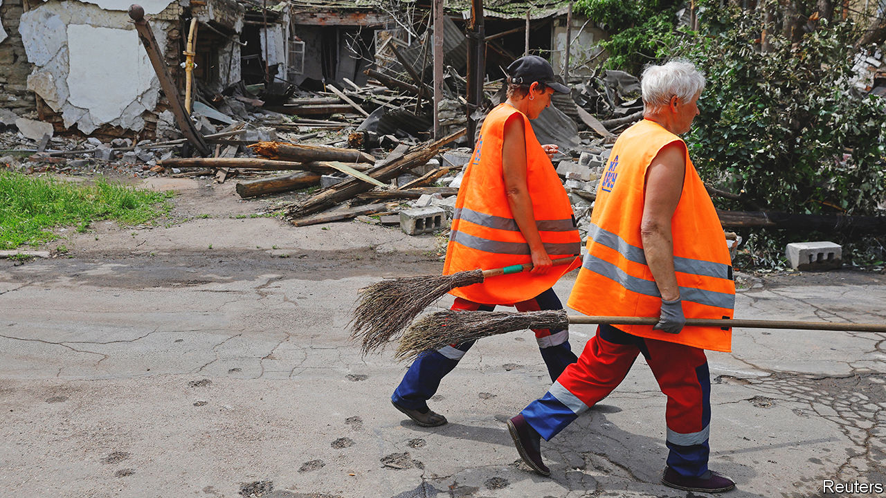

###### War economics

# Rebuilding Ukraine will require money, but also tough reforms 

##### Policymakers, financiers and business types meet in London to discuss plans 

 

> Jun 22nd 2023 

Ukraine suffered a brutal winter. Russia lobbed missiles at civilian and energy infrastructure, attempting to terrorise the population and cut off the green shoots of economic growth. It had some success. A sentiment indicator surveying Ukrainian firms hit a low in January. But as the country’s soldiers began their counter-offensive, so the economy pushed back. In April and May the sentiment indicator signalled economic expansion. Vacancies continue to rise, as businesses seek workers. Forecasts are increasingly rosy, too. Dragon Capital, an investment firm in Kyiv, expects gdp growth of 4.5% this year. 

There is nevertheless a long way to go: Ukraine’s economy shrank by more than a third at the start of the war. Agriculture has been hit hard by the bursting of the Kakhovka dam; many iron and steel facilities are destroyed or in Russian-occupied territory; foreign investors are understandably cautious; many workers are fighting or have fled the country. Thus policymakers, financiers and business types gathered in London on June 21st and 22nd for an annual conference. Their task was to work out how to support Ukraine’s recovery.

The first order of business was the immediate reconstruction of the country, so that it can meet the basic needs of its people, especially next winter. Ukraine has asked for $14bn to cover this year, of which a chunk will go on grants to households to rebuild their homes and to firms to repair their businesses. So far, only a portion of these funds have been raised. 


Ukraine also needs cash for its long-term recovery. In March the eu, un, World Bank and Ukrainian government together put the cost at $411bn over the next decade, a figure reached before the destruction of the Kakhovka dam. The International Finance Corporation, an arm of the World Bank, thinks two-thirds of the money will need to come from public sources because of the difficulty of enticing private money. This would amount to an annual cost of 0.1% of the West’s gdp over the same period. In London, Ursula von der Leyen, head of the European Commission, proposed that the eu should provide 45% of the funding until 2027 in grants and loans. 

Next comes reform. Seasoned donor-country experts are impressed by what Ukraine has so far achieved under war conditions. The country has completed an imf programme and continued with changes to improve the transparency of property transactions and public procurement, meaning international donors can use the country’s lauded Prozorro online platform, which makes information public and digitally accessible. The country has also completed two out of seven judicial and anti-corruption reforms required to open formal accession negotiations with the eu. 

The integration of electricity markets between Ukraine and the eu shows the value of pushing ahead. Long-planned as part of a shift towards the West, the process sped up after Russia’s invasion. It involved technical adjustments and painful market reforms on Ukraine’s side to create a competitive, open wholesale market. “It was quite brave of eu politicians to realise the integration so quickly,” says Maxim Timchenko, boss of dtek, one of Ukraine’s biggest energy firms. The bravery has paid off. Ukraine and the eu are able to trade electricity, and investors can begin to tap Ukraine’s vast potential for green energy.

The question now is whether such private money will actually arrive. Under war conditions, investors usually need some kind of guarantee from a public body to take the leap. One idea under consideration in London was for donors not only to provide war insurance or guarantees, but to help prop up a reinsurance market. 

If such guarantees can be arranged, the final step will be to take advantage of opportunities, which ought to be plentiful given the amount of aid pouring into Ukraine and the country’s economic potential. Some observers even think private investment could surpass the $411bn estimated to be required for Ukraine’s long-term reconstruction. Yet that is only if everything goes to plan. Ukrainian reformers will need to take inspiration from their countrymen’s bravery on the battlefield, as will foreign investors. ■


