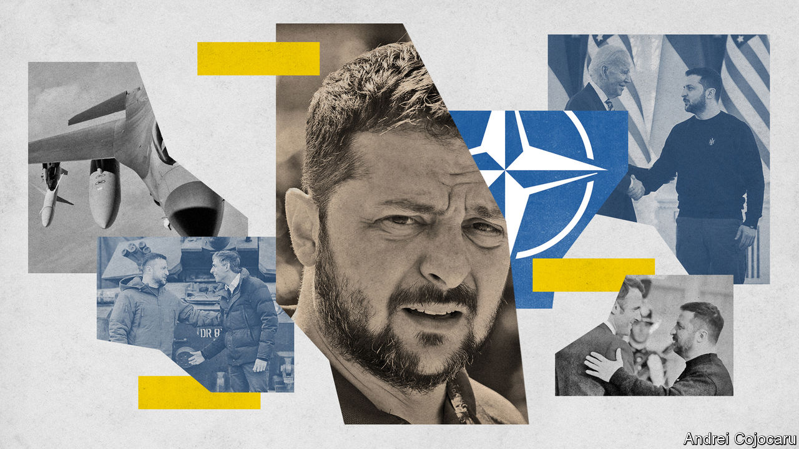
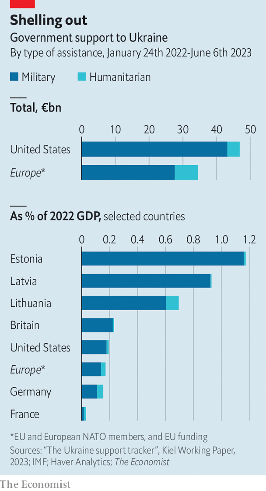

###### The great dilemma

# NATO is agonising over whether to let Ukraine join 

##### America is not keen for the country to enter the alliance—yet 

 

> Jun 21st 2023 


President joe biden was blunt this month about Ukraine’s chances of joining nato. “I’m not going to make it easier,” he declared. Despite its bold fight against Russia, the country still has to prove itself: “Does it meet all the standards every other nation in NATO does?” Joining the alliance, he insisted, “is not automatic”.

America thus finds itself unusually isolated in the transatlantic alliance it founded and that it has long dominated. It is the indispensable supporter of Ukraine’s war, providing the lion’s share of military aid (see chart). Yet it is now the most reluctant of the allies to admit Ukraine to nato.

 


In the run-up to the alliance’s summit in Vilnius next month, its members are determined to preserve unity. They will seek agreement through two parallel quests. One is to reach a linguistic compromise signalling that Ukraine is moving closer to nato membership—without promises of quick accession. The second concerns a lattice of enduring bilateral and multilateral security commitments to bolster pledges to support Ukraine “for as long as it takes”. This secondary offer will fall short of collective defence, as enshrined in nato’s Article 5, which holds that an attack on one ally is an attack on all. Instead the aim will be to enable Ukraine to defend itself, now and in the future. 

The West is struggling to dispel the ghosts of two past failures, in Budapest in 1994 and in Bucharest in 2008. In Budapest, America, Britain and Russia offered Ukraine “security assurances” in a memorandum because Ukraine had agreed to remove Soviet nuclear weapons from its soil. The assurances proved hollow.

In 2008 America was the champion of nato enlargement, pushing for Ukraine to be admitted to the “membership action plan” (map), an antechamber to full accession. France and Germany resisted, worried about antagonising Russia. The alliance awkwardly promised that Ukraine and Georgia “will become members of nato” but did nothing to enact the pledge. Today the roles are reversed. France wants a clear “path towards membership” and America resists making firm commitments. (Germany has been reluctant throughout, hiding behind France in 2008 and America now.)

Why the change of heart? Because in 2008, says Ivo Daalder, a former American ambassador to nato, the idea of war between nato and Russia seemed “preposterous”; today it does not. If Article 5 is to mean anything, he argues, admitting Ukraine would be tantamount to nato promising to fight at its side. That is something Mr Biden has avoided, fearing nuclear escalation and even a third world war. These are not idle concerns, particularly given Russia’s threats and its decision to deploy tactical nukes to Belarus.

The Bucharest debacle irked Vladimir Putin, Russia’s president, but gave no security to nato aspirants, paving the way for Russia to attack Georgia in 2008, and Ukraine in 2014 and 2022. These days, notes Kurt Volker, another ex-ambassador to nato, “grey zones are green lights” for Russian aggression. The French view is that the West must not again fail to act on its security promises. The American view is that it must not again make a promise it does not intend to honour. And given that Mr Biden’s re-election campaign has started, and that China poses the gravest concern to America, he may recoil from making deeper commitments to Europe. Yet he cannot say no to Ukraine on the grounds that it is at war; that would be giving Russia a veto and an incentive to keep fighting. 

One compromise promoted by Jens Stoltenberg, the nato secretary-general, would be to let Ukraine skip MAP as Finland did when it joined in April. Sidestepping map would offer Ukraine a sense of progress without promising membership soon. America is open to the idea, officials say, despite Mr Biden’s stern words.

Others want nato to go further. Mr Stoltenberg’s predecessor, Anders Fogh Rasmussen, thinks the alliance should signal it may be open to inviting Ukraine to join next year, at the Washington summit marking NATO’s 75th anniversary. Mr Volker thinks working to hasten Ukraine’s membership “will shorten this war and prevent the next one” by sending Russia the message that it cannot win.

In the White House, bigwigs think this is all semantic nit-picking. In practice, they say, no ally is pushing for Ukraine to join while it is at war. So better to focus on how to help Ukraine defend itself, not as an alternative to membership but as a step towards it. The need for sustained support may become all the more important if Ukraine’s counter-offensive continues to make only slow progress. Russia seems intent on a long war. Mr Putin may be waiting for 2025, hoping that a return to the White House of Donald Trump—or at least a Trumpist Republican—will disrupt support for Ukraine. 

In many ways, the West will be offering to provide more of the same, more systematically, over the coming years: weapons, intelligence, training, money and so on. The new promises would be made bilaterally and collectively—perhaps by the g7 but more probably the “quad” of America, Britain, France and Germany—rather than by nato. Some European officials say different aspects of the package—strengthening the defence of Ukraine’s skies or seas, for instance—might be led by different countries according to their capacity and appetite for risk, eg, sending personnel to train troops in Ukraine. These promises may be signed before the Vilnius summit.

Word choice matters intensely. Ukraine understandably rejects more assurances. Rather it wants “guarantees” of help over decades to ensure that its army can defend the country, as set out in the “Kyiv Security Compact”, a proposal by Mr Rasmussen and Andriy Yermak, the chief of staff to Ukraine’s president, Volodymyr Zelensky. Their paper also envisages guarantors using “all elements of their national and collective power” to respond to any attack on Ukraine. This leaves open the possibility of the country’s friends intervening more directly than they have hitherto.

That may explain why the Americans dislike “guarantees”. Instead Eric Ciaramella, who has worked at the White House under both Democratic and Republican administrations, proposes more neutral words such as “arrangements” and “commitments” in a recent report for the Carnegie Endowment for International Peace, an American think-tank. His five-point plan seeks to make the Kyiv Security Compact more binding, not least though “strong political and legal codification”, ie, Trump-proofing the system. It also calls for predictable military supplies, mechanisms for talks and data-sharing and links to both Ukraine’s EU accession process and to post-war reconstruction planning. 

There are concerns that a big international commitment might offer a Republican president an opportunity to break with Biden-era policy, as Mr Trump did with the Joint Comprehensive Plan of Action, which was Barack Obama’s deal to limit Iran’s nuclear programme. Much depends on whether Congress would enshrine a multi-year commitment in bipartisan legislation so as to resist not only “America-first” isolationism, but also the vagaries of yearly appropriations in Congress. 

Israel shows that America can sustain support for other countries when successive administrations choose to. Yet as an example for Ukraine it is imperfect. Israel is the strongest military power in the Middle East and the only one with nuclear weapons. Ukraine faces a much bigger and richer foe and one with the world’s largest arsenal of nukes. Telling Ukraine to fend for itself may push it to seek nuclear weapons. And strengthening its army so that it can deter Russia may prove very costly. America gives Israel $3.8bn a year; it shells out tens of billions a year on Ukraine. 

Despite promising to assist Ukraine “for as long as it takes”, the West still has little notion of how or when the war will end. Some hope that diplomacy might follow a Ukrainian battlefield success. More likely is a process of “fighting and talking”. Peace missions are multiplying. Envoys from Brazil, China and African countries have recently shuttled between Kyiv and Moscow. Ukraine says talks can start only when Russian forces leave its entire territory, including Crimea, which Russia annexed in 2014. Russia retorts that Ukraine must first accept “new realities”: its control of nearly a fifth of Ukrainian land.

Welcome are the peacemakers

America once dismissed outsiders and their calls for an immediate ceasefire. On balance, it now thinks their involvement strengthens Ukraine and isolates Russia. That is because of the attachment of many to the UN Charter, which prohibits using force to take another state’s land. An international “summit for peace” may soon be held, possibly in Paris. It would exclude Russia and, European officials hope, include the likes of Brazil, China, India and others from the global south. Antony Blinken, America’s secretary of state, says that during his recent visit to Beijing he and President Xi Jinping “talked a lot” about the war in Ukraine and the “positive role” China could play in ending it. 

So much for the talking. As for the fighting, Ukraine believes the best guarantee of peace is a military victory that forces Russian troops out of Ukraine and, ideally, Mr Putin out of power. Does America back these aims, given the worry it might prompt Mr Putin to use nuclear weapons? Right now such differences are moot, because Ukraine does not seem close to a spectacular victory. But Ukraine may discover what Israel has long known: America can be a constraint as well as an ally, especially when interests diverge.

In the end, the West’s promise to support Ukraine “for as long as it takes” may mean only “for as long as it does not lead to nuclear escalation”; or “for as long as there is no reasonable diplomatic solution”. If and when the fighting stops, America may have to reconsider Ukraine’s accession to nato. Ukraine might achieve more than anyone expects but less than it wants to. In that situation, as with West Germany when it joined in 1955, Article 5 would cover only territory controlled by the government. Ukraine would then, in effect, give up on retaking lost territory by force. Membership may offer a way to bridge the gap between Ukraine’s demands and what it can achieve in battle, or what the West is prepared to bankroll. Some think Ukraine is becoming so powerful that it would be safer to have it within nato than outside. Membership may ultimately offer the best way to cement a truce and guard against a renewed conflict. For all his aggression, Mr Putin has never attacked a nato state. ■

