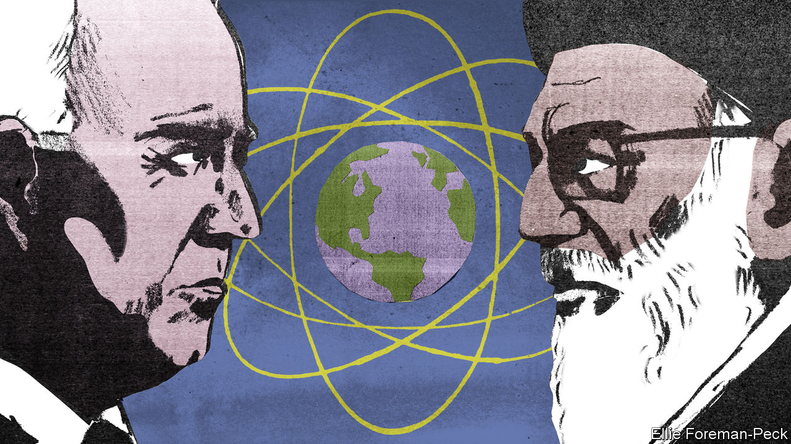

###### Iran’s nuclear programme

# America wants to lower tensions with Iran. Good 

##### Now is the time to buy some time 

 

> Jun 21st 2023 

IRAN CANNOT rival  and Taiwan for headlines, but it could soon prove  as either. Its nuclear-weapons programme has put its regime in a position to dash for a bomb. Because full-blown negotiations are impossible, the threat could yet draw the Middle East into war—including through American strikes on Iranian nuclear facilities. That is why it is good that the Biden administration is seeking to lower tensions.

Since 2018, when President Donald Trump  a pact between Iran and a group of world powers, known as the Joint Comprehensive Plan of Action (jcpoa), Iran has faced fewer constraints on its nuclear programme. The original pact lifted some sanctions; and in return, Iran agreed to abide by a set of commitments until at least 2030, including that it would cap its uranium enrichment at 3.67% and accept intrusive inspections. The goal was to freeze at a year the time needed to enrich a bomb’s worth of uranium.

Mr Trump viewed this as “the worst deal ever”, yet he also decided against a military strike (the plans for one may be in his stash of classified documents). Iran has responded by accelerating its enrichment activity and continuing to act as a menace in other ways. It has supplied fleets of drones to Russia. Since September, after a young woman died in the custody of Iran’s morality police, it has crushed anti-regime protests at home. In February international inspectors found particles of uranium enriched to 83.7%, just short of the 90% typically needed for a bomb, leading Israel to warn that it may attack.

The new arrangement being discussed between America and Iran—no one is calling it a deal—would seek to  . Iran would cap enrichment at 60% and accept more inspections. America would ease sanctions somewhat, for example by letting Iraq and South Korea honour $10bn of payments they owe Iran. Congressional approval would not be needed. 

The arrangement would reward Iran for slightly less dangerous behaviour even as it flirts with becoming a nuclear-weapons state. That sounds like a dreadful outcome, until you consider the alternatives. Mr Trump’s policy of bringing down the regime through sanctions has failed. gdp has shrunk by 44% since 2012 in dollar terms, but the mullahs and Revolutionary Guards are retaining power by spilling blood: 349 people have been executed this year. In the past year oil exports, mostly to China, have risen from under 1m barrels a day, to over 1.5m. A Chinese-brokered deal with Saudi Arabia has left Iran less isolated.

The jcpoa is dead: Iran’s breakout time is measured in days, not years; the deal’s backers in Tehran have lost sway; and the possibility of Mr Trump being re-elected means America cannot make a credible long-term commitment. The military option is no better. American-led strikes would not destroy Iran’s nuclear effort, only set it back months or years. They might also ignite a regional war. America has other priorities: helping Ukraine and deterring China in Asia. The last thing it needs is a conflict in the Middle East. 

Today the conditions for a grand bargain with Iran are not in place. That could change. When Ayatollah Ali Khamenei, Iran’s 84-year-old supreme leader, eventually dies it could trigger a succession struggle. A deal between Saudi Arabia and Israel could shake up Middle Eastern diplomacy. With an eye on its oil supplies, China could press Iran to act more responsibly. Even if a grand bargain proves permanently out of reach, the intensity of the Ukraine war could one day fade, freeing up American military resources. Buying time while retaining the option of using force against Iran is the least bad option.■

