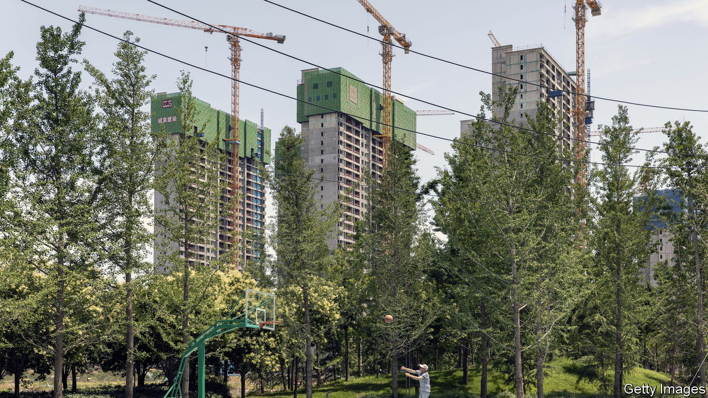

###### Confidence trap

# China’s economic recovery is spluttering. The prognosis is not good 

##### There are lessons from Japan’s long stagnation 

 

> Jun 22nd 2023 

When the Chinese government abruptly abandoned its zero-covid policy at the end of 2022, all bets were on a rapid economic rebound. After nearly three years of restrictions, the world’s second-largest economy would, the thinking went, come roaring back. 

In the event, China has reopened  not a bang. A range of economic indicators, including retail sales and investment, have risen less rapidly than expected. Some analysts now think the economy might not have grown at all during the second quarter. At this rate, the government’s modest gdp target, for growth in 2023 of 5%, will only just be met.

There are several reasons to be gloomy about China’s economic prospects, from America’s export controls on advanced semiconductors and skittish foreign investors, to President Xi Jinping’s crackdown on big tech firms. But the main culprit for the recent weakness is property, which before the pandemic was a crucial source of growth across the economy. Activity slowed, first as the government sought to rein in heavily indebted developers, and then more recently as sales have stayed weak. Between January and May, for instance, real-estate investment fell by 7.2%, compared with the same period a year ago. The danger is that the property bust now becomes an enduring malaise. 

The end of the long property boom has hurt the economy in several ways. It has dragged down construction and all the associated services needed for housebuilding and sales. Because homeowners are less likely to spend money if they are worried about their most valuable asset, the end of the boom has probably also depressed consumption. Many businesses in China use property as collateral for their borrowing, so it is likely to have cooled private investment, too. 

Property bubbles rarely end well. America’s last housing blow-up set off a global financial crisis. But the most instructive comparison for China today is Japan in the 1980s. Although it was much richer then than China is today, its economic growth, like China’s over the past decade and a half, was created by an investment boom, much of which flooded into property. 

When Japan’s asset-price bubble burst at the end of 1989, growth slowed dramatically. Firms and households, burdened by debt, paid off their liabilities rather than spending on goods and services. Together with a shrinking workforce, this meant that Japan’s gdp growth lagged behind the rest of the rich world.

Part of the problem was that policymakers were too slow to respond. It was not until 1999 that the Bank of Japan cut its benchmark rate to zero; the government directed stimulus towards investment, rather than consumption. The bust turned into decades of stagnation. 

Unfortunately, China looks as if it may repeat the same mistake. The government remains fond of directing stimulus to investment, rather than towards . The central bank is cutting rates, but by a paltry tenth of a percentage point at a time. China may also be in a worse position than Japan. Although Chinese leaders’ fanfare about “common prosperity” raised hopes that a more equal distribution of income could raise consumption, the share of household spending in gdp is 38%, well below the global average of 55%. In the past six years it has not increased. 

Calling all hedonists

Even if China wanted to foster more consumption-led growth, it would not easily be able to do so. Many of the government’s economic policies are still designed to promote exports and investment, and to suppress consumption. Sustainably boosting households’ spending, such as by building up sturdier safety-nets, would take years to accomplish. The property-driven gloom could hover over the economy not just for the rest of the year, but far into the future. ■

