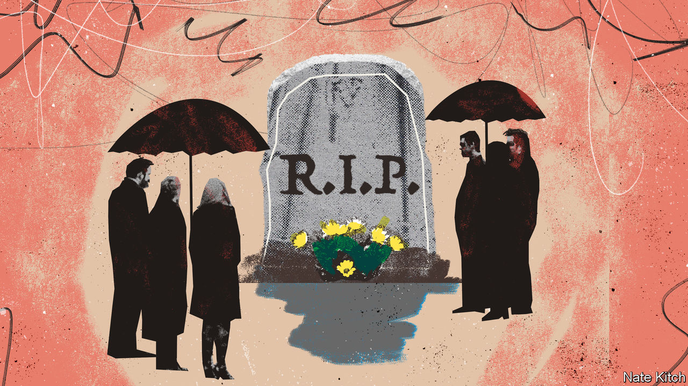
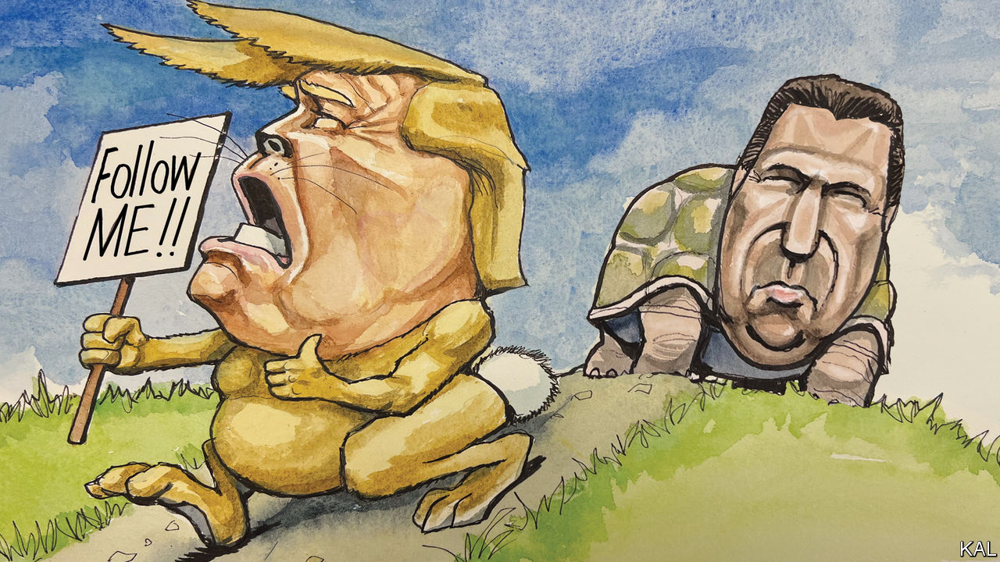
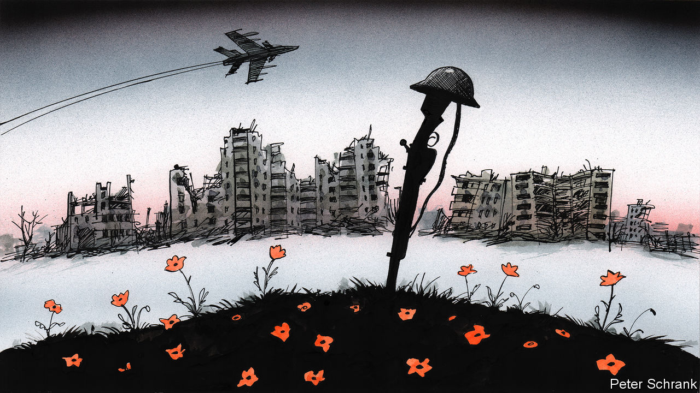
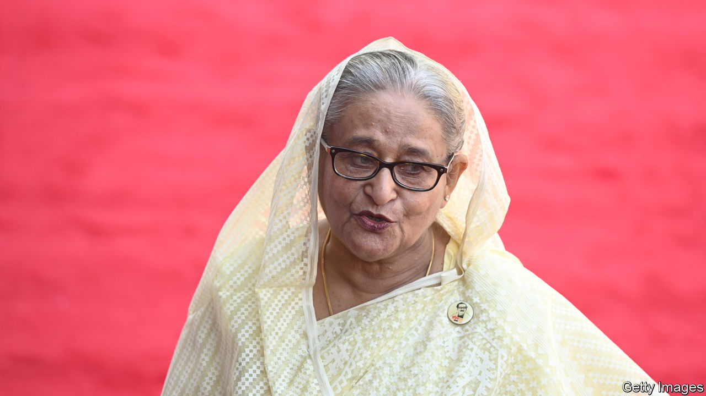
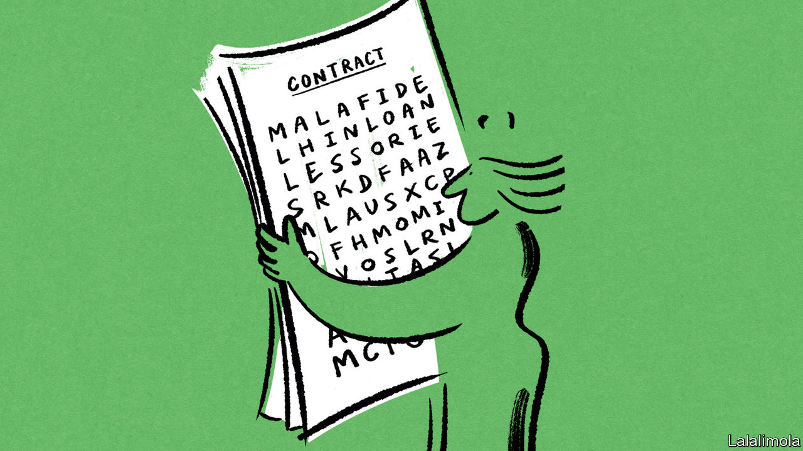

###### On productivity in Latin America, Boris Johnson, New College of Florida, Verdun, banking, Sheikh Hasina, legal speak

# Letters to the editor 

##### A selection of correspondence 

 

> Jun 22nd 2023 


Productivity in Latin America

I am an assiduous reader of , always admiring and praising your global coverage, technical depth and well-argued liberal values. However, by choosing the headline “” (June 10th) to describe productivity in Latin America you fell short of those standards. As a Mexican citizen, I have met and learned from informal workers. They typically work more than eight hours a day in rigorous, often unsafe conditions. Sadly, many of these workers cannot even afford healthy and balanced diets to provide them with the necessary energy that their jobs demand. They receive very low economic remuneration and perhaps even less social recognition. 

Although the article was well researched and nuanced, describing all Latin American workers as “useless” was insensitive and disrespectful, to say the least. 

Pablo Reynoso


The headline was changed to “A land of frustrated workers” online to make clear that we are analysing the social and economic costs of low productivity.

I wholeheartedly agree with your emphasis on the significance of systemic conditions that determine the working environment as the key factor in labour productivity, rather than the workers’ inherent qualities. In Chile productivity lags across industries, including copper mining, where the best local operation uses 44% more labour than international peers. There are also notable productivity problems in the public sector. The reasons for this include gaps in best-practice management, a low-quality education system, an inadequate regulatory framework and insufficient innovation rates. A long and uncertain permit-granting process also hampers investment and can dampen competition.

A new constitution is currently being drafted. It is our hope that a significant update of the country’s political system will serve as a catalyst for a new generation of bold yet sound economic reforms.

Rodrigo Krell

Executive secretary

National Productivity and Evaluation Commission


 


Cometh the hour…

The owl of Minerva, Hegel observed, flies only at dusk. It is only at the end of Boris Johnson’s political career, and let us not doubt that it is over, that we get the true measure of the man (, June 17th). Self-obsessed, economical with the truth (to put it mildly) and a coward.

Mr Johnson could have tried to persuade the House of Commons to reject any recommendation from the Privileges Committee. He made no such effort. He could have campaigned against any recall petition that would force a by-election. He will lead no such campaign. He could have stood in any by-election that ensued. His name will not appear on the ballot paper in Uxbridge and South Ruislip. He has chosen instead to sulk off into a well-paid sunset, where it is to be hoped that “commentators who cannot resist writing about one of their own” (including ) will leave him well alone.

Jonathan Allum


 


A rumpus on campus

Christopher Rufo may well have “quickly moved to eliminate diversity, equity and inclusion initiatives” at New College of Florida when Ron DeSantis appointed him as a trustee (, May 27th). But in fact, New College had almost no administrative DEI infrastructure to dismantle. A signee to the Chicago Principles on free speech, New College had one employee (since terminated) who worked half-time on state-mandated DEI initiatives, and a one hour “mandatory” DEI training video, which 25% of employees completed in the most recent academic year. In the Board of Trustees meeting in which DEI was “eliminated” at New College, it was pointed out to Mr Rufo just how little DEI the school actually had. 

New College is a remarkably independent-minded institution, where students can design their own major, faculty teach what they want without curricular oversight, and all students are encouraged to do independent research culminating in a year-long required thesis project. It would be hard to find a college with less potential for top-down indoctrination of students. Mr Rufo and his fellow trustees are engaged in disruptive political theatre, not a measured response to the facts on the ground at New College, a unique educational institution that in no way exemplifies illiberal leftist excess in the academy. 

Peter Cook

Associate professor of psychology and neuroscience

New College of Florida


 


The history of Verdun

’s column likening the Battle of Bakhmut to that of Verdun was excellent (June 3rd). But the characterisation of Verdun as having been “a small place of little renown” before its martyrdom in the first world war was wrong. The French town already had immense symbolic significance in Franco-German history as the namesake of the Treaty of Verdun (843), which partitioned the Frankish empire and can be said to have marked the separation of France and Germany into separate nations. Verdun was one of the Three Bishoprics, which were part of the Holy Roman Empire throughout the Middle Ages but annexed to France in 1552. And it was the site of a major battle in the Franco-Prussian war of 1870-71. 

Indeed, one reason why the Germans chose Verdun as the site where they would try to draw the French into a battle 

of attrition was because even by 1916 it already carried so much historical baggage.

MICHAEL FROST


 


Narrow banking

Recent articles from  on American banking (such as “”, May 20th) give an impression that the editors have forgotten the midlife appeal of narrow banking. The idea attracted serious discussion even from non-financial journals in the 1990s, but not because it offered a way to hand banking back to the state. The idea was to separate lending (risky) and deposit taking (better off de-risked). Agile local equity-funded lenders would make loans and take first losses on their portfolios. Big national deposit-takers would buy senior interests in the portfolios of the lenders they liked and trusted. Which leaves the interbank market , not the state, allocating credit and imposing discipline.

David Apgar

Former senior policy adviser for banking at the US Treasury


 


Bangladesh responds

I am happy that you acknowledged many of the accomplishments of Sheikh Hasina as prime minister of Bangladesh (“”, May 27th). However, some of your points were misleading or inaccurate.

The comment that “Her tragic past now threatens Bangladesh’s future,” makes one wonder how you linked that tragedy to Bangladesh’s future. The gratuitous insult comes when you rather cruelly suggest she just get over it already. Sheikh Hasina lost 18 family members (as you stated), including her mother, father, and three brothers, in one of the most brutal mass murders in Bangladesh’s history. Do you think Sheikh Hasina is seeking retribution against the Bangladeshi people by improving their socio-economic conditions?

In Sheikh Hasina’s 14 years in office, Bangladesh’s poverty rate has decreased from 42% to 19%, child and maternal mortality rates are in sharp decline, average life expectancy grew to 73 years from 55 years, and the country’s literacy rate has rocketed from 45% to 75%. These accomplishments don’t strike me as the work of someone mired in the events of yesteryear.

Missing from your article is the reason Sheikh Hasina visited America in the first place. Your readers may be interested to know it was to commemorate Bangladesh’s 50-year relationship with the World Bank, widely deemed to be an international success story. As David Malpass, the president of the World Bank, observed, “Many countries can learn from Bangladesh’s development successes. The country stands out for its innovative approaches to reducing poverty in record time, empowering women, achieving widespread electricity access, and adapting to climate change.”

You seemed inclined to put Sheikh Hasina’s tenure in office in a bad light. Lest one forget, she has undergone 21 years of agonising struggle against military and quasi-military dictators, to establish democracy in Bangladesh, hold a free and fair election, and become prime minister in 1996. In 2008, she was elected again, and transformed Bangladesh, paving its way to becoming a developed nation by 2041.

Nazrul Islam

Speech writer to Sheikh Hasina


 


Legalese

The article trying to explain “” (June 3rd) missed a big factor: the language used in court decisions. Complicated language may be the reason why a contractual term ends up being litigated, but once the court has made its decision its meaning, no matter how tortured the language, is set in stone. No lawyer will run the risk of using simpler, untested language, especially if the wording touches areas of law that are complicated.

The interpretation of contractual indemnities illustrates this. After the Piper Alpha disaster in 1988 there were bitter legal fights as to who should carry the can, some of which revolved around the precise meaning of indemnities (promises to pay out or not to sue) in the contracts between Occidental, the operator of the oil platform, and various service providers. The courts decided, the meaning was settled and the exact same wording is still used 35 years on.

David Roper

Solicitor


You let lawyers off too easily. Apart from the deficiencies mentioned, legal writing too often has Unnecessary Defined Terms (“Unnecessary Defined Terms”), repeats even one (1) number as a numeral, obfuscates by not avoiding double negatives, and puts too many words in one sentence.

Jeffrey Sherman


