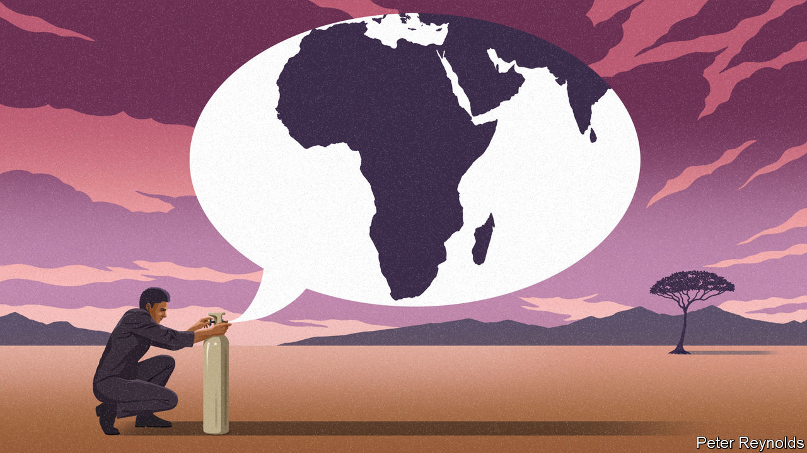
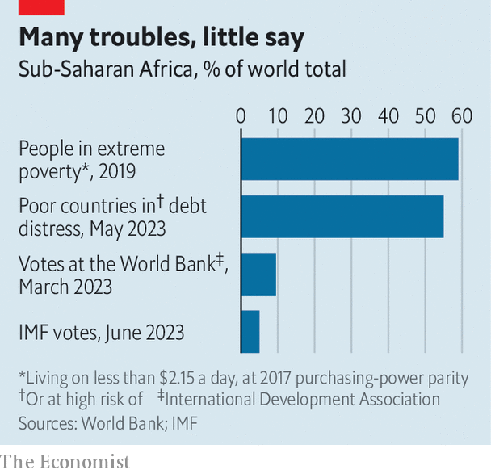

###### Finding Africa’s voice

# African countries are fed up with being marginalised in global institutions 

##### They will be pushing hard for change at a big global pow-wow this week 

 

> Jun 19th 2023 

There was no shortage of bigwigs at a development-finance pow-wow hosted by Emmanuel Macron, France’s president, in Paris on June 22nd to discuss pressing global issues including World Bank reform, climate finance and . The expected attendees at the Summit for a New Global Financial Pact included Li Qiang, the Chinese premier, Janet Yellen, America’s treasury secretary, and no fewer than 16 African presidents. 

Africa’s large presence reflects a fear that the continent is being short-changed as priorities shift towards helping Ukraine and dealing with climate change. That is feeding a deeper anger—that the continent has too little say in global institutions such as the World Bank, the IMF and the UN, and that some of the proposed reforms could again leave Africa out in the cold. “When decision-makers are quite far from the realities of the country it’s more difficult to build empathy,” says Vera Daves, Angola’s finance minister. “That’s why it so important for us [Africans] to be more present within the institutions.” 

 


Much of the work these institutions do is in Africa, where they are trying to reduce poverty (the continent has more than half the world’s poor), rescue listing economies, end civil conflicts and help refugees. But African leaders are alarmed by an impending plunge in cheap financing from the International Development Association (IDA), the concessional arm of the World Bank. When covid-19 struck, the IDA raised additional funds and stepped up its support for poor countries. In the past year it has committed perhaps $37bn around the world, up from almost $22bn in 2019. But this depleted its larder, and its commitments will probably be about $10bn lower in each of the next two years. 

The cuts will happen even as African countries are being squeezed by rising interest rates and by higher food and fuel prices following Russia’s invasion of Ukraine. They want, but probably will not get, the IDA’s funds refilled ahead of its next scheduled replenishment in 2025. 

Axel van Trotsenburg, the World Bank’s senior managing director, points out that overall funding has risen, “particularly in Africa”. Yet the continent is competing for funds with two new priorities: Ukraine and climate change. The Bank is hoping to raise $12bn for a new IDA crisis facility, but half of that would go to Ukraine and Moldova, which are not poor enough to normally qualify for the IDA’s concessional loans and grants. Many Africans see this effort as evidence that international institutions apply a double standard by bending their own rules for non-African countries.

Bilateral aid (directly between countries) to sub-Saharan Africa fell by 8% in real terms to $29bn in 2022, according to the OECD, a club mainly of rich countries. At the same time global bilateral aid rose by 15%, in large part due to $16bn going directly to Ukraine and another $29bn being spent at home in donor countries on hosting (mostly Ukrainian) refugees. “We have seen the international community making resources available at scale and swiftly for Greece and Ukraine,” says Hanan Morsy of the UN Economic Commission for Africa. “Solutions for Africa are not found in the same way, and that has to change.” 

The Paris summit involves a big push, mainly by rich countries and small island states, to do more on climate change. Africans worry that this will be at the expense of the poor. New priorities should not avert the bank’s focus on poverty, says Enoch Godongwana, South Africa’s finance minister. A note seen by , signed by every African member among others, says they want “an institution that remains strongly committed to end poverty”, warning that “too broad” a mission will dilute this focus. They also called for additional funding for climate projects so that these do not reduce spending on development. Yet “it’s really a zero-sum world,” says Clemence Landers of the Centre for Global Development (CGD), a think-tank. 

In response to the uproar, the institutions are debating some technical fixes. The G20 thinks the bank could lend more by tweaking its own rules and borrowing more from markets. Yet doing so could push up the interest rates it charges poor countries, frets Abdoul Salam Bello, the representative on the World Bank’s board for 23 African countries. “They are not reforming for us,” sums up one Ethiopian official bluntly. “It is for the countries that will be giving them money.”

Most African countries borrow from the imf at subsidised interest rates. Yet the fund is running short of concessional cash, says Ernest Addison, the governor of Ghana’s central bank. Indeed, without new money it could be forced to slash concessional lending in a year or so. The IMF retorts that it has provided unprecedented support to poor countries since the pandemic and that it is trying to get donors to stump up more. 

But it is not just the availability of money that is the issue. African countries are also hamstrung by the fund’s rules on how much countries can borrow, says Mamo Mihretu, the governor of Ethiopia’s central bank. Just when international financial institutions are most needed to play a big role, “they’re not there”, he says.

Another technical fix is getting rich countries to make available to poor ones some of their special drawing rights (sdrs), a kind of global reserve currency issued by the IMF. Mr Macron may trumpet this in Paris, says the CGD. Yet in November 2021 the G20 set a global target for rich countries to contribute $100bn in sdrs and they are still well short of meeting this, partly because Congress has not released the $21bn that America pledged. 

Faced with the prospect of declining funding and technical fixes that may not add up to much, African countries are asking a bigger question: why they have a weak voice in the Fund and the Bank, whose boards are dominated by rich countries that pay in the most capital. “If the big guys, the G7, have formulated an opinion, they stick to it irrespective of what people’s concerns are,” complains South Africa’s Mr Godongwana. African leaders hope to get a stronger voice at the G20, a club of the world’s biggest economies, as well as in the international financial institutions. 

Macky Sall, the president of Senegal and until recently the chair of the African Union (au), the regional bloc, argues that Africa’s weak representation in international institutions results in the continent having decisions foisted upon it on matters such as climate change and debt. “The G20 undermines its effectiveness and influence by leaving out such a large proportion of humanity and the global economy,” he wrote in an op-ed in . 

Africans are also trying to push talks about international taxation from the OECD into the UN, where they have a voice. And they have demanded more of a say in global debt discussions, which remain dominated by creditors. 

Africa’s most ambitious geopolitical demand is for reform of the UN Security Council. Roughly half of all Security Council meetings discuss Africa. Yet the 15-member council—comprising five veto-wielding permanent members and ten rotating members—has just three rotating seats for African countries. “The inertia of the Security Council in the fight against terrorism in Africa underlines the failure of the multilateral system,” declared Mr Sall of Senegal. Africa wants two permanent seats and five non-permanent ones on a new 26-member council. 

The indifference displayed by African countries in particular to Russia’s invasion of Ukraine seems to have focused minds on the need to listen to the continent. Some 11 members of the G20 support the AU attending, as the EU already does. In November President Joe Biden called for permanent seats for countries in Africa, Latin America and the Caribbean. “The time has come for this institution to become more inclusive,” he said, “so that it can better respond to the needs of today’s world.” His words apply no less to the IMF, World Bank and G20. It is high time the continent with the world’s fastest-growing population was given its voice. ■

