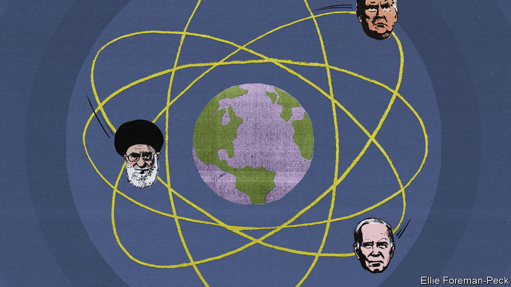

###### An unenriching agreement

# America and Iran try to step back from the brink over nukes 

##### A mini-deal between Iran and America may be the least bad option right now 

 

> Jun 22nd 2023 

FOR the past five years, since Donald Trump withdrew America from the 2015 nuclear pact with Iran, American presidents have sought a new bargain with their old foe. Mr Trump, then president, predicted that tough sanctions would compel Iran to sign a “new and lasting deal”. Joe Biden’s administration promised smart diplomacy to craft a “longer and stronger” agreement.

Those efforts are sputtering towards an unsatisfying conclusion. Instead of making a deal, Iran has enriched more uranium to higher purity than ever before: it is on the threshold of being a nuclear-armed state. Desperate to halt its progress, America wants to negotiate a tacit understanding that would offer Iran a dollop of cash to freeze its nuclear work where it stands.

It is a far cry from the pact in 2015, the Joint Comprehensive Plan of Action (JCPOA), which imposed strict limits on Iran’s uranium enrichment. Yet it is probably the best deal on offer right now, and it would be tolerated (though hardly celebrated) by Arab states keen to avoid a crisis. 

The clearest picture of Iran’s progress is found in a report in May from the International Atomic Energy Agency (IAEA), the UN’s nuclear watchdog. The agency said Iran had accumulated 114kg of uranium enriched to 60% purity, a level that has no civilian use. That is enough to produce at least two nuclear bombs if refined further to the weapons-grade level of 90%.

At Fordow, a fortified facility built into a mountain, inspectors who tested environmental samples found traces of uranium enriched to 83.7% purity. Iran blamed that on a momentary hardware glitch, and the IAEA found no evidence that Iran had amassed a stockpile of such highly enriched uranium. Still, the shock discovery added urgency to diplomatic efforts.

The emerging deal, by all accounts, would be modest. Iran would promise not to enrich beyond the 60% threshold, though it would not have to reduce its uranium stockpile. It now has 4,385kg of the stuff at varying levels of purity. The JCPOA, by comparison, limited it to just 300kg at 3.67% and nothing above that level. There is optimistic talk that Iran would make promises unrelated to its nuclear work. It might release at least three American citizens held for years on bogus charges.

America would offer money in return. It would not lift sanctions on Iran’s oil industry, as it did under the JCPOA, but it would enforce them less fiercely. It could also release Iranian funds frozen abroad, such as $7bn in oil revenue stuck in South Korea. That would be a welcome infusion for a regime struggling with high inflation and unnerved by .

All this has been discussed in indirect talks in recent months, some in Oman, the Gulf state that also hosted the first tentative meetings towards the JCPOA a decade ago. America insists it is premature to talk about an agreement. “Rumours about a nuclear deal, interim or otherwise, are false and misleading,” the State Department said on June 14th.

But diplomats see such denials as linguistic hairsplitting. A law passed in 2015 requires Congress to review any nuclear deal with Iran. Republicans would surely oppose a new agreement, and even many Democrats would buck at supporting one that leaves Iran with a stockpile of highly enriched uranium. The Biden administration is loth to risk an embarrassing legislative defeat ahead of next year’s election.

There will be no “deal”, in other words—nothing like the JCPOA, a 159-page document signed by a gaggle of foreign ministers. Instead there may be a quiet, informal understanding. If Iran frees American prisoners, and if the IAEA reports that it has stopped accumulating highly enriched uranium, those would be signs that the talks have made progress. So would any gestures that ease the pressure on Iran’s economy. Earlier this month America granted Iraq a waiver to pay $2.8bn in gas and electricity debts to Iran, which had previously been blocked by sanctions.

Then there is oil. Kpler, a data firm, estimates that Iran’s exports have increased from well under 1m barrels per day (bpd) a year ago to more than 1.5m bpd now. That is the highest level in five years, though still far below the 2.7m bpd that Iran shipped in mid-2018, just before Mr Trump ditched the JCPOA. Most of that oil is sold at a discount and shipped via third countries on a “” of dodgy tankers to China. Such transactions technically run foul of American sanctions—but only if America bothers to enforce them.

In years past, such a quid pro quo would have infuriated America’s friends in the Middle East. They may be less hostile today. In March Saudi Arabia and Iran  to restore diplomatic ties after a seven-year break. The Saudi foreign minister went to Tehran for talks this month, the first such visit since 2006. After a years-long proxy war with Iran, the Saudis now want calm in the region so they can focus on ambitious plans to build a post-oil economy. Even the tiniest agreement between America and Iran would lower the risk of conflict. 

Binyamin Netanyahu, the Israeli prime minister, has made Iran’s nuclear programme a defining issue of his long rule. He said this month that he opposes any “mini-agreement” between America and Iran. Yet he too may be unusually muted in his criticism. Mr Netanyahu believes Mr Biden is serious about trying to  that would see the kingdom recognise Israel. That would do much to ease the sting of an American-Iranian arrangement.

It is hard for anyone to cheer an agreement that would leave Iran just shy of the nuclear threshold. But it is also hard to see an alternative. Iran’s ultra-conservative rulers are reluctant to negotiate anything with America, let alone a comprehensive pact that Mr Trump could tear up (again) in 18 months. Military strikes on Iran’s nuclear facilities, which both America and Israel have threatened, could drag the region into a war. A mini-deal would simply kick the can down the road—but for now that may be the best choice available. ■


