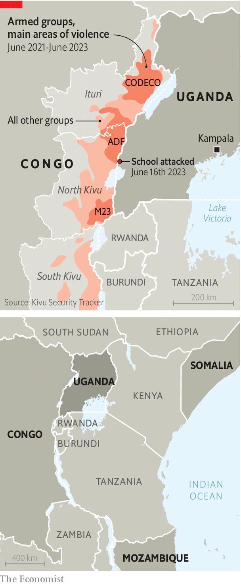

###### The spreading menace

# Jihadists in Congo linked are extending their reach in the region 

##### Terrorist networks link groups in Congo, Somalia and Mozambique 

 

> Jun 22nd 2023 

They came in the dead of night with guns, axes, machetes and petrol bombs, shooting, hacking and setting fire to students as they slept in their dormitories at a remote school in Uganda’s west. After murdering 41 people, the fighters of the Allied Democratic Forces (ADF), an armed group based in eastern Congo linked to Islamic State (IS), spirited themselves back across the border, taking at least six captives with them. 

The attack on June 16th is a reminder of how , which is terrorised by dozens of armed groups, is threatening the wider region. In addition to the ADF, these groups include the M23, a rebel movement backed by Rwanda, and CODECO, an ethnic militia accused of raping, dismembering and beheading its victims. This year alone some 1m people have fled their homes in Congo, taking the total to more than 6m, according to the UN.

 


Moreover, the attack highlights how jihadists have been able to spread their influence across a large triangle of east Africa —roughly from Somalia to Mozambique and Congo—often by exploiting local grievances. Uganda, which is at a nexus of this terrorist activity, has been attacked several times. The latest is its worst since 2010, when suicide-bombers from al-Shabab, a Somalia affiliate of al-Qaeda, killed more than 70 people in two almost-simultaneous attacks in Kampala, the capital. Uganda’s army, which has battled al-Shabab in Somalia for years, officially lost 54 soldiers (though the real number of casualties is understood to be far higher) when the group attacked one of its bases there in May. But it is the ADF that worries the Uganda’s security chiefs most. “This threat is more important to us, because it was born here,” says a senior Ugandan official.

The ADF started as an Islamist rebel outfit in Uganda, but fled to Congo in the late 1990s. Its commanders intermarried with locals and remained dormant there for many years. Then in 2013 it adopted guerrilla tactics and started massacring civilians and attacking the security forces. Congo’s army fought back, killing many of its fighters and scattering the rest. 

By 2017 the ADF was falling apart. It was then that the group started getting funding from Islamic State, according to a new report by the Programme on Extremism at George Washington University. From a low of just a few hundred fighters in 2018 the ADF may now have some 2,000 fighters, according to the UN’s peacekeeping mission in Congo. In 2021 the group infiltrated suicide-bombers into Kampala, where they killed four people. In response, Uganda’s army deployed into Congo.

Though the Ugandan army has bruised the ADF and bombed out some of its bases, the group remains resilient. It also appears to be learning from jihadists elsewhere. In the past few years it has started using more sophisticated bomb-making techniques. And in December it attempted another cross-border attack into western Uganda, although that one was easily repelled by Uganda’s security forces.

The ADF has also expanded the territory under its influence in Congo. This is because even as Uganda’s army has deployed against it, Congo’s army has had to withdraw troops from the group’s strongholds to fight the M23 elsewhere in North Kivu province. The ADF has meanwhile expanded into two neighbouring provinces: Ituri, where it is actively fighting, and South Kivu, where it is establishing sleeper cells. “The biggest beneficiary of the M23 war is the ADF,” says a UN official in Congo. 

East Africa’s regional bloc, worried about instability and the threat of contagion, sent troops into Congo late last year to fight the M23. But they seem to have done almost no fighting. Félix Tshisekedi, Congo’s president, recently accused the force of “cohabitation” with the rebel group. Now southern Africa’s bloc is preparing to send its own multinational force to fight the M23 and other armed groups. 

Meanwhile the jihadists themselves are internationalising their human resources and finances. The ADF imports non-Congolese fighters from east Africa into its safe zones via Uganda and Burundi. From there it sends them to various front lines. Money comes from several sources, too, according to the Programme on Extremism. IS cells in Somalia extort money from businesses and people. In South Africa its operatives raise money through kidnapping, extortion and robbery, which is then used to finance the ADF as well as IS-linked jihadists in Mozambique. This money is moved into east Africa through money-transfer agencies and then into the ADF’s hands in Congo. Similar channels are probably also used to send money to jihadists in northern Mozambique. “Unless these money transfers are cut,” says a Western counter-terrorism official, “no amount of military operations are likely to stamp out this problem.” ■

