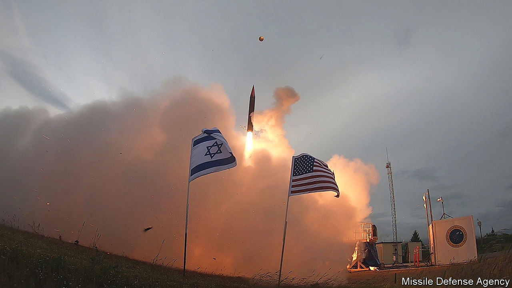

###### Fire sale

# The war in Ukraine is boosting Israel’s arms exports 

##### European countries want missile-defence systems 

 

> Jun 22nd 2023 


For decades the standout product of the Israeli arms industry was the Uzi, a submachine gun used by soldiers and action stars the world over. More recently, however, attention has shifted to the Iron Dome. Footage of interceptor missiles pirouetting in Israel’s skies, shooting down Palestinian rockets, has made it perhaps the world’s best-known missile-defence system. The war in Ukraine has further increased interest and proved a boon for Israel’s arms exports.

On June 14th Germany’s parliament signed off on a €560m ($615m) instalment on the purchase of the Arrow-3, a missile-defence system, by the 17-nation European Sky Shield Initiative. The long-range Arrow-3, developed by the state-owned Israel Aerospace Industries and Boeing, an American aviation giant, is designed to intercept missiles above the Earth’s atmosphere. It is already operational in Israel, which fears attacks from Iran. Germany and its allies worry about Russia. At €4bn, the deal will be Israel’s largest-ever arms sale. Finland and the Czech Republic, similarly concerned, have placed orders for smaller Israeli missile-defence systems. Other European governments plan to do so.

Israel began developing anti-ballistic-missile technology in the late 1980s. It has since adapted it for use against smaller rockets and artillery shells. That Israel has these systems in operational use gives them a clear advantage over competitors, says Tal Inbar, an Israeli missile-technology analyst.

Europeans have been on a spending spree since Russia’s invasion of Ukraine. Last year Israeli arms-export deals hit an all-time high of $12.5bn. Over a quarter of the sales were to Europe, a proportion expected to grow in 2023. 

Drones, anti-tank missiles and advanced training systems have proved popular, along with missile-defence systems. Israel has even found customers for its used kit. An undisclosed European country wants to buy second-hand Merkava tanks, probably to replace older tanks earmarked for Ukraine. 

Israel has remained on the fence in the war itself. It has sent humanitarian aid to Ukraine, but refused its entreaties for weapons. Israel frets about Russian troops near its border in Syria and about the fate of the large Jewish communities in Russia and Ukraine.

The surge in arms sales to Europe is a diplomatic boost for Israel. In the past potential customers have criticised its treatment of the Palestinians in the occupied territories. Now they will be using Israeli systems developed and used in Israel’s conflicts in Gaza. Europeans who suddenly have a front line on their borders may be more understanding of Israel, suggests Jeremy Issacharoff, Israel’s former ambassador to Germany.■

