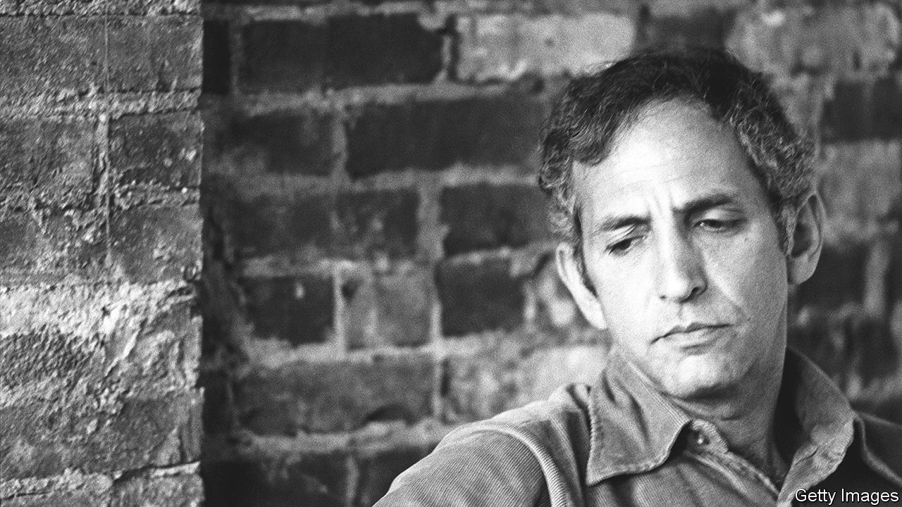

###### Tell me lies about Vietnam

# Daniel Ellsberg leaked the Pentagon Papers to try to stop the Vietnam war 

##### The historian, policy-planner and determined activist died on June 16th, aged 92 

 

> Jun 21st 2023 

Two thatch huts were still smouldering when Daniel Ellsberg and his group reached the village. It took nothing to destroy them; just a Zippo lighter. Children were searching for toys in the ashes. In the first days of his posting to Saigon in 1965, to advise on General Edward Lansdale’s “pacification” programme, he had fallen in love with Vietnamese children: their nimbleness, their boldness, their fascination with the hair on his arms. They had followed him around like a cloud of birds. Now he watched one little girl pull out a blackened doll.

 He was directly implicated in this. Since 1964 he had been working at the Pentagon as assistant to John McNaughton, number two to Robert McNamara, the secretary of defence. With McNaughton, he had scoured for gory details of Vietcong atrocities to justify heavier American involvement. (Those burned huts, he was told, were VC hideouts.) Together they had drafted lies for McNamara to tell the press.

He did not see the wrongness of that because he was a patriot and a hawk; an all-American, who wanted to serve the president wherever he was sent. Though he was an intellectual, not any sort of jock, he had enlisted in the marines, passing out as a first lieutenant and taking his rifle company briefly to the Middle East. In Vietnam, as a civilian, he encountered the enemy in glimpses: shadows in ricefields, wooden traps dropped on a trail. From those signs alone, he knew America could not win a war there. With luck, however, limited military interventions might do the job. 

At the same time, his unease was growing. He had a deep-seated horror of military attacks on civilians, laid down in childhood as he heard reports of the bombing of Warsaw and Rotterdam. At school in a tranquil suburb of Detroit he was shown a slim, silver magnesium bomb whose flames could not be doused with water, only with the sand that stood in a bucket in each classroom. He knew then that nothing was so purely evil as the deliberate bombing of women and children. When war became nuclear, he resolved to oppose those weapons always. At the Rand Corporation in California he took part in planning America’s strategy after nuclear attack, but his own aim was to make that insanity impossible.

In 1968 he was back at Rand again, helping to compile for McNamara a “History of the US Decision-Making Process on the Vietnam Policy” since 1945, loosely known as the Pentagon Papers. This played to his strengths. War policy was a perfect worked example of his Harvard dissertation on how people weighed risk and uncertainty when they made decisions. His “Ellsberg paradox” showed that they tended to shy away from ambiguity and act on what they thought probable, even if the evidence was scant and equivocal and the outcome might be worse. In the Pentagon Papers, this was the  The Gulf of Tonkin incident in 1964, when an attack by North Vietnam on an American ship gave a pretext for getting involved in Indochina, was largely invented. The enemy’s intentions were assumed or guessed at. The secret objective of bombing North Vietnam, in McNamara’s own words, was to contain China.

 As that bombing escalated, Mr Ellsberg knew he had to expose the lying, killing machine. The evidence was in his own four-drawer safe, easily released. All the same, he waited, weighing the risks and uncertainties. If he leaked the papers, he would probably go to jail for a long time. If he did not, he was a coward perhaps, but would also keep his job and the secrets entrusted to him. Did his duties as a faithful employee and a provider outweigh his duties to the human race? The moral course was not clear-cut. 

Yet the war itself was immoral, and that decided him. When in 1969 he heard a draft-resister, Randy Kehler, speak of a world of non-violence and the “beauty” of going to jail in the name of peace, he wept for more than an hour. That was the life he wanted to lead. He began to smuggle the “History”, 7,000 pages in all, out of the Rand complex in his briefcase by night, copying it on a Xerox machine with the help of a friend. On his way home after the first session, in the small hours, he paused to body-surf on the waves of the Pacific. He was free; he had found the power to resist. 

The copies went to Neil Sheehan, a reporter for the , and in June 1971 the  began to serialise the findings. President Richard Nixon tried to stop publication, both there and in the ; but when the case went to the Supreme Court the court upheld the freedom of the press against executive pressure. It was a famous victory. The Ellsberg trial, in 1973, was another: he was charged under the Espionage Act, which carried a maximum sentence of 115 years in jail, but all charges were dismissed. He was now a hero of the anti-war movement.

Yet he felt he had failed, because he had not stopped the war. At best, he had shortened it. And it was not the leak that achieved even that; it was Nixon’s decision to “get this sonofabitch” by creating the “Plumbers” to burgle the office of Mr Ellsberg’s former psychiatrist, to prove him unhinged. When the Plumbers moved on to try to raid the Watergate complex, a scandal erupted that spared Mr Ellsberg prison and brought down the president. Ending the Vietnam war was then only a matter of time. 

He campaigned for it with all his lean-built energy and eloquence. Then, for half a century, he proselytised for peace and against nuclear weapons. He was arrested 90 times. The Iraq war energised him especially, founded as it was on the same deliberate delusion that had underpinned Vietnam. Wholeheartedly, he supported the whistleblowers—Edward Snowden, Chelsea Manning—who followed his example. He urged those who knew the truth not to wait, as he had, until the bombs were falling. 

He had once believed Americans were the good guys. Now, inured to seeing perfidy and conspiracies everywhere, he accused America of imperial ambitions in the post-colonial world. There were no good or bad guys any longer, he thought, only right and wrong. And, having weighed all the risks and run several of them, he knew without a doubt which side he had come down on. ■

