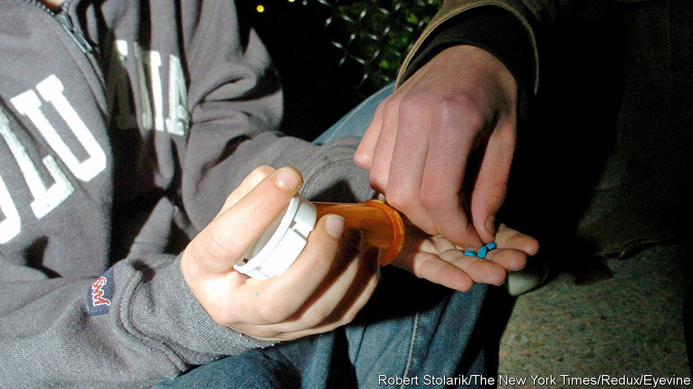

###### Brains in a pill

# Study drugs make healthy people worse at problem-solving, not better 

##### Users try harder, but are less competent 

 

> Jun 20th 2023 

FOR MORE than six months Americans have been struggling to get their hands on medications like dextroamphetamine (better known as Adderall) and methylphenidate (Ritalin). Officially, these stimulant drugs are used to treat attention-deficit hyperactivity disorder (ADHD). 

Unofficially, the drugs are also popular with devotees of “nootropics”—chemicals that supposedly boost brainpower. Students and workers in industries from tech to finance  in the hope they will improve their concentration and ability to get things done. But a new paper suggests that this may be ill-advised. The drugs seem to make people slightly worse at solving problems, not better. 

In the paper, published on June 14th in , a group of researchers led by Peter Bossaerts, an economist at the University of Cambridge, tested how Adderall, Ritalin and another stimulant drug called modafinil (Provigil) affected 40 healthy people’s ability to perform optimisation problems. They used the “knapsack task”, in which participants had to work out which items to put into a bag. The idea was to maximise the value of the items without exceeding the carrying weight of the sack. The researchers used several trials of varying difficulty, each with different weight limits and lists of items.

The participants visited the lab on four separate days. On each day they were given either a placebo pill or one of the drugs under study. The study was double-blind, meaning neither the participants taking the pills nor the experimenters handing them out knew which had been administered on which day. They found that participants achieved slightly worse end-results on the task after taking a drug. The drugs did not impair people’s ability to find an optimal solution. Participants managed this in around half of the trials, whether they took the drugs or the placebo pills. But they did cause a small drop in the value of participants’ knapsacks across all trials, by making the non-optimal solutions worse.

Perhaps more striking was how drugs changed the way people attacked the task. After taking Adderall or Ritalin (but not Provigil) the participants spent far longer working on their knapsacks than they did when they had taken the placebo pill. (Participants were given four minutes to complete each trial but could submit an answer earlier if they thought they had found a good solution). When given Ritalin in particular, subjects were around 50% slower at completing trials. That was roughly equivalent to the delay expected from going from the easiest to the most difficult trial in the placebo session. 

This extra time was spent moving items in and out of the knapsack, somewhat erratically. The authors assessed the productivity of each move by measuring how much it increased the value of a sack, and found that participants were about 9% less productive when they had taken one of the study drugs compared with a placebo pill. “It was like they were trying to solve a jigsaw puzzle by randomly throwing pieces in the air,” says Dr Bossaerts. 

The authors argue that although the drugs made people more motivated and helped them put more effort into the task, this was more than cancelled out by the fact that the drugs decreased the quality of all that effort. In other words, although people tried harder, they became far less competent. Just how much the drugs hindered performance seemed to depend on how good a participant was without them. Star performers during the placebo session fell to the bottom of the pack when they had taken the drugs. 

Popping stimulants  in industries like software and finance. One survey of 6,500 American college students reported that 14% had used the drugs for non-medical reasons. This latest study adds to a growing pile of evidence suggesting that such drugs do little to improve cognitive performance in people who do not need them. For tech bosses looking for efficient employees, and workers hoping to clock off at a reasonable hour, the stimulant shortage may be a good thing. ■


