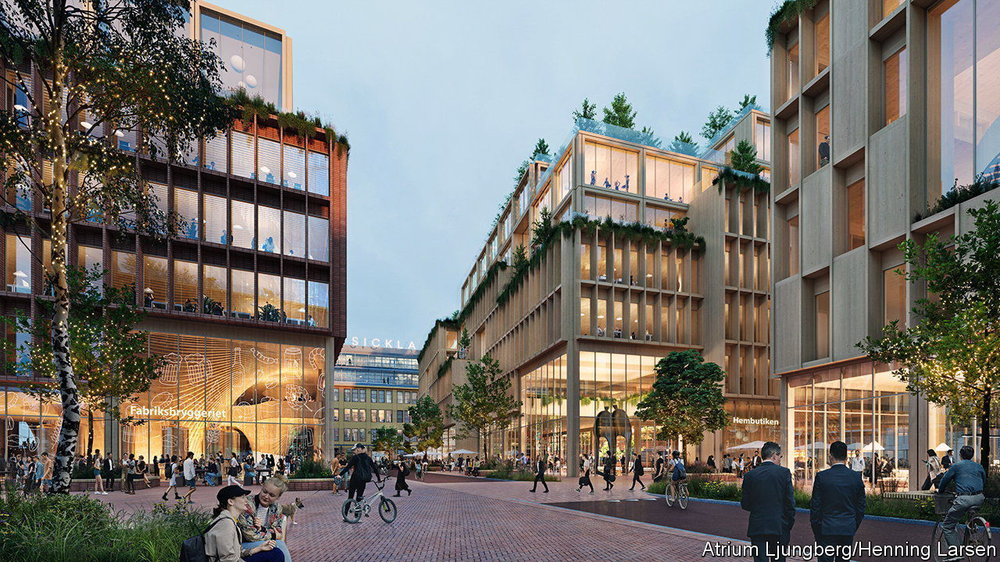

###### Growing business

# Sweden wants to build an entire city from wood 

##### Modern timber buildings can be cheap, green and fireproof 

 

> Jun 21st 2023 

There is a global race to build the tallest wooden skyscraper. The record was held by Mjostarnet, an 85-metre tower on the shore of Lake Mjosa in Norway, which hosts flats, a hotel and a swimming pool—until Ascent, an 87-metre structure, was completed in Wisconsin in July 2022. And it will be put in the shade in turn by other buildings: a 90 metre tower is planned for Ontario, and a 100 metre one for Switzerland. (By way of comparison, St Paul’s cathedral in London is 110 metres tall.)

This week, though, a Swedish firm announced it was going for a different sort of record. It unveiled plans to build what could be the world’s biggest wooden city. Stockholm Wood City will be built in Sickla, an area in the south of the Swedish capital. Construction on the 250,000 square-metre site will begin in 2025. When complete, ten years later, it will contain 2,000 homes and 7,000 offices, along with restaurants and shops. The 12bn-krona ($1.4bn) project is led by Atrium Ljungberg, a Swedish urban development company.

By using wood the company hopes to reduce the project’s carbon footprint by up to 40%, compared with building in concrete and steel, says Annica Anäs, the company’s boss. Wood is a sustainable material that can be produced from renewable forests, which Sweden has in plenty. When used for building, it locks up the carbon that the trees absorbed from the atmosphere while growing. As with other modern construction projects using timber, Wood City will still use some concrete and steel in places like the foundations, but the overall amounts will be greatly reduced. As wooden buildings are much lighter, their foundations can be smaller.

The Swedish project will, as existing wooden skyscrapers do, employ large prefabricated sections made from what is called “engineered timber”. Instead of ordinary lumber, chipboard or plywood, engineered timber is a composite in which layers of wood are laminated together in specific ways. The wood grains in each layer are aligned to provide individual components of the building, such as floors, walls, cross braces and beams, with extremely high levels of strength. And because these parts can be manufactured in a factory, where tolerances are finer and quality control is easier to maintain than on a building site, the use of prefabricated sections cuts down on the delivery of raw materials and allows construction to proceed more quickly.

The burning question

Another advantage is that construction will not be as noisy as it would be if the town were built from concrete and bricks, adds Ms Anäs. This makes wooden buildings particularly suitable for urban redevelopment in general, since putting them up is less likely to annoy the neighbours. It should also be profitable. Ms Anäs is looking for a return on investment of 20% or better. “Sweden is progressive when it comes to wood construction,” she says. “But I don’t see any reason why it shouldn’t work elsewhere.” 

The biggest concern most people have about wooden buildings is the risk of fire. The buildings in Wood City will be fitted with several fire-protection systems, such as sprinklers and flame-resistant layers, as would also be found on their concrete or brick counterparts. 

At the same time, researchers are coming to believe that engineered timber is, by its nature, extremely fire resistant. To help win approval for the construction of the Ascent building, the us Forest Service carried out tests on the laminated timber columns it would use. After finding them difficult to burn, the columns were awarded an exemplary three-hour fire-resistance rating because they maintained their structural integrity. 

Without a sustained heat source the charring of the outer layer of a big piece of timber protects the structure inside—try lighting a camp fire when you only have logs. Many of the large urban fires of old, like the Great Fire of London in 1666, were mostly fuelled by small sections of timber acting as kindling. So when it comes to building in wood, it is best to think big. ■


