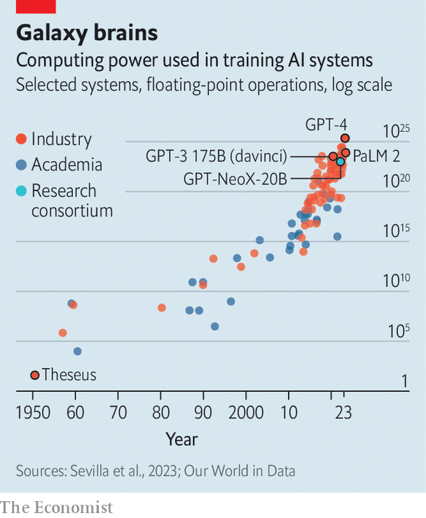

###### Anything that can’t continue, won’t

# The bigger-is-better approach to AI is running out of road 

##### If AI is to keep getting better, it will have to do more with less 

 

> Jun 21st 2023 

When it comes to “large language models” (LLMs) such as GPT—which powers ChatGPT, a popular chatbot made by OpenAI, an American research lab—the clue is in the name. Modern AI systems are powered by vast artificial neural networks, bits of software modelled, very loosely, on biological brains. GPT-3, an LLM released in 2020, was a behemoth. It had 175bn “parameters”, as the simulated connections between those neurons are called. It was trained by having thousands of GPUs (specialised chips that excel at AI work) crunch through hundreds of billions of words of text over the course of several weeks. All that is thought to have cost at least $4.6m.

 


But the most consistent result from modern AI research is that, while big is good, bigger is better. Models have therefore been growing at a blistering pace. GPT-4, released in March, is thought to have around 1trn parameters—nearly six times as many as its predecessor. Sam Altman, the firm’s boss, put its development costs at more than $100m. Similar trends exist across the industry. Epoch AI, a research firm, estimated in 2022 that the computing power necessary to train a cutting-edge model was doubling every six to ten months (see chart). 

This gigantism is becoming a problem. If Epoch AI’s ten-monthly doubling figure is right, then training costs could exceed a billion dollars by 2026—assuming, that is, models do not run out of data first. An analysis published in October 2022 forecast that the stock of high-quality text for training may well be exhausted around the same time. And even once the training is complete, actually using the resulting model can be expensive as well. The bigger the model, the more it costs to run. Earlier this year Morgan Stanley, a bank, guessed that, were half of Google’s searches to be handled by a current GPT-style program, it could cost the firm an additional $6bn a year. As the models get bigger, that number will probably rise.

Many in the field therefore think the “bigger is better” approach is running out of road. If AI models are to carry on improving—never mind fulfilling the AI-related dreams currently sweeping the tech industry—their creators will need to work out how to get more performance out of fewer resources. As Mr Altman put it in April, reflecting on the history of giant-sized AI: “I think we’re at the end of an era.” 

Quantitative tightening

Instead, researchers are beginning to turn their attention to making their models more efficient, rather than simply bigger. One approach is to make trade-offs, cutting the number of parameters but training models with more data. In 2022 researchers at DeepMind, a division of Google, trained Chinchilla, an LLM with 70bn parameters, on a corpus of 1.4trn words. The model outperforms GPT-3, which has 175bn parameters trained on 300bn words. Feeding a smaller LLM more data means it takes longer to train. But the result is a smaller model that is faster and cheaper to use. 

Another option is to make the maths fuzzier. Tracking fewer decimal places for each number in the model—rounding them off, in other words—can cut hardware requirements drastically. In March researchers at the Institute of Science and Technology in Austria showed that rounding could squash the amount of memory consumed by a model similar to GPT-3, allowing the model to run on one high-end GPU instead of five, and with only “negligible accuracy degradation”. 

Some users fine-tune general-purpose LLMs to focus on a specific task such as generating legal documents or detecting fake news. That is not as cumbersome as training an LLM in the first place, but can still be costly and slow. Fine-tuning LLaMA, an open-source model with 65bn parameters that was built by Meta, Facebook’s corporate parent, takes multiple GPUs anywhere from several hours to a few days. 

Researchers at the University of Washington have invented a more efficient method that allowed them to create a new model, Guanaco, from LLaMA on a single GPU in a day without sacrificing much, if any, performance. Part of the trick was to use a similar rounding technique to the Austrians. But they also used a technique called “low-rank adaptation”, which involves freezing a model’s existing parameters, then adding a new, smaller set of parameters in between. The fine-tuning is done by altering only those new variables. This simplifies things enough that even relatively feeble computers such as smartphones might be up to the task. Allowing LLMs to live on a user’s device, rather than in the giant data centres they currently inhabit, could allow for both greater personalisation and more privacy. 

A team at Google, meanwhile, has come up with a different option for those who can get by with smaller models. This approach focuses on extracting the specific knowledge required from a big, general-purpose model into a smaller, specialised one. The big model acts as a teacher, and the smaller as a student. The researchers ask the teacher to answer questions and show how it comes to its conclusions. Both the answers and the teacher’s reasoning are used to train the student model. The team was able to train a student model with just 770m parameters, which outperformed its 540bn-parameter teacher on a specialised reasoning task.

Rather than focus on what the models are doing, another approach is to change how they are made. A great deal of AI programming is done in a language called Python. It is designed to be easy to use, freeing coders from the need to think about exactly how their programs will behave on the chips that run them. The price of abstracting such details away is slow code. Paying more attention to these implementation details can bring big benefits. This is “a huge part of the game at the moment”, says Thomas Wolf, chief science officer of Hugging Face, an open-source AI company. 

Learn to code

In 2022, for instance, researchers at Stanford University published a modified version of the “attention algorithm”, which allows LLMs to learn connections between words and ideas. The idea was to modify the code to take account of what is happening on the chip that is running it, and especially to keep track of when a given piece of information needs to be looked up or stored. Their algorithm was able to speed up the training of GPT-2, an older large language model, threefold. It also gave it the ability to respond to longer queries. 

Sleeker code can also come from better tools. Earlier this year, Meta released an updated version of PyTorch, an ai-programming framework. By allowing coders to think more about how computations are arranged on the actual chip, it can double a model’s training speed by adding just one line of code. Modular, a startup founded by former engineers at Apple and Google, last month released a new AI-focused programming language called Mojo, which is based on Python. It too gives coders control over all sorts of fine details that were previously hidden. In some cases, code written in Mojo can run thousands of times faster than the same code in Python.

A final option is to improve the chips on which that code runs. GPUs are only accidentally good at running AI software—they were originally designed to process the fancy graphics in modern video games. In particular, says a hardware researcher at Meta, GPUs are imperfectly designed for “inference” work (ie, actually running a model once it has been trained). Some firms are therefore designing their own, more specialised hardware. Google already runs most of its AI projects on its in-house “TPU” chips. Meta, with its MTIAs, and Amazon, with its Inferentia chips, are pursuing a similar path. 

That such big performance increases can be extracted from relatively simple changes like rounding numbers or switching programming languages might seem surprising. But it reflects the breakneck speed with which LLMs have been developed. For many years they were research projects, and simply getting them to work well was more important than making them elegant. Only recently have they graduated to commercial, mass-market products. Most experts think there remains plenty of room for improvement. As Chris Manning, a computer scientist at Stanford University, put it: “There’s absolutely no reason to believe…that this is the ultimate neural architecture, and we will never find anything better.” ■


