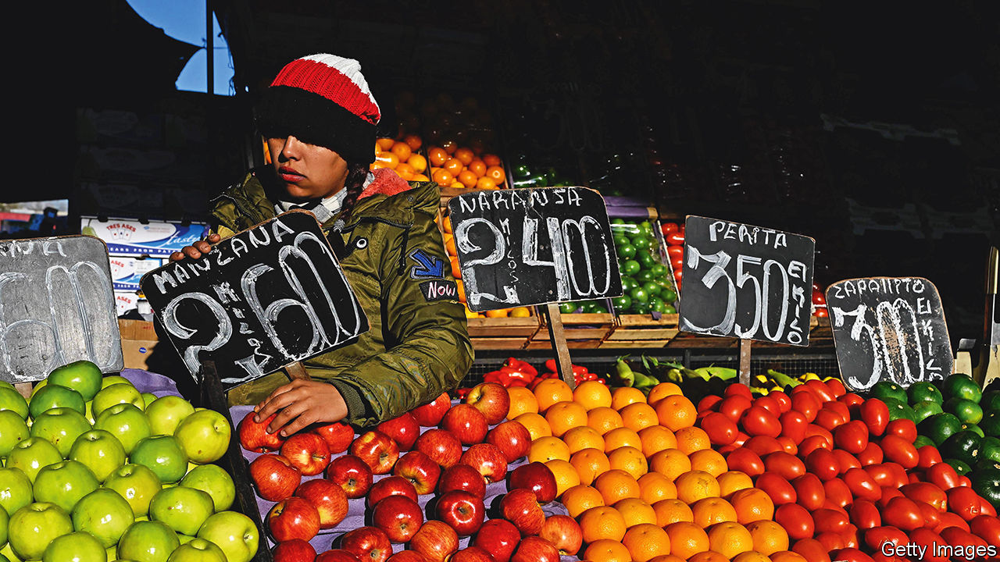
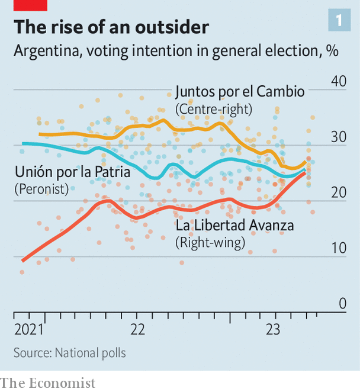
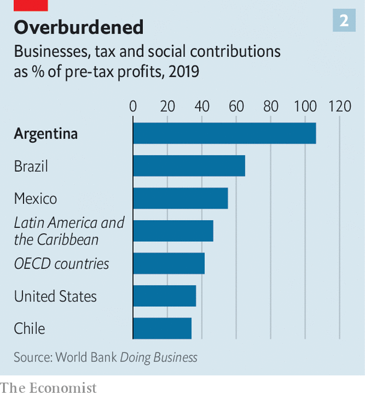
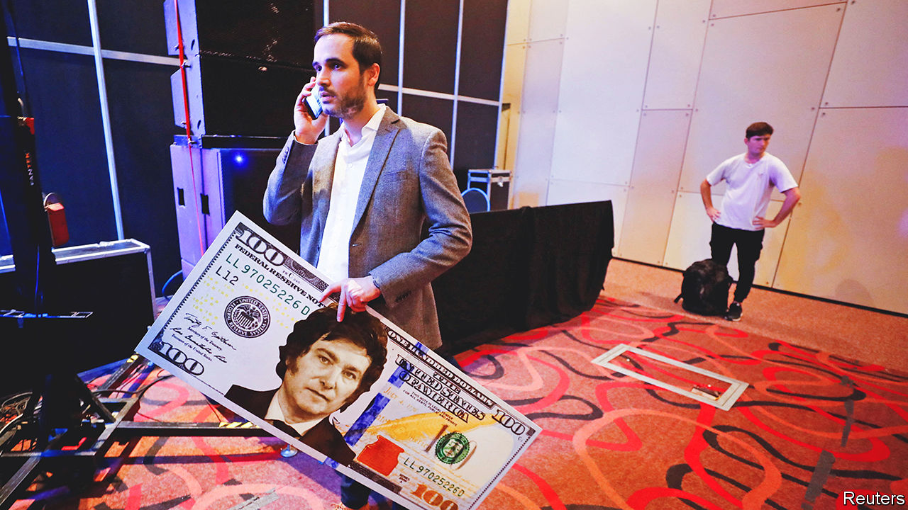

###### It’s still the economy, stupid

# Annual inflation of 114% is pushing Argentina to the right 

##### Patricia Bullrich and Javier Milei are rising in the polls for this year’s presidential election 

 

> Jun 22nd 2023 

Saturday June 24th will be a momentous day in Argentina: Lionel Messi, a superstar footballer, will turn 36. It is also the day the election season officially begins in the country. As politicians limber up to compete as presidential hopefuls for the poll later this year, they face a daunting backdrop. The annual inflation rate, of 114%, is the world’s third-highest. The share of people who cannot afford basic foodstuffs and services has risen from 30% in 2018 to 43% today. Unsurprisingly, the main concern of voters is the economy. And it is pushing them to favour politicians who offer radical fixes to their country’s economic malaise. 

So far, some 20 candidates have thrown their hat in the ring. They will battle it out to win the backing of their parties in primaries on August 13th. The winners of those will move to the first round of the presidential election on October 22nd. But the depth of Argentina’s economic problems means that the election this year is particularly unpredictable.

Since 1946, when General Juan Domingo Perón came to power, Argentina has mostly been ruled by the populist movement that took his name. But Peronism appears to be at its lowest ebb: just over a quarter of the electorate say they will cast their ballot for a Peronist. Under President Alberto Fernández annual inflation has tripled. Capital controls have tightened, fuelling a gigantic black market for dollars, the currency in which Argentines save. The central bank has printed so much money that the amount of cash in circulation has almost quadrupled to 3.8trn pesos.

 


Both Mr Fernández and his vice-president, Cristina Fernández de Kirchner (no relation), have said they will not run for office. The potential Peronist hopefuls include Eduardo de Pedro, a protégé of Ms Fernández, and Sergio Massa, the economy minister, although he has not formally announced he will run. Neither is hugely popular. Instead, the polls are dominated by the centre-right opposition, Juntos por el Cambio (“Together for Change” or JxC), and La Libertad Avanza (“Freedom Advances”), the party of Javier Milei, a libertarian congressman (see chart 1).

For months the strongest candidate from JxC seemed to be Horacio Rodríguez Larreta, the technocratic mayor of Buenos Aires. Yet his emphasis on gradual change has resulted in him losing appeal as the economy worsens. This has opened up the floor for Patricia Bullrich, a former security minister. Whereas Mr Larreta is trying to bring moderate Peronists into JxC, Ms Bullrich opposes any alliance with the movement. She favours a sharp devaluation and a rapid reduction in public spending. Both want to enshrine central-bank independence, reduce the total fiscal deficit (expected to be 3.8% of GDP this year), slash currency controls and unify Argentina’s mind-boggling array of exchange rates. 

Some Argentines find this playbook unappealing. The previous administration was led by Mauricio Macri, the founder of the main party involved in JxC. He removed subsidies, lifted currency controls and agreed loans totalling $56bn with the IMF. The formula ended in crisis in 2018. Instead, many want more extreme solutions. That has fuelled the rise of Mr Milei, who calls his programme a “chainsaw plan”, as it is so sweeping. He wants to scrap the central bank and swap pesos for dollars. He promises to cut taxes, privatise state firms, scrap subsidies and export restrictions, and re-establish private pension funds. He also wants to introduce a voucher system in schools and privatise health care. The number of government ministries would be reduced from 18 to 8. 

Mr Milei attracts voters fed up with a bloated state. But his eccentric style—he lives with five mastiffs, four of which are named after famous economists, and also wants to create a legal market for organs—is particularly attractive to young men. When polled, a little over a fifth of voters say they will choose him. 


His plans for dollarisation have gained the most attention. Mr Milei’s programme is unclear, but suggests either a full-scale dollarisation of the economy, or for citizens to choose a currency of their liking. Many economists think official dollarisation is unfeasible. In some forms it would require the central bank to have large dollar holdings to back the banking system. Yet the central bank’s net foreign exchange reserves are a negative $1.5bn, estimates Miguel Kiguel of Econviews, a consultancy. 

Dollarisation is supposed to make it impossible to plunder the central bank to fund the government. A previous effort in the 1990s that pegged the peso to the dollar stopped hyperinflation for a few years. Yet the system backing the peg was too lax to restrain the government, and so deficits kept piling up. When it became clear that one peso was not worth one dollar, Argentines rushed to withdraw their dollar savings from banks in 2001. The government then, in effect, confiscated these. Argentines were given devalued pesos, and the worst crisis in the country’s history ensued. GDP fell by 17% and unemployment nearly doubled to 24%. 

Despite this, many like the fact that Mr Milei offers radicalism. However in recent local elections his allies have not done well. This could mean that, in a general election, he may win only in big cities. But if Ms Bullrich wins, she has said that she would make an alliance with Mr Milei.

 


Whoever is the next president has a tricky task ahead. Public spending has grown from 26% of GDP in 2000 to almost 40% today. Government revenues, however, have not caught up. They represent 32% of GDP. But informality makes the tax base small. According to the statistical agency, 36% of Argentines work in the informal sector, though many economists put the figure higher. The few Argentines who do pay taxes are overburdened. The World Bank estimated that in 2019 a typical medium-sized firm in Argentina would owe taxes and social charges equivalent to a whopping 106% of its pre-tax profits (see chart 2).

Beyond raising taxes, the country has few other options to get cash. Since it has defaulted on its sovereign debt nine times, it is shunned by international capital markets and cannot borrow (except from multilateral lenders). Argentina could increase revenues by exporting. But successive Peronist administrations have built walls around the country. Trade is equivalent to only 33% of GDP, one of the lowest shares in the world. Argentina is among only a dozen countries which tax agricultural exports, according to César Litvin, a consultant in Buenos Aires. 

 


All this means that Argentina’s governments have often turned to the central bank, which enjoys only notional independence, to finance the fiscal deficit. In March the government updated an agreement with the IMF to refinance its outstanding loan, which stipulates that the central bank may not finance more than 0.6% of government spending in 2023. Yet in the first five months of this year central-bank financing has already exceeded this limit, says Marcos Buscaglia of Alberdi Partners, a consultancy. Much of the money is not funnelled directly to the Treasury. Instead, according to Mr Buscaglia, the government has been selling peso-denominated bonds to public-sector entities, which then sell the bonds back to the central bank. This, in effect, puts cash in the government’s hands.

Sorting out the economy will require short-term pain. In order to cut the fiscal deficit, the government will need to reduce public spending and subsidies, on which around 2% of GDP is spent. Yet that will raise energy prices, which will push up inflation. Similarly, to boost trade Argentina will need a single exchange rate. Yet that will probably require devaluing the peso, which will push up prices. That could lead to social unrest.

Implementing such reforms is politically challenging. Argentina’s constitution divides the country into 24 provinces with lots of autonomy. Much of the surge in public spending over the past two decades has been fuelled by the provinces rather than the federal government. Any incoming president will have to negotiate with 24 governors who often run their regions like fiefs. In some of Argentina’s poorest provinces, over two-thirds of employees work for some form of government.

The next president may, however, be helped by a stronger harvest. This year one of the worst droughts in Argentina’s history wiped out over $22.5bn worth of soya, corn and wheat exports, worth 3.2% of GDP. The harvest is expected to recover next year. Increasing demand for lithium could also help. Recent investments in the world’s second-largest field of shale gas, in the West, could boost energy exports.

Ms Bullrich and Mr Milei may tout quick fixes. But it will take persistence to win back the trust of foreign investors and Argentine savers. “None of our problems will be solved under one government,” says Ricardo Carciofi of the University of Buenos Aires. “The secret is to solve the problems of today and persevere without changing direction for years, decades even.” For Argentina’s volatile politics, that is a tall order. ■

