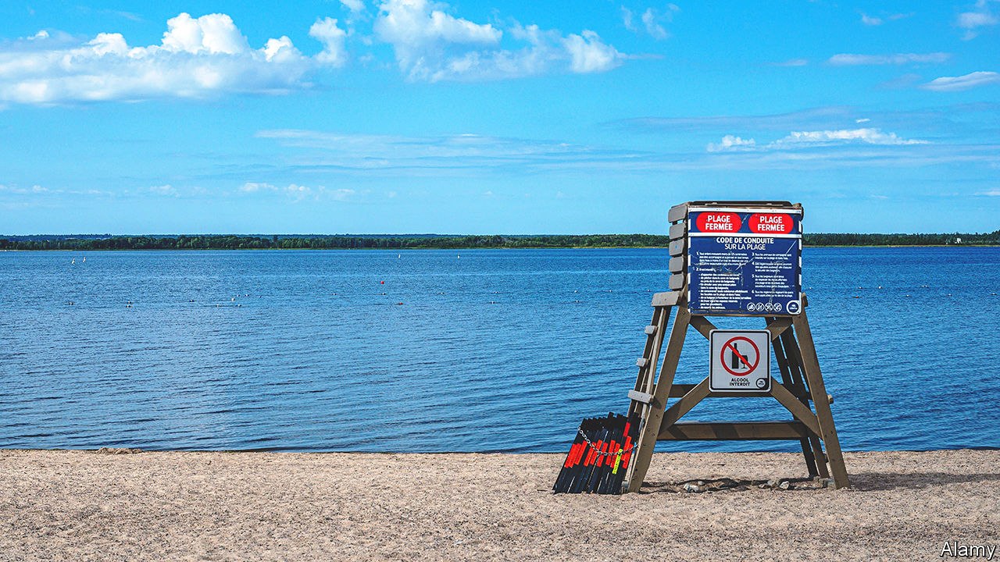

###### Of buoys and men

# Canada has a shortage of lifeguards 

##### Younger recruits are being dragooned in to help 

 

> Jun 22nd 2023 

Michael Olsen first became a lifeguard when he was a teenager in Australia. Now 81 years old, and after careers in tech and in the postal service, he has gone back the poolside. Most of his co-workers at the Nepean Sportsplex in Ottawa, the capital of Canada, are high-school and university students. He is currently the oldest lifeguard in the province of Ontario—but he may be joined by other octogenarians if a nationwide trend continues. “I’ve been downsized from jobs before,” he says. “It’s nice to know that I’m in demand now.”

Canada has a shortage of lifeguards. This has caused dozens of pools to close across the country—some temporarily and others permanently. On June 2nd Ontario’s government lowered the minimum age to be a lifeguard, from 16 to 15, in order to encourage more youngsters to take up summer jobs.

The shortage is mostly the result of the pandemic, which shuttered pools. When they reopened, many lifeguards who were fired during lockdowns did not return. Training can be expensive. Although the initial course costs hundreds of Canadian dollars, over the years additional lessons and the like can add up to C$1,500 ($1,134), estimates Christopher Love of the Manitoba Lifesaving Society. Training also takes a whopping 135 hours. 

The number of lifeguards is ticking up again. But it is still not what it was before the pandemic. In 2019, the province of Manitoba trained around 1,000 lifeguards. In 2021 only 200 received training. In 2022, 900 did. Ahead of the busy summer season, the Lifesaving Society, a charity, offered free training for 12 people in Winnipeg this month. Only four people signed up. 

Similarly, some pools are subsidising the costs of training. Lifeguards who have worked in other countries, such as Mr Olsen, are also being fast-tracked into jobs; previously, they would have had to retrain. (Even so, he still had to prove he could swim 400 metres in under 12 minutes and haul up a weight of 9.1kg from the bottom of the pool.) Other municipalities are offering gift cards, to Starbucks and the like, to attract recruits. 

Higher wages help, too. Municipalities in British Columbia are trying to make waves in the labour market. Lifeguards working for the city of Vancouver can earn C$28 an hour, more than C$12 higher than the current minimum wage. Meanwhile, lifeguards who patrol the city’s ten beaches make C$35 an hour. Surf’s up. ■

