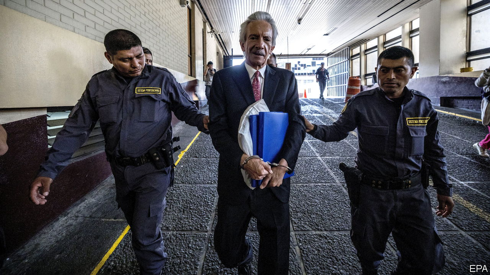

###### No country for journalists

# Press freedom is stifled in Guatemala ahead of an election 

##### José Rubén Zamora, a graft-skewering editor, has been put behind bars 

 

> Jun 22nd 2023 

José Rubén Zamora, a Guatemalan journalist, has often exposed corruption in the Central American country. In 2008 he was kidnapped, beaten and drugged by unknown assailants, before being dumped outside the capital. Some 15 years later, he is still being targeted. On June 14th, a court sentenced Mr Zamora to six years in prison for money-laundering and ordered him to pay a $40,000 fine. He was cleared of charges of blackmail and influence-peddling. The case is widely considered spurious. It is a worrying sign of eroding press freedom ahead of the first round of a presidential election on June 25th.

Alejandro Giammattei, the outgoing president (he cannot run again), insists the trial had nothing to do with journalism and everything to do with Mr Zamora’s business activities, which included asking an acquaintance to deposit $40,000 in cash in a bank for him. Mr Zamora argues that the use of cash was necessary to protect donors from the ire of the authorities. , the newspaper Mr Zamora founded in 1996, closed in May—he claims that the authorities repeatedly intimidated its donors and journalists (the government denies these allegations). 

Mr Zamora’s punishment is “a very bad signal for democracy”, says Carolina Jiménez Sandoval, the head of the Washington Office on Latin America (WOLA), an American think-tank. Ahead of this year’s presidential election, the right to take part in politics has also been “severely violated”, she notes. The country’s electoral authorities have made apparently arbitrary decisions to bar candidates, including Carlos Pineda, a businessman who became the surprise front-runner after campaigning on TikTok, a video app.

This is part of a broader trend of democratic backsliding. Several countries in Central America are moving in the direction of Daniel Ortega’s Nicaragua, the original model for despotism in the region. The rule of law is quickly eroding in El Salvador under Nayib Bukele, its millennial president. Unlike these two other nations, though, Guatemala is not dominated by one individual. Rather, its political, military and economic elites entrench their hold on power through a system described by WOLA as “corporate authoritarianism”. 

Democracy started to unravel in Guatemala in 2019 when the then-president, Jimmy Morales, disbanded CICIG, a UN-created anti-impunity task-force. This trend deepened under his successor, Mr Giammattei. Threatened by questionable legal challenges, many lawyers and judges have fled the country in recent years. Since November two dozen journalists have gone into exile.

When interviewed in May the founder of  was handcuffed, well-dressed and gaunt after ten months in a cell. He correctly guessed that he would receive between five and seven years in jail, adding that Guatemalan democracy had always been imperfect, but that it had significantly worsened of late. “We are passing a threshold, and it will be progressively more difficult to practise journalism in Guatemala,” he sighed. He believes the article that particularly irked the authorities before his arrest was a report on irregularities surrounding the government’s covid-19 vaccine deal.

Marielos Monzón, who is part of a media collective called  (They Will Not Silence Us), believes the sentencing of the “emblematic” Mr Zamora is a “clear message” to anyone who practises her profession. Ms Monzón thinks the situation is the worst in the country since 1996, when the post-civil war era began. “They are leaving us two paths,” she says. “The path to exile or the path to prison.” ■

