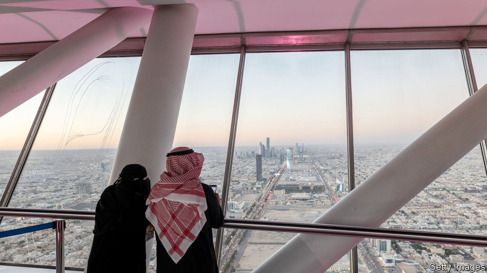

###### Saudi Arabia

# What to read (and watch) to understand Saudi Arabia 

##### Five books and a film help make sense of the rapidly changing country 

 

> Jun 22nd 2023 

FOR A COUNTRY of 40m people that is largely desert, Saudi Arabia has a surprisingly big role in the wider world. The second-largest producer of oil, it often sets the international price of that commodity. The annual pilgrimage to Mecca, in western Saudi Arabia, attracts millions of Muslims. Under Muhammad bin Salman, the crown prince and the country’s de facto ruler for the past six years, Saudi Arabia has sought to expand both its hard and soft power. It is trying to bring to an end an eight-year war that it has been fighting in neighbouring Yemen against Iran-backed rebels. In 2018 agents of the Saudi government murdered Jamal Khashoggi, a critic of Prince Muhammad. The kingdom is trying to improve its reputation by pouring money into less brutish pursuits, like . While consolidating power Prince Muhammad, who is often known as MBS, is also , for example by reducing the influence of clergy and boosting the rights of women. These five books and a film help explain a confounding and important country. 

. By Robert Lacey. .

Robert Lacey published his first book about Saudi Arabia, “The Kingdom”in 1981. The Saudi government banned it. Mr Lacey did not expect to return. He changed his mind after September 11th 2001 when two aeroplanes crashed into the World Trade Centre’s twin towers in New York, initiating what America called the “war on terror”. Fifteen of the 19 jihadists who hijacked four commercial flights that day were Saudi citizens. Seeking to understand why, Mr Lacey returned to the country for three years, and interviewed anyone willing to speak to him. His second book about Saudi Arabia begins in the late 1970s, when Wahhabism, a strict form of Islam, began to gain influence. This was a consequence of a series of crises, beginning with the siege of the Grand Mosque in Mecca by Islamist zealots in 1979. Mr Lacey shows how these events changed Saudi Arabia’s culture—creating conditions in which extremism thrived. It came to have devastating consequences far beyond Saudi Arabia’s borders. You can read our full review of the book . 

By Kim Ghattas. 

“What happened to us?” asks Kim Ghattas, a Dutch-Lebanese journalist. The Middle East, she says, was not always wracked by conflict and in thrall to religious zealots. Music and poetry were once freer to flourish than they are now. Like Mr Lacey, Ms Ghattas identifies 1979 as the crucial year, but her book ranges more widely. In that year two “Islamic revolutions” began: one in Iran, which was obvious and sudden, and a slower upheaval in Saudi Arabia, initiated by the siege of the Grand Mosque. It was also the year of the Soviet invasion of Afghanistan. The combination of these events, she argues, led to competition between Saudi Arabia and Iran for cultural and geopolitical dominance across the Middle East. This led to proxy wars in such places as Yemen and Lebanon. Ms Ghattas shows how a “black wave” of intolerance spread into seven countries over four decades. She weaves her narrative from the deeply personal stories of individuals, many of whom tried to hold back the wave. Among them are Mehtab Channa, who lost her job as a television anchor in Pakistan because she refused to wear a veil. Saudi Arabia and Iran recently began a . Ms Ghattas’s work reminds us that the shifts in their relationship will continue to have big implications for the rest of the region. 

By Rajaa Alsanea. 

Rajaa Alsanea had not intended to publish “Girls of Riyadh”, a novel based on her experiences, in English. She did not think that Westerners would be interested in four young women living in Riyadh, Saudi Arabia’s capital, who are the subjects of the book. But she realised, she writes, that there was value in introducing Western readers to characters who have hopes and desires and fall in love “just like women anywhere else”. In newsletter-like emails a sharp-witted narrator writes of young women who balance tradition with the modernity they encounter online. They date clandestinely, drink alcohol and dress up as men to drive cars. (The driving ban was lifted in 2018.) Their lives are complicated: one of the young women, Sadeem, is dumped by her fiancé after she has sex with him before their wedding; another, Gamrah, is divorced by her husband and forced to return from her life abroad to her conservative family in Riyadh. The narrator’s taboo-breaking emails are received with disdain. “Everyone is condemning my bold writing,” she says, “and perhaps my boldness in writing at all.” The book itself provoked censorship, not merely censure: upon publication in Arabic in 2005, Saudi Arabia’s government banned “Girls of Riyadh”. 

By Bradley Hope and Justin Scheck. 

Saudi Arabia is changing. Not long ago women and men could not mingle outside their families; now they go to raves in the desert together. The religious police, who accosted people who disobeyed religious dress codes, have retreated from the streets. But not all of the recent changes are progress. The murder of Khashoggi, by officials who cut up his corpse, is the most horrifying instance of a broader crackdown on dissent. Much of this change—the bad and the good—is the work of MBS. In 2017 Bradley Hope and Justin Scheck set out to chronicle his astonishing rise to power. Very little was known, they argue, about one of the world’s most important political figures. They interviewed countless sources, many of whom would only speak on condition of anonymity. The authors give a detailed account of MBS’s evolution from awkward teenager with a video-game addiction to reformer with a ruthless streak. He is a complex figure, write the authors. MBS craves power, no doubt, but his radical decisions are also motivated by a strong desire to create a lasting legacy. 

By Abdelrahman Munif. Translated by Peter Theroux. 

Abdelrahman Munif spent most of his career in the oil industry. It is therefore no surprise that the commodity drives the plot of his novel “Cities of Salt”. Although it is scarcely mentioned, it flows “invisibly through every page”, writes the translator, Peter Theroux. For the most part its effects are harmful. This Arabic epic, the first in a series of five (not all of which have been translated into English), depicts how the American discovery of oil in 1938 upended a Bedouin community. Their leafy haven in the desert, a fictional oasis called Wadi al-Uyoun, is gone “as quickly as in a dream”. Munif writes of the “tractors which attacked the orchards like ravenous wolves”, and the way that the trees “cried for help, wailed, panicked…and fell entreatingly to the ground”. Mr Munif’s novel is an unrivalled portrait of Saudi Arabia during its earliest days as a sovereign state in the 1930s, and shows how oil was critical to its foundation.

Directed by Haifaa al-Mansour. Available to rent or buy online.

Maryam, a strong-willed doctor from a small town, wants to travel abroad for a medical conference. But when her permit to travel, issued by her father, expires, he is not around to renew it. “The Perfect Candidate”, a film directed by Haifaa al-Mansour, Saudi Arabia’s first female director, tells Maryam’s story as she battles these and other strictures at a time of social and legal change in Saudi Arabia. In the opening scene she drives around in a beat-up car, a right newly granted to women when the film was released in 2019. When she cannot get the local government to fix a road outside the hospital, she decides to run for office in the municipal elections (and loses). Saudi Arabia has liberalised even since the film’s release. The law obliging women to get permission to travel has been repealed. Women have begun to take off their niqabs. But many other restrictions, formal and informal, remain. Maryam’s story illustrates the change, and its incompleteness. At the beginning of the film one of her patients refuses to be treated by her because she is a woman. But Ms al-Mansour’s tale is hopeful. At the end of the film, that very same patient tells Maryam that he voted for her in the elections. 


To learn more about MBS, read  in , our sister magazine. You can also read our analysis of the recent between Iran and Saudi Arabia and about how the kingdom is improving its relations with its , including .  we write about Saudi Arabia’s efforts to disentangle itself from the war in Yemen. 

