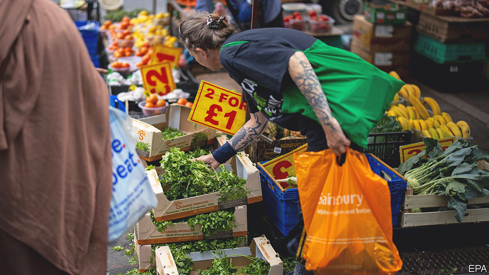

###### The world this week

# Business 

#####  

 

> Jun 22nd 2023 

Britain’s headline annual rate of  remained elevated at 8.7% in May, defying expectations that it would fall again. Core inflation, which strips out food and energy prices, rose to 7.1%, the highest it has been since March 1992. The government has promised to cut inflation by half this year from the 10.1% registered in January, but higher prices persist in food, clothing, recreation, health, communications and travel.

Brick by brick

The price ofin Britain is also soaring. The cost of a two-year fixed-rate mortgage has shot above 6% in recent days, as lenders re-evaluate their mortgage products and remove cheaper deals from the market. Banks link their fixed-rate mortgages to market expectations for interest rates, which are rising as the outlook sours on inflation. Official statistics showed rents also surging, by 5% in the year to May, the fastest pace since the data series began in 2016. 

With inflation still stubbornly high the  lifted its key interest rate by half a percentage point, to 5.0%. Before this week’s inflation figures markets had been expecting another quarter-point increase. The central bank has been criticised for allowing inflation to take a grip on the economy and for thinking that rising prices would be transitory. 

 central bank trimmed its benchmark lending rates for the first time in ten months, in an effort to rejuvenate growth. With Li Qiang, the prime minister, warning that “the external environment is becoming more complex and severe”, the government is considering other measures to get the economy moving. The finance ministry unveiled a 520bn yuan ($72bn) extension to tax breaks for to boost car sales. 

 filed a lawsuit seeking $1bn in damages from Nissan related to his arrest and defenestration as the carmaker’s boss in 2018 over allegations of financial misconduct. Mr Ghosn, one of the most powerful executives in the car industry at the time, filed his claim in Lebanon, where he fled in 2019 to avoid a trial. Nissan declined to comment.

The International Energy Agency published a report on  in developing and emerging-market economies. It said that investments in those countries would have to rise from $770bn a year to between $2.2trn and $2.8trn by the early 2030s if the Paris agreement’s goals on carbon emissions are to be met. China accounts for two-thirds of the current spending on clean energy, with Brazil and India taking a large bite of the rest. 

Denmark retained top spot in the annual  from the International Institute for Management Development (IMD). The criteria behind the ranking include international trade, government and business efficiency and technological infrastructure. Ireland leapt from 11th place to 2nd while Britain tumbled from 23rd to 29th, dragged down by worsening productivity and rising bureaucracy. America was 9th; China 21st.

The Italian government took measures to block a Chinese state-owned company from appointing a CEO at , a global maker of tyres best known for its association with Formula One racing. Sinochem holds a 37% stake in Pirelli. 

IndiGo, a low-cost Indian airline, placed an order for 500 Airbus A320 passenger jets, the biggest ever deal in . India has become the fastest-growing aviation market and IndiGo is the biggest domestic player. The deal was announced at the first Paris air show since 2019. At the event Air India firmed up its order for 470 planes from Airbus and Boeing. 

America’s Federal Trade Commission sued  for allegedly enrolling customers into its Prime service without their consent and for making it hard for them to cancel. 

 doubled the amount it is investing in two new chipmaking factories in  to $33bn, after the German government agreed to increase subsidies for the project to €10bn ($11bn). It is the largest-ever foreign investment in Germany and the biggest bid by a European country to enter the chip war, following America’s enticement of chipmakers. The  government said that Intel would up its investment in a factory in the country to $25bn. 

 announced that Eddie Yongming Wu would replace Daniel Zhang as chief executive in September. Mr Zhang will retain control of the cloud division. Mr Wu is one of the founders of the Chinese internet giant and is a close friend of Jack Ma, another founder, as is Joe Tsai, who takes over Mr Zhang’s other role as chairman. In March the company announced plans to turn itself into a holding company overseeing six divisions.

A ray of Son shine

Son Masayoshi used his first public appearance in seven months to talk up  investments in artificial intelligence. Displaying his typical exuberance, the boss of the Japanese tech conglomerate told shareholders that “a huge revolution is coming” in AI and that SoftBank would “rule the world” in its development. After a period of reflection following heavy losses at its flagship Vision Funds, Mr Son said he now wants to become “an architect for the future of humanity”. 

