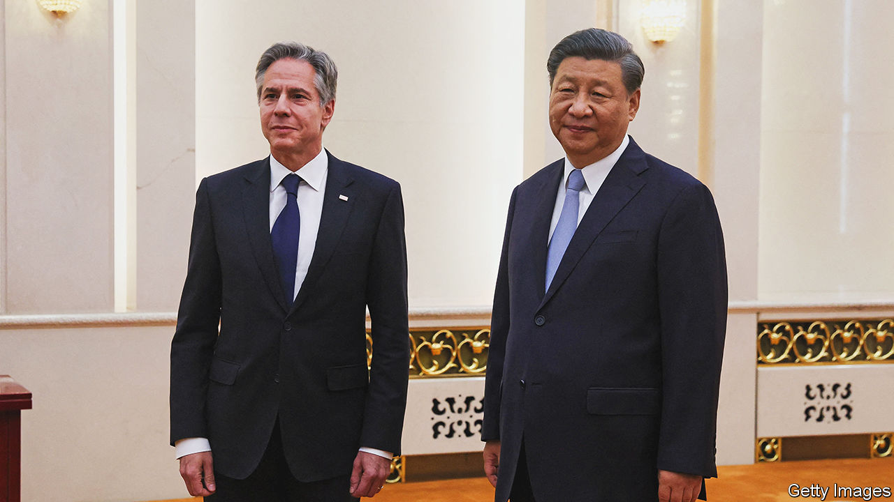
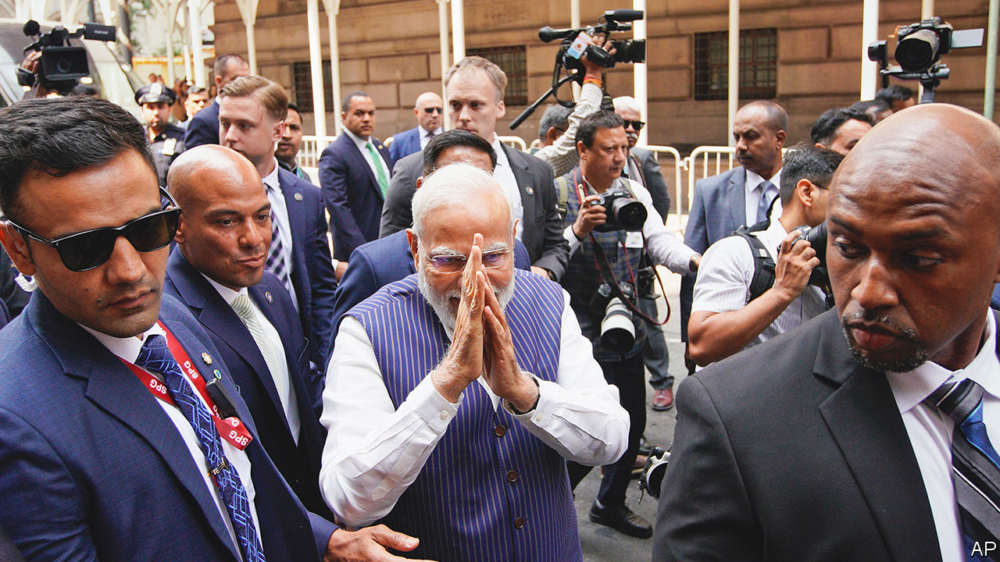

###### The world this week

# Politics 

#####  

 

> Jun 22nd 2023 

Antony Blinken visited , the first American secretary of state to do so in five years. He met several senior officials, as well as China’s president, Xi Jinping, who said they had made “progress” towards stabilising relations. Both sides appeared open to further talks, but no agreements were reached. Mr Blinken said there are “many issues on which we profoundly, even vehemently, disagree”. Later, at an event in California, Joe Biden called Mr Xi a dictator and said the Chinese leader had been embarrassed when America shot down an alleged Chinese spy balloon in February. China said the comments were absurd.

Mr Biden described Russia’s deployment of tactical  to Belarus as “absolutely irresponsible”. Vladimir Putin confirmed that the first batch of weapons, which carry small warheads for battlefield use, had been sent to its ally as a warning to countries that are “thinking of inflicting a strategic defeat on us”. 

A voice in the wilderness

The Russian authorities began a new trial of , this time accusing Russia’s most prominent opposition politician of rehabilitating Nazism while in prison. The closed-door trial is being held in the penal colony where Mr Navalny is serving over 11 years on other trumped-up charges. The preordained guilty verdict in this sham case could add another 30 years to his term. 

Russian officials threatened to end the deal that ensures the safe passage of Ukrainian grain through . The agreement has been extended until July 17th, but Russia claims its own grain exports are being impeded. 

In  the Constitutional Court placed a ban on Sor, a pro-Russian political party that has led protests against the Moldovan government. The party’s leader was Ilan Shor, a businessman who fled to Israel after being found guilty of money-laundering. 

Petteri Orpo became prime minister of . The country’s parliament formally backed his new centre-right coalition following an election in April, in which the ruling Social Democrats were defeated. The new finance minister is Riikka Purra, who leads the Eurosceptic Finns Party. 

 parliament legalised same-sex marriage, making the Baltic nation the first country in eastern Europe to do so. The prime minister, Kaja Kallas, has formed a liberal coalition following her party’s election win in March. 

Four  were killed by two  gunmen in an attack near a settlement in the occupied West Bank. Palestinian officials said hundreds of Israeli settlers assaulted a village in revenge; a Palestinian man died in the ensuing mêlée. Hamas, the Islamist group that runs Gaza, said the gunmen were its members and that the attack was retaliation for an Israeli raid on Jenin, where Israel fired from helicopters in the West Bank for the first time in 20 years, killing seven Palestinians.

Zied el Heni, a journalist, was arrested on charges of insulting Kais Saied,  president. Tunisian judges have detained or opened investigations into more than 20 prominent figures opposed to Mr Saied in recent months.

 ordered a peacekeeping mission with 15,000 personnel to leave “without delay” and said it would bring espionage charges against UN officials involved in a report accusing the government of atrocities. Since the army seized power in 2020, Mali has constrained the operations of the blue helmets and has turned instead to Wagner Group, a Russian mercenary firm, in its fight against jihadists.

Jihadists from the Allied Democratic Forces, a Congolese group backed by Islamic State, killed 41 people, most of them children, in a cross-border raid on a school in . It was the country’s worst terrorist attack since 2010.

At least 46 women were killed in a prison in  in a battle between rival gangs. Most of the women had been set on fire. President Xiomara Castro, who has been trying, without much success, to crack down on gang activity, including within prisons, said the violence had happened with the acquiescence of security officials. She sacked the country’s security minister. 

 


Narendra Modi travelled to America for his first full state visit (it was his sixth trip as prime minister of ). Mr Modi is being feted by America, which wants to deepen ties with India on defence and technology, in large part to counteract the rise of China. India is not an American ally, however, and still depends on Russia for oil and weapons. Mr Modi also met Elon Musk to discuss tech investments. 

 election commission confirmed the results of a ballot in May that was won by the opposition. The commission’s confirmation of the result paves the way for parliament to choose a government. It is unclear if the progressive Move Forward party, which scored a stunning upset by coming first in the election, has enough support to form a coalition under its leader, Pita Limjaroenrat. 

The age of sexual consent in  is to rise from 13 to 16 following landmark reforms passed by the country’s legislature. The definition of rape is to be broadened from “forced” to “non-consensual” sexual intercourse. 

Police in the  city of Daegu stepped in to allow a gay pride festival to proceed after local officials tried to stop the event. The conservative local mayor said the organisers had not sought permission and the festival would impinge on businesses. But a court refused to impose an injunction, finding that freedom of expression was paramount.

A federal judge in Arkansas overturned the state’s ban on any medical care that helps  under the age of 18 to transition. In the first permanent decision of its kind in America, the judge found that “rather than protecting children, or safeguarding medical ethics” the ban “undermined the interests it claims to be advancing.” The ruling applies to Arkansas only, but could have ramifications for other legal challenges to similar state bans. 

Hunter on the defence

In a deal with the Justice Department,  pleaded guilty to failing to pay income tax. He also reached an agreement on his illegal possession of a gun that will see him avoid prosecution. Republicans accused the department of political bias in what they claim is its lenient handling of Joe Biden’s son. 

A  vessel carrying five passengers on a trip to the wreck of the  lost contact with its support ship. An extensive search was launched for the , which had limited oxygen on board. 

In  MPs voted on a committee report that censured Boris Johnson for deliberately misleading Parliament. Rishi Sunak was criticised by the opposition for a lack of leadership when he declined to turn up for the vote. Most other Conservative MPs also failed to appear. But in the end only seven Tories voted against the report, a crushingly low level of support for Mr Johnson. 

