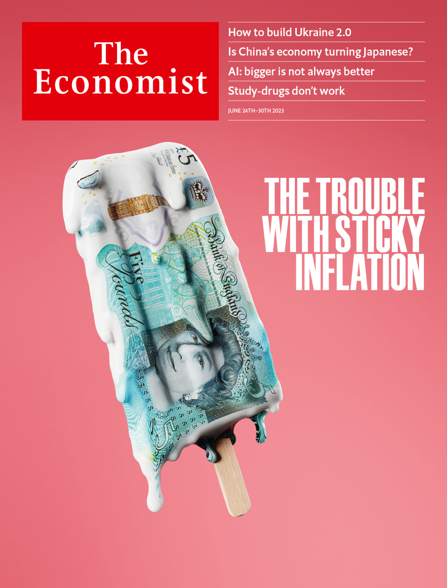
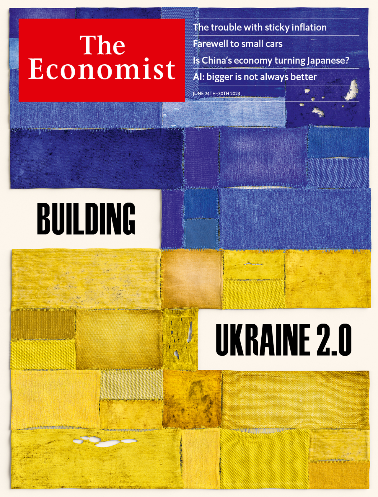

###### The Economist

# This week’s covers 

##### How we saw the world 

> Jun 22nd 2023 

We hAVE tWo and a half cover images this week. In most of the world we present our take on inflation, which remains stubbornly high despite the fading of the energy shock. Central banks face agonising choices. Might they raise rates by less than is needed to hit their inflation targets? What they do next will reverberate across financial markets, threatening uncertainty and upheaval for workers, bosses and pensioners. (Concerns about inflation are particular grave in Britain. Readers there see a different ice-lolly, the second one below.)

 


 


: 

: 

: 


In continental Europe we focus on Ukraine’s home front. It is less dramatic than the battlefield, but everything depends on Ukraine’s ability to build a functioning, successful state. Russia may continue to occupy tracts of land, but if Ukraine ends up prosperous, democratic and secure, then Vladimir Putin’s war will have failed utterly. We look at what Ukraine’s nation-builders need to succeed. 

 


: 

: 

: 

