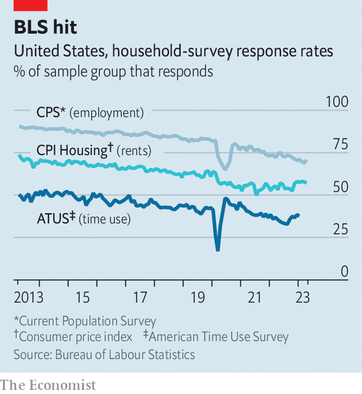

###### Telling it how it isn’t

# As response rates decline, the risk of polling errors rises 

##### A growing problem for America’s pollsters 

 

> Jun 22nd 2023 

KNOWLEDGE of many facets of American life comes from surveys. Every ten years the Census Bureau asks adults to tally themselves and their demographic information in an online or mail-in form: a survey. The Bureau of Labour Statistics (BLS) produces monthly estimates of the unemployment rate and other economic numbers that are derived from interviews with tens of thousands of households: another survey. And knowledge of political issues from opinion polls, of course, comes from surveys. That would not be a problem if everyone answered the pollsters. But not everyone does, and the people who don’t can be very different from those who do.

Take a recent survey conducted by the  and the National Opinion Research Centre (NORC) at the University of Chicago. The poll, published in March, purportedly showed that the popularity of many American values had fallen precipitously over the past few decades. In 1998 a poll by the  and NBC News found that 70% of adults said “patriotism” was “very important” to them; now just 38% do. Similarly, religion’s score had declined from 62% to 39%; bringing up a family from 59% to 30%; and community involvement, which rose from 47% to 62% by 2019, had crashed to 27%. Only money had become more important to the average adult since 1998: 31% then, 43% now.

 


The  wrote that “America pulls back from the values that once defined it.” A headline on Axios, an online news outlet, declared: “Rot of nation’s core values quantified by single poll”. On Twitter commentators agonised over the trends, blaming progressivism and secularism. 

Yet the trends may not be real. Instead, according to Patrick Ruffini, a pollster at the Republican-aligned firm Echelon Insights, they mainly reflect a change in how the  conducts its polling. In the past it had joined forces with NBC News to field a nationally representative poll by telephone, a practice that grew expensive and prone to error as response rates plunged. So the newspaper recently turned to NORC, which over the past decade has developed polls that collect responses over the internet from a representative sample of Americans recruited by mail. 

The problem arises when the types of people contacted by phone and the internet can be representative of Americans demographically, but statistical weirdos in other ways. Studying the differences in populations from telephone and online surveys—which industry insiders call “mode” effects—the Pew Research Centre in 2019 pointed out that its own online panellists may have been more honest about key metrics than its telephone respondents and less subject to “social desirability bias”, a phenomenon where people are more honest about things like their financial situation and height when asked anonymously than they are over the phone. Pew found that on the same question, among the same respondents, it got different responses by mode.

That means the decline of American society is a mirage—a statistical quirk rather than the fall of Western civilisation. Such quirks affect other numbers. According to the BLS’s Office of Survey Methods Research, the percentage of people completing interviews for the monthly Current Population Survey (CPS) has fallen from 90% in 2013 to 71% today. The CPS is the source of key economic indicators such as the unemployment rate and labour-force participation. A decline in response rate means there is a higher chance of distortion if “non-responders” are different from the people researchers actually hear from. 

Analysts at the US Census Bureau found that plunging CPS response rates during the covid-19 pandemic made the survey much less representative of poor Americans. Their best guess is that the estimate of median household income in 2020 is inflated by $2,000 purely because of a changing population of survey-takers. Another paper, from the Global Labour Organisation, an international non-profit group, found that CPS response rates are lower in cities and hubs for manufacturing jobs. 

Government researchers are hopeful they can fix problems of non-response by spending more money to interview more people, or by developing new statistical techniques for analysing samples. But other issues will persist undetected until a researcher asks the right questions. Often, as with the values survey, that is too late. ■


