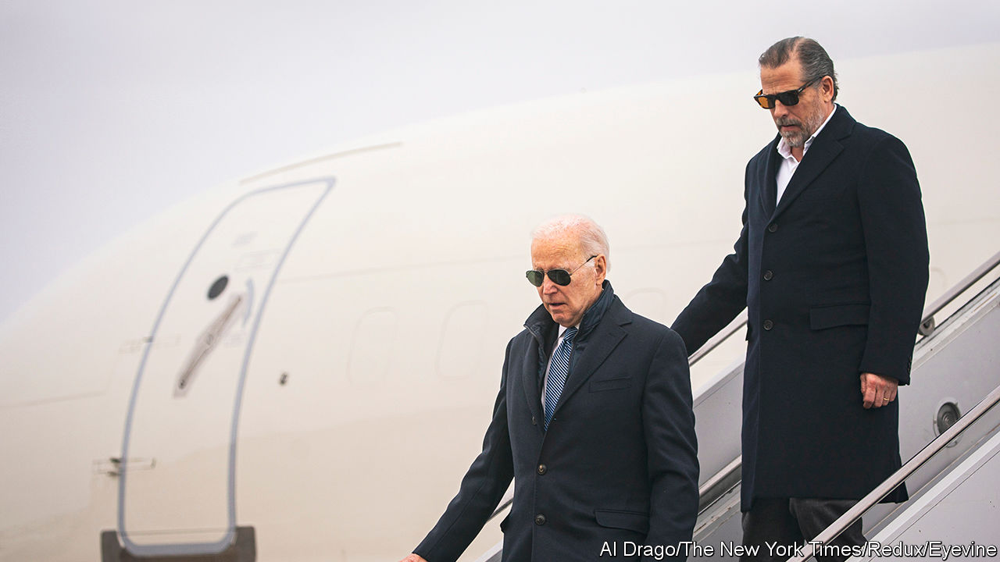

###### Crack case

# Hunter Biden’s plea bargain will not stop Republicans chasing him 

##### But it may help his father draw a line under the affair 

 

> Jun 22nd 2023 

If there ever was a chance that Joe Biden was going to distance himself from his wayward son, Hunter, it was squashed in mid-April, when the president paid an official visit to Ireland. As Mr Biden criss-crossed the Emerald Isle Hunter was constantly by his side, wearing matching aviator sunglasses. According to the a right-wing news website, Mr Biden’s lawyers, who are representing him in a case concerning child-support payments in Arkansas, claim that their client even shared a hotel bedroom with his father in Dublin. Mr Biden repeatedly told crowds how proud he was of Hunter.

Mr Biden’s loyalty is genuine. But his advisers will be hoping it is also politically savvy. After five years, the criminal investigation against Hunter Biden may be coming to an end. On June 20th David Weiss, the United States attorney in Delaware, the Bidens’ home state, filed charges against the president’s son, noting that a plea bargain had been agreed. 

Hunter Biden will plead guilty to two misdemeanour charges of not paying taxes. A felony charge of illegally purchasing a gun (for which Mr Biden apparently lied on a background-check form about his use of crack cocaine) will be dismissed after a period of probation. The president’s son thus avoids a prison sentence. The judge could in theory reject the agreement, but that is unlikely.

Donald Trump compared the punishment to a “traffic ticket”, arranged by a “corrupt” Department of Justice. Ron DeSantis, the governor of Florida and Mr Trump’s main Republican rival, called it a “sweetheart deal”. But there is little reason to think that Mr Biden has been especially generously treated. Mr Weiss was appointed by Mr Trump, and kept in place so that he could continue the case. Just one in 50 federal criminal cases goes to trial, and few first-time offenders for non-violent crimes are sentenced to prison. Prosecutions of people who lie on federal forms when buying guns are extremely rare. According to data extracted from the government by the , just 298 cases were filed in 2019, though there were almost 170,000 refusals from background checks that year.

Will the conclusion of the case mean that Hunter’s problems are over? That is not yet guaranteed. Since January James Comer, the chairman of the House Oversight Committee, has released a steady drip of details about Mr Biden’s financial dealings when his father was vice-president. Over a period of several years the younger Mr Biden was paid large sums of money by a wide range of foreigners, who seemingly thought that by paying Hunter they could get closer to Joe. Mr Weiss’s statement said that “the investigation is ongoing.” 

Yet there have already been five years of investigation, and so far nothing has emerged that shows Joe Biden acting in any way other than as a loving father. His son seems mostly to have overcharged gullible foreigners for legal services, which is not obviously illegal. More charges seem unlikely. For President Biden, his son’s willingness to own up to wrongdoing can be contrasted with Mr Trump, who is fighting his own criminal charges. As long as Hunter can stay clean, and so not break his probation, he can probably go back to his latest pursuit: abstract painting. ■


