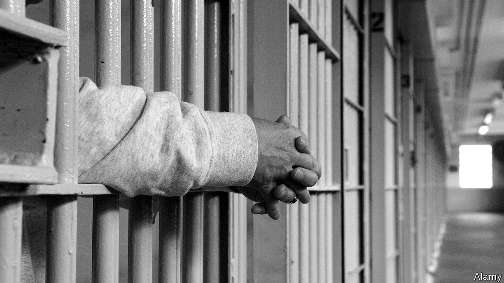

###### Murder on his mind

# Nearly all Louisiana’s death-row inmates have filed for clemency 

##### The lame-duck governor could grant it before his term ends in 2024 

 

> Jun 22nd 2023 

A final term gives a politician an opportunity for courage. John Bel Edwards, Louisiana’s lame-duck Democratic governor, seemed to be seizing it when he announced his opposition to the death penalty in a conversation on faith and leadership at Loyola University, a Jesuit college, in March. In a state where Donald Trump trounced Hillary Clinton in 2016 and easily captured the eight electoral-college votes in 2020, most voters have long approved of putting inmates to death. Despite newfound support from the outgoing governor, a bill to ban the practice died in committee in May. Abolishing it, Republicans and prosecutors argued, would incentivise murderers to go rogue. 

Mr Edwards’s political bravery is now being put to the test. On June 13th, 51 of the state’s 57 death-row inmates filed for clemency (the other six chose not to do so). A governor-appointed parole board will hear their cases one by one—the defence has just 15 minutes to argue for the life of each inmate—and could recommend that the governor swap out capital punishment for life imprisonment without parole. 

Lawyers at Capital Appeals Project, the non-profit behind the mass filing, think their best bet is to argue for a systemic indictment of the state’s protocols. That is why they chose to go all in instead of testing the most sympathetic cases first.

Of the people sentenced to death in Louisiana, 67% are black and most killed a white person. Ronald Dominique, a white man known as “the Bayou strangler” who raped and murdered 23 (mostly black) boys and men in the decade to 2006, did not get the death penalty, whereas Bobby Hampton, a black man, is on death row for allegedly killing a convenience-store clerk during a 1995 robbery in which there is evidence that another man was the shooter. Though the Supreme Court ruled that it is forbidden to execute a person with an intellectual disability, 40% of those on death row have one. The defence points to a concentration of sentences coming from two parishes as evidence of prosecutorial overreach; and notes that since 1976, 83% of the state’s capital cases have been reversed. 

Louisiana, however, has less of an appetite for killing than other states, says Cecelia Kappel, a defence lawyer. In the past five decades, the Bayou State executed 28 people (and none since 2010); Texas killed 583 and Oklahoma 120. Beyond a struggle to get the right drugs—some pharmaceutical firms now refuse to supply prisons with the chemicals used to kill—many attribute the resistance to the state’s Catholic heritage. In 2022 Pope Francis declared capital punishment “morally inadmissible” in all cases. Sister Helen Prejean, a nun from New Orleans, says a pro-life state should not put people to death. Though Republican lawmakers are gung-ho about , their law-and-order convictions seem to trump their inclinations to preserve adult life. 

The race to replace Mr Edwards is already under way. The attorney-general, Jeff Landry, leads the pack: fundraising reports show he has far more cash on hand than anyone else. His office plans to fight the clemency pleas and on the campaign trail he has called for executions to start again. With each passing day the window for mercy in Louisiana closes a little more. ■


