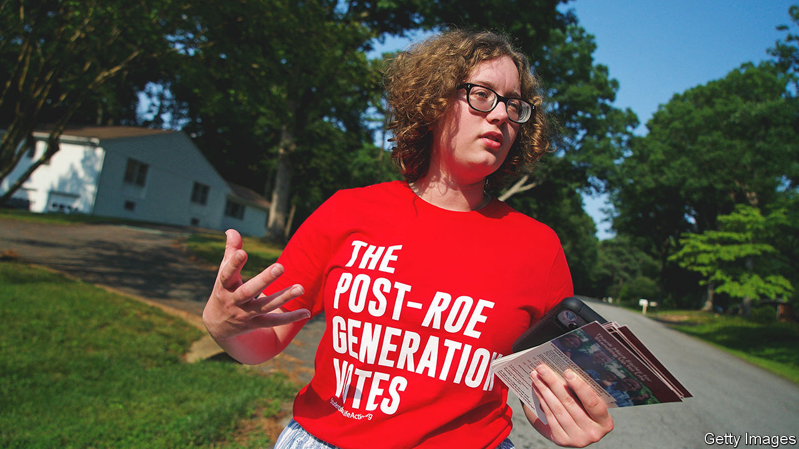
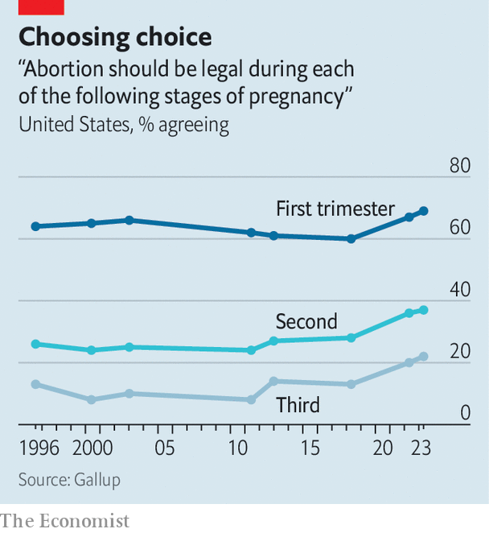

###### Abortion politics

# One year after Dobbs, America’s pro-life movement is in flux 

##### Two factions are jockeying to lead it 

 

> Jun 22nd 2023 

FOR THE first 12 years of her life Audrey Wascome’s grandparents raped her to make child pornography. She dodged pregnancy, but because of scar tissue her bladder no longer works as it should. On May 10th Ms Wascome, now an anti-violence advocate, testified before the Louisiana House’s criminal-justice committee for a bill that would carve out exceptions for rape and incest from the state’s abortion ban. Pro-lifers responded by calling for punishment for rapists rather than “death penalty” for fetuses, and argued that exceptions would make women clamour to put ex-lovers behind bars to “dispense with the inconvenience of giving birth”. Fixing one tragedy with another, they said, does no good. At roll-call the bill died, with lawmakers voting neatly on party lines. 

After the vote, pro-lifers convened for a celebratory lunch in the private suite of the lieutenant-governor. A pastor prayed for “the unborn life, liberty and limited government”. Like the movement overall, many of the pro-lifers at the capitol were born-again Christians—a “God-squad” of mostly white Catholics and evangelicals who consider themselves to be wrestling an evil as grave as slavery or the Holocaust.

Before the ruling in , which one year ago scrappedand let states ban abortion, pro-lifers were a pretty united bunch. Leaders and grassroots organisers found a common enemy in . But since the Supreme Court decided to “stay out of the dehumanisation business for good”, as one pro-lifer put it, the movement has been in flux. After the festivities—some say the founding fathers rejoiced in heaven when  fell—pro-lifers realised sending power back to the states was just the beginning. “ was the day we waited for for close to 40 years,” says Gene Mills, head of the Louisiana Family Forum, a non-profit group. “What now?”

 


They agree on one thing: the work is far from done. Abortion is not outlawed everywhere, and where it is, women circumvent bans by driving to out-of-state clinics or buying pills online. In California and New York, which together recorded a quarter of America’s abortions before , nearly 23,000 fetuses are still aborted each month. Many find the new patchwork of policies morally untenable, comparing it to pre-civil-war times when slavery was legal in some states, but not in others.

Fiercer opposition also makes things harder. Between 2020 and 2022 the share of Americans who vowed to vote only for pro-choice candidates nearly doubled; in the five years to 2023 the percentage who say third-trimester abortions should be legal rose from 13% to 22% (see chart). To many on the left,  is now the animating force that  was on the right.

Hearts, minds and “born privilege”

Different pro-life factions, however, have different priorities. Wyoming has extended Medicaid for new mothers and North Carolina pledged $160m for child care, foster care and parental leave. New Mexicans are looking into the Comstock Act as a basis for a national ban, Arkansans are building a “monument to unborn children” at their capitol and Texans are working on the legal logistics of criminalising travel for abortions. Some are flirting with a ban on morning-after pills, others are attacking in vitro fertilisation, arguing that too many “babies on ice” are discarded.

Two broad camps are jockeying to set the movement’s direction. Establishment pro-lifers use political connections to score policy victories with judges and legislators. The National Right to Life Committee, the oldest pro-life organisation, attributes ’s fall to years of “chipping away” at it. In defence of a 15-week ban, Marjorie Dannenfelser, the president of Susan B. Anthony Pro-Life America, another big group, said that promoting politically viable policies is more important than gunning for gold. Incrementalists point to Kansas and Kentucky, both Republican states that rejected abortion-ban referendums last year, as evidence that rash moves can backfire. 

Younger pro-lifers, boosted by groups like Students For Life, tend to be more absolutist. Though a greater share of older people think abortion should be illegal in some or all cases, 18- to 29-year-olds are most likely to want total bans. Budding activists resist any exceptions, dreaming of a federal ban and of going after birth-control pills. Being “massively pro-family” is where they break with their parents’ generation, says Zachary Schnaars, a final-year student at Louisiana State University. He feels his cohort has suffered more from the decline of the family unit.

Many have replaced the “hard-core, alt-right talk of hellfire” with language more empathetic to the mother, says Keagen Alexander, a student from Houston. Using the lingo of the left, young advocates talk about “born privilege” (discrimination against the unborn) and the environmental costs of “chemical abortions” (for which there is no scientific evidence). They reckon these are the best ways to win over other young hearts and minds. 

Historically, incrementalists have not chided the movement’s fringe for going too far, even when extremists shot providers and firebombed clinics in the 1980s, says Karissa Haugeberg of Tulane University. The radicals made the establishment look more reasonable. Things changed when in May 2022 a Louisiana legislator proposed a bill to let the state bring homicide charges against women who had illegal abortions. Over 70 pro-life organisations opposed it. Backing the bill threatened the case that they had worked so hard to construct: that being anti-abortion is also pro-woman. Radicals pushed back, arguing that if one truly believes that abortion is murder it is logically inconsistent to fail to prosecute the killer. In this ethical framework, rape and incest exceptions make no sense. ■


