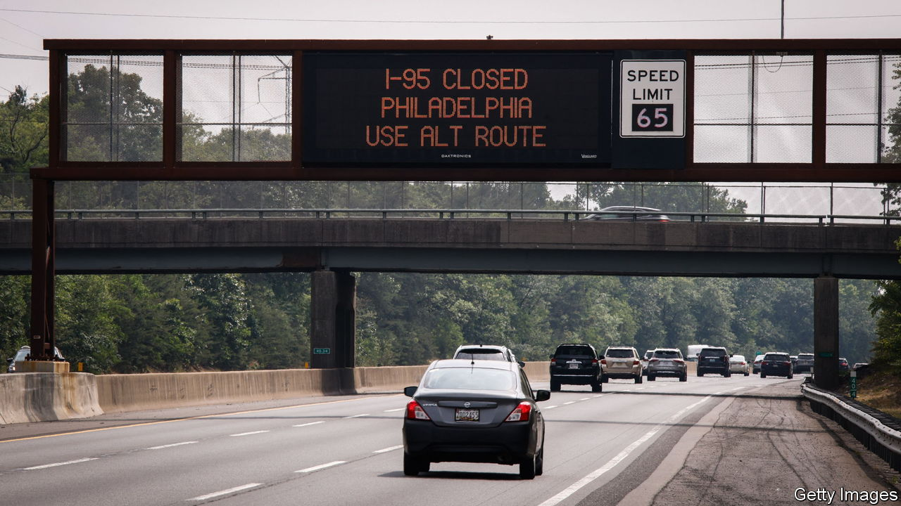
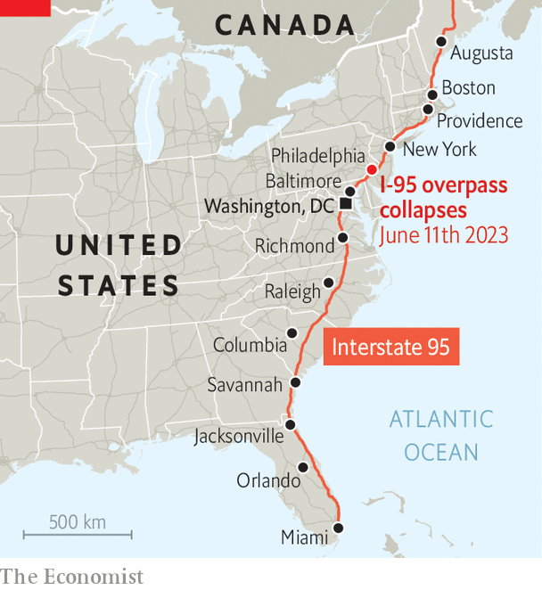

###### The road most travelled

# Pain and pride around a vital American highway 

##### The collapse of a section of Interstate 95 highlights its importance 

 

> Jun 22nd 2023 

On June 11th a petrol tanker tipped over and burst into flames underneath an elevated section of Interstate 95 in Philadelphia. The heat caused the northbound lanes to collapse and compromised the southbound lanes, shutting down traffic in both directions. Experts initially said repairs would take months. The disruption throws a spotlight on the I-95, which stretches for over 1,900 miles (3,100km) from Maine to Miami in Florida. 

 


It is not America’s longest highway—that is the I-90 from Seattle to Boston—but it is the busiest in terms of miles travelled. (Along certain stretches, users complain, it also stands out for truly dreadful driving.) It runs through or near many of America’s big urban areas (see map). The portion that collapsed was in a particularly dense stretch that carried 160,000 vehicles a day, including 14,000 lorries. 

Pete Buttigieg, the transport secretary, said when he visited the site that the disruption to trucking will put “upward pressure” on shipping costs on the east coast, which may raise the cost of consumer goods. Mark Zandi, chief economist at Moody’s Analytics, a research outfit, says the highway collapse will not have a material impact on the macroeconomy, but “it has been a pain in the neck.”

Many lorries have been stuck in snarling congestion in places not designed for big rigs. Rebecca Oyler, head of the Pennsylvania Motor Truck Association, an industry group, says one lorry driver taking a detour pulled down power lines, knocking out electricity in the vicinity. “I’ve heard from some trucking companies that simply have given up their routes,” she says. “It’s just simply not feasible for them to get in and out…with all the congestion and come out on top.” 

President Joe Biden, a big proponent of infrastructure investment, flew over the site of the collapse and pledged federal dollars to help repair it quickly (Pennsylvania also happens to be a vital swing state). The bill for the rebuild is put at $25m-30m. Workers are on site round the clock. A live webcam of their progress is compulsive viewing. Josh Shapiro, Pennsylvania’s new Democratic governor, said that it is being shown in Philly sports bars. During press briefings at the site, he stressed Philadelphia’s grit and determination. More than one observer called him presidential. 

Mr Shapiro announced on June 20th that traffic will flow on the I-95 this weekend. A temporary road was built at remarkable speed. Mr Shapiro was not surprised. “We can get big things done,” he said. “We see a crisis and manage it effectively.” ■


