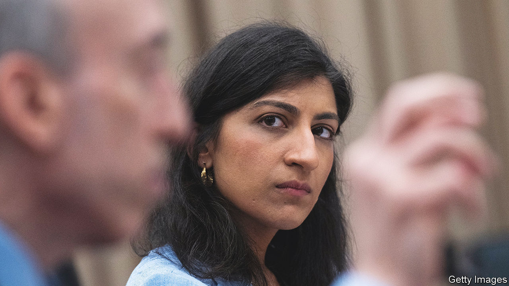
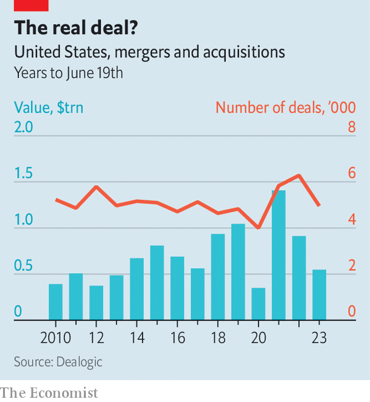

###### America’s competition cops

# Why Joe Biden’s trustbusters have fallen short of their ambitions 

##### Blame flawed leadership and competing priorities 

 

> Jun 21st 2023 

AMERICA’S TOP trustbusters mean to make their policing presence felt. Lawyers, bankers and financiers now “recognise that there are cops on the beat…that we’re vigorously looking to protect the American public from illegal mergers,” says Lina Khan, chair of the Federal Trade Commission (FTC), which enforces consumer-protection and competition laws.

Whether Ms Khan, who became the youngest-ever chair of the FTC two years ago this month (she is 34), is a good or bad cop is a matter of fierce debate. Progressives applaud the greater scrutiny she has brought to companies’ conduct—including her latest lawsuit, announced on June 21st, against Amazon, for alleged deception involving its Prime subscription service. Corporate America loathes her more partisan, boisterous approach to merger enforcement. Others accuse her of treating all big firms as criminals and most mergers as offences. David Gelfand, a lawyer at Cleary Gottlieb who worked on antitrust in the Obama administration, compares the approach to “going into a neighbourhood and saying you have a crime problem, so you’re going to stop-and-frisk everybody”.

Joe Biden’s appointment of Ms Khan was a signal of seriousness about fighting corporate concentration. In 2021 the White House issued an executive order calling on agencies across government to focus on competition. It reckoned the dominance of a small number of firms in many markets meant higher prices and lower wages. 

Ms Khan was a surprising pick, given her lack of experience as a legal practitioner. (She rose to prominence as a law student in 2017 thanks to an article arguing that Amazon was a monopolist, and later worked for Congress, as a law professor and at a think-tank.) Mr Biden also appointed Jonathan Kanter, a lawyer who had worked against Google, to lead the antitrust division at the Department of Justice (DoJ). The two have spearheaded a campaign to reboot trustbusting. They are pushing beyond the “consumer-welfare” standard (examining consumer prices) to encourage a broader look at other harms, including to labour and small businesses. 

How successful have they been? They have certainly reframed public thinking about trustbusting. “Six years ago, if you didn’t buy into the consumer-welfare standard, you weren’t a serious person. Now that’s completely gone,” says Luigi Zingales, a finance professor at the University of Chicago Booth School of Business. 

 


Through the threat of lawsuits and requests for information, which boost legal bills and the uncertainty of closing mergers, the trustbusters have also deterred some splashy dealmaking. So far this year there have been 4,955 deals in America, according to Dealogic, a data firm, only 3% fewer than the average for the same period over the five years before. But the total value is down some 40% on the previous average, suggesting firms are avoiding larger acquisitions (see chart). 

Target companies are insisting on bigger break-up fees should an acquisition not fly. For example, Figma, a software company, will get $1bn in cash from Adobe, its potential acquirer, if the $20bn deal is scuttled. (The DoJ is said to be considering suing to block it.) But on the legal front the trustbusters, especially at the FTC, have notched up plenty of losses. The most significant court victory has been the Justice Department’s challenge to Penguin Random House’s proposed $2.1bn takeover of a rival publisher, Simon &amp; Schuster. In October a judge concurred that the deal would hand the publisher more pricing control over authors’ earnings, and blocked it. 

High-profile lawsuits are still winding their way through the courts, including two against Google (one initiated during the Trump administration, one by Mr Kanter’s office, which is seeking to break up Google’s advertising business). That one will be heard by a jury, instead of a judge, next year, in an effort to bring antitrust back to the people. “It’s been at least 50 years, if not longer, since we’ve done a case like this in front of a jury,” says Mr Kanter. Another big lawsuit against Amazon, possibly over giving preferential treatment to its own goods and services, is in the offing this year, predicts Konstantin Medvedovsky, an antitrust-watcher who works for a fund betting on merger outcomes.

Ms Khan has taken a more speculative approach. Having argued that enforcers of yore were too timid to fight tech deals that snuffed out competition, such as past acquisitions of WhatsApp and Instagram by Facebook (now Meta), she challenged Meta’s deal for Within, a fledgling maker of virtual-reality fitness apps. But a judge rejected the FTC’s request for an injunction. More recently the FTC sued a second time to block Microsoft’s $69bn acquisition of , a gaming firm, arguing it could suppress competition in the video-game market. A hearing was set to begin on June 22nd—a very public test of whether Ms Khan is choosing the right deals to contest.

Lacking a federal privacy law or new antitrust legislation, which Congress has not approved, Ms Khan has persevered alone. But in some instances she has “sued on the grounds not of what’s currently illegal but what’s undesirable”, says Matt Perault, a professor at the University of North Carolina at Chapel Hill. That could backfire. “When you start losing cases, you set back the cause,” says Larry Summers, a former treasury secretary.

The administration’s mixed record reveals three things it missed as it set out to attack corporate concentration. First, there is a problem of competing goals. The court is “extraordinarily friendly to large corporate interest”, points out Nancy Rose of the Massachusetts Institute of Technology, yet Mr Biden has not made it a priority to appoint judges with expertise in antitrust, pushing instead to diversify the bench by race and background. “It mystifies me that there hasn’t been more effort to go to school on a strategy that [President Ronald] Reagan used very successfully,” which was nominating like-minded judges on antitrust, says Bill Kovacic of George Washington University Law School, a former FTC chair. To shore up the stability of the financial system, meanwhile, big banks have been allowed to merge with smaller, failed ones: an administration that has tried to fight consolidation has thus enabled it. 

Busting trust

The second problem is that the person with vision for a movement may not be the best person to lead it. “The arguments they used to achieve power have gotten in the way of exercising it,” says Mr Kovacic. Ms Khan took command after saying that the agencies had been failing for decades to do proper policing. That has dented morale, especially at the FTC. A poll last year of employees found that 49% said they trusted senior leadership, down from 80% in 2019. (Some observe that Mr Kanter has been more diplomatic in his criticism of staff’s past work than Ms Khan, and also more strategic in the cases he has brought.) 

The administration has also underestimated unintended consequences. Ms Khan has pushed the FTC to try to accomplish a lot through new rules, including  (which bar employees from working for a competitor) and asserting its authority to pursue privacy violations. “In many ways, I view my tenure as a conservative one,” says Ms Khan. “We’re really going back to the original vision of the FTC as Congress envisioned it.” But the courts and Congress may not see it that way. The Supreme Court could ultimately take up the question of the FTC’s authority and circumscribe it. 

Still, antitrust is a long game. “It took 12 years for the Reagan administration”—eight under Reagan, four under his successor, George H.W. Bush—“to get where they wanted on antitrust doctrine. We’re in year two,” says Tim Wu of Columbia Law School, who worked in the White House on competition policy. Technology, including the rise of AI, will surely affect competition, but it is too early to say how, says Mark Warner, a Democratic senator. 

Some wonder how much of Mr Biden’s policy will outlast him if he does not win a second term, given his limited victories so far in court and the threat that some of the signature policies will be challenged there, including the ban on non-competes. Others are more optimistic. Bashing big business has become more common among populist Republicans, including a prominent presidential aspirant, Ron DeSantis, the governor of Florida. “The politics of this have changed, and no one wants to be on the other side of it,” insists Mr Wu. Look out for Republican presidential hopefuls competing on competition policy. ■


