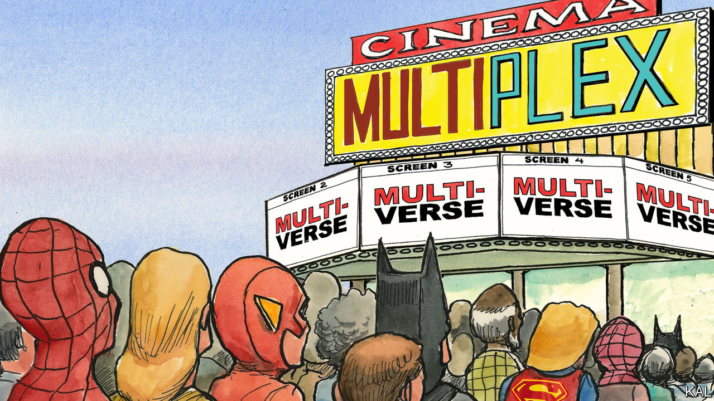

###### Lexington

# Why the multiverse is eating popular culture 

##### It offers escape for a society lamenting its traumas and regretting its choices 

 

> Jun 22nd 2023 

“Oh, JAKE,” brett said, “we could have had such a damned good time together.” So writes Ernest Hemingway in “The Sun Also Rises”. “Ahead was a mounted policeman in khaki directing traffic. He raised his baton. The car slowed suddenly pressing Brett against me. ‘Yes,’ I said. ’isn’t it pretty to think so?’” 

It pretty to think so, and if Hollywood got its mitts on Hemingway’s oeuvre today, the story would not end with such aching futility. As the baton came down the scene would jump to another world, or timeline, where Brett and Jake—he, in this other reality, having dodged that emasculating war wound—are rolling in the hay, then (wave of the baton) another reality in which Brett, now a matador, is bringing a bull to its knees and then (this time a wave of her red cape) another where she is helping a wrinkled Cuban fellow in a tiny boat reel in a giant fish, with a heave from the Incredible Hulk and, inevitably, his chuckling buddy Thor.

 It is a multi-splendoured thing, the multiverse: a science-fiction plot device that has been around for decades, yet has suddenly spread through cinema and television with the speed of Quicksilver and the ensorcelling power of Dr Strange (both © Marvel Entertainment). By combining characters and cultural references old and new, it can bind together grandparents, parents and children, as well as many brands and the most convoluted plots. 

The newest summer spectacle, “The Flash”, resurrects not only three different Batmen (played by Ben Affleck, Michael Keaton and George Clooney) but also several Superpeople of both genders reaching back to the black-and-white era. It winks at the audience with references to “Star Wars”, “Scooby Doo” and “Back to the Future’‘. The effect is of a self-aware palimpsest begat by TikTok and a pinball machine. “Look at this!” cries the Flash—well, one of the two or three Flashes—at the climax. “These worlds collapsing and colliding! We did this!” Indeed they did (truly, it is a meta-multiverse). Just how they did it is worth pondering only in a dorm room blue with pot smoke. Using a bowl of spaghetti, a Batman explains that “Time isn’t linear,” though it must be admitted that, during the film’s 144 minutes, it can certainly feel that way. 

Much of this is just good fun, of course. Asking why one enjoys a rollercoaster ride is an invitation to turn delight into homework. Yet the ubiquity of the concept of the multiverse does raise the question: Why now? Technology is clearly part of the answer. It has made these movies possible not just through advances in graphics but by training audiences to toggle among countless open-browser tabs, even as their politics and news media are teaching them that reality is slippery, hard to name or trust. But certain themes that come up again and again suggest that these films also respond to some deeper yearning. 

Earlier this year a multiverse movie, “Everything Everywhere All at Once”, won seven Oscars, including for best picture. It was in essence a Marvel action film dressed up in musings about identity (as are, come to think of it, Marvel movies). Evelyn, played by Michelle Yeoh, is a Chinese-American immigrant who discovers she has great power in an alternative reality and must travel the multiverse to save it from destruction (via a bagel) by another powerful being who turns out to be a different-reality version of her alienated daughter. The two are reconciled and the multiverse saved by Evelyn’s embrace of empathy and kindness. 

The Flash, by contrast, after disastrously dashing back in time to tinker with events, discovers that to save the world he must let his mother die. “The Flash” may be tougher-minded, but the basic message is the same: parenting is hard. One hopes the sprogs take that in, along with their $12 popcorn.

As those summaries suggest, these films are also obsessed with choice and contingency. When the show ends and the lights come up you can feel less inspired than sad, considering a society suffused with regret, more preoccupied with individual trauma and with sorting out the past, and recycling its tropes, than dreaming of the future. The escapism on offer is not just the old comic-book fantasy of a humdrum existence transformed by a spider bite. It is that in another reality, right now, the audience member might have made choices that led to a grander life, or at least Hillary Clinton might have campaigned harder in the Midwest. 

Spidey sense

For Lexington’s money the best of this multiplying genre is the jazzy, animated series of “Spider-Verse” movies emerging from Columbia Pictures, the second of which is in cinemas now. In hisHitchhiker’s Guide to the Galaxy” novels, Douglas Adams romped with the idea of infinity, positing that it meant that anything imaginable, such as a planet of sentient mattresses, must exist somewhere. Each planet of the infinite Spider-Verse hosts a Spider-creature of some sort—a cat, a punk rocker, a Tyrannosaurus Rex—with a costume, powers and an agonising back story like that of the original Spider-Man, who failed to stop a robber who subsequently killed his beloved Uncle Ben. Interdimensional travel allows these Spider-beings to join forces, and can also bring them into conflict with one another.

Intimate tales of trauma and parental struggle are, as usual, chained to the onrush of Armageddon, but the series wears these themes both more lightly and more soulfully. In a fleeting scene in the new film (“Across the Spider-Verse”) the audience glimpses a Spider-therapist listening to a Spider-Man on a couch talking about his uncle. “Let me guess,” Spider-therapist interrupts with a hint of impatience, looking up from his pad of paper. “He died?”

The emerging arc of the series is that the hero, Miles Morales, is determined to transcend the cycle that the other Spiders accept as written. “Everyone keeps telling me how my story is supposed to go,” he exclaims. “Nah! I’m going to do my own thing.” It may be that the multiverse of cinematic multiverses will, in the end, offer up something new. ■


