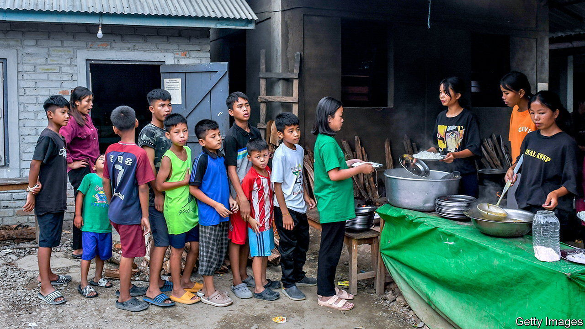
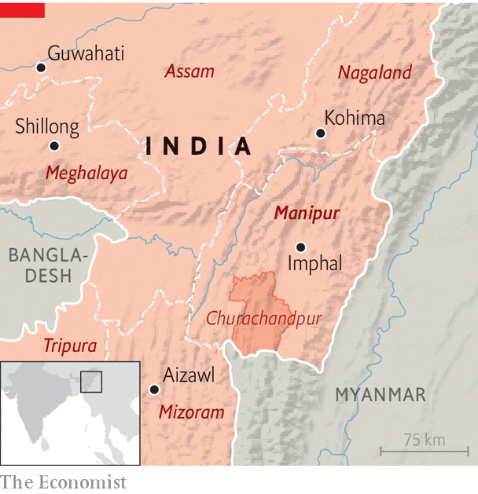

###### Closing Pandora’s box

# Ethnic conflict drags on in Manipur in India’s north-east 

##### An eerie calm follows an especially bloody phase, but yields no hint of a solution 

 

> Jun 29th 2023 

MANIPUR IS A state of fertile valleys and lush green hills on the border with Myanmar in India’s north-east, and home to some 3m people. For the past two months it has also been the site of a deadly and uncompromising flare-up in one of Asia’s longest-running ethnic conflicts. Though violence is currently subsiding, there seems to be little political will to resolve the underlying conflict, which could boil over again at any time.

The violence pits the state’s majority-Hindu Meitei community against its hill tribes, chiefly Christian Kukis. The Meitei, who dominate the valley, including the capital, Imphal, have long claimed that Kukis have been unfairly privileged by their tribal status. The Kukis oppose demands by the Meitei to be included in the state’s list of “scheduled tribes”, which would expand their access to government jobs allocated by tribal quotas, and allow them to settle in tribal areas. Kukis fear this would further strengthen Meitei economic dominance and threaten their own already limited livelihoods. 

 


More than 130 people have been killed and hundreds more injured in mob attacks and clashes with security forces since the violence worsened following a protest march on May 3rd, organised by a union of tribal students against the inclusion of the Meitei in this list. Hundreds of homes and churches have been burnt and members from both communities living in mixed areas have been forced to flee, with as many as 60,000 displaced. A process of ethnic cleansing is largely complete, say people living in the state. 

The escalation was preceded by months of simmering conflict in which the state government has not been a neutral party. Its chief minister is Biren Singh of the Bharatiya Janata Party (BJP), the ruling party nationally, who is a Meitei. The government accuses Kukis of peddling drugs and sheltering illegal immigrants. Under the guise of protecting forest land, it had been stepping up evictions in tribal villages in recent months.

Lately the violence has subsided, owing both to a heavier and better-managed central-government security presence and to disruption from heavy monsoon rains. Residents in both the capital and the hills report a tenuous calm. The central government has deployed the army to guard a buffer zone between tribal areas and the valley; most of the state has had no internet service since early May.

The conflict remains unresolved. A peace committee convened by the central government earlier this month was stillborn when leaders from both sides declared its members unacceptable and refused to engage with it. Kuki leaders have revived old demands for wide-ranging political autonomy before agreeing to talks, a condition Mr Singh has ruled out. 

The chief minister himself appears to be on increasingly shaky ground. After briefing the home minister, Amit Shah, in Delhi over the weekend, Mr Singh conceded to reporters that the situation was “very chaotic” and “We can’t say what’s happening now.” Yet he also seems to be seeking to project a contradictory sense of normality. On Tuesday he ordered government employees to return to their posts or face having their salaries cut, much to the chagrin of those who had been displaced. They are scared to return to their homes, many of which have in any case been destroyed. “How can we go back if we cannot be sure that the government will protect us?” asks Benjamin Mate, a Kuki and BJP politician, who fled from Imphal in May. 

With the state authorities seen as weak and compromised, leaders from both sides hope the central government may broker a deal. Yet despite a four-day visit to the state last month by Mr Shah, few signs of what such a political solution might look like have emerged, beyond a promise from the central government to maintain security in tribal areas. Renewed violence remains a threat. Vigilante groups still control thousands of weapons looted from state-police armouries.

Meanwhile, displacement is turning into a humanitarian disaster. Relief camps across Manipur are filling up with people coming back to the state after exhausting their relatives’ patience. One resident of Churachandpur, a tribal district in the south, says the local camps currently house some 16,000 people in atrocious, unhygienic conditions exacerbated by heavy rain. Fevers and diarrhoea are widespread; markets remain shut and medicine and food are running low, as relief goods promised by the state government have yet to reach the area. If a deal remains elusive, displacement may soon prove deadlier than violence. ■

