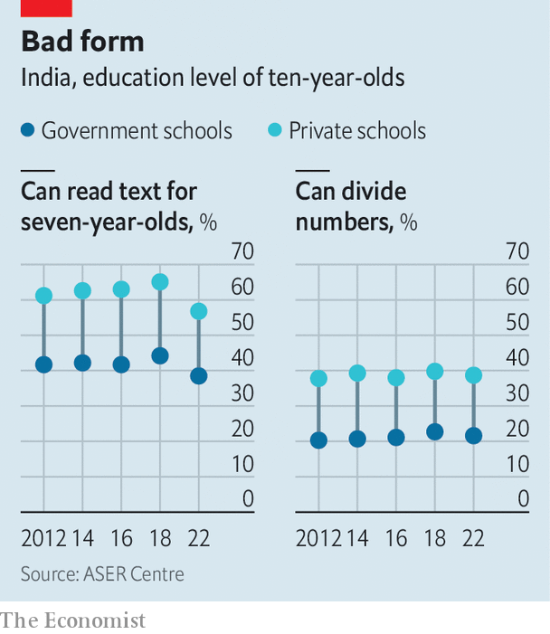

###### Missing the mark

# Narendra Modi’s ultimate test—educating 265m pupils 

##### Bad schools threaten India’s dream of being a superpower 

 

> Jun 28th 2023 

CLOSING THE factory in the north Indian state of Uttar Pradesh was not a decision he took lightly, says the boss of a manufacturer based in Mumbai, India’s business capital. Yet the local workforce’s lack of skills and discipline meant it made sense to produce in the south and west. “We offer training at all our production sites, but bringing people to the required level simply wasn’t worth our time.”

The tale illustrates one of India’s biggest problems. Its education system is failing it. At some 1.4bn, it has  than China, and its economy is . It needs to make hundreds of millions of its young people employable, particularly in the poorer, more populous northern states. Otherwise it could waste much of its growth potential and court instability as undereducated, underemployed youngsters lose hope.

Graduates of its leading universities are high-flyers at the world’s best firms. But many of the 265m pupils enrolled in its schools will leave them barely able to read or do basic maths. aser,  an annual survey of children in rural India (three-quarters of the total), found that in 2022 just a quarter in Year 5 (when they are ten) could do basic division and a mere 43% managed to read a Year 2-level text. Of those in Year 8, when compulsory education ends, barely 45% could do basic division and less than 70% could read a Year 2-level text. 

 


Even more alarming is the lack of progress. Though school infrastructure and enrolment have improved in recent years, with more children attending schools that have toilets, running water and sometimes even computers, learning has not kept pace. By 2022, maths skills had barely budged in a decade; reading skills had declined, partly owing to learning lost during the covid-19 pandemic. These numbers hide regional variations; learning levels tend to be higher in richer southern states and lower in the poorer north. 

One reason is a long-standing focus on elite education inherited from British rulers, keen to train administrators to run the empire. Post-independence governments relied on a small, brainy elite to build the new nation. “It’s a sorting mechanism, a system for the first two rows of the class,” says Yamini Aiyar, who heads the Centre for Policy Research (CPR) in Delhi.

The system’s narrow emphasis on finishing a rigid syllabus assumes skills few children have when they start school—and never get a chance to acquire. It does little for the vast majority of pupils at non-elite government or low-cost private schools. Yet they are the ones India’s economy needs to broaden from its focus on services and increase its heft in manufacturing, which it hopes will account for 25% of GDP in 2025, up from 17%. Even a factory job requires skills many school leavers lack.

Some signs of change can be seen. On a recent afternoon in Bajraha village in Bodhgaya in the eastern state of Bihar, a dozen children in their early teens sat in a circle in the village hall as Baijanti Kumari, a local volunteer, drew letters on a blackboard. In their summer holiday the children were learning how to read a simple story and do basic maths, things they had not learnt in four years at school. The programme, organised by Pratham, an Indian nGO, along with the state government, aims to stop them and some 1.5m other children across Bihar falling further behind in the new academic year. Similar efforts are afoot in Uttar Pradesh and Madhya Pradesh, reaching some 3.3m children. 

Such catch-up activities are welcome, but cannot fix the system’s many problems. Attendance by children remains poor, with the national average at around 70% and closer to 50% in states like Bihar. Teachers in government schools are paid well, but penalised little if children fail to learn anything. Data published in 2017 showed that a quarter of spot-checks found teachers absent from schools.

Fixing those problems requires complex cultural changes, says Ms Aiyar of cpr. One state-level government that has done more than most is in Delhi, India’s capital, under the Aam Aadmi Party (AAP). Starting in 2015, it massively boosted spending on education. The aim was to improve infrastructure and the quality and accountability of teachers and administrators in its secondary schools through a combination of curriculum reform, training and community involvement. The approach worked: for the past eight years, formerly grotty government schools in the city have done far better than private ones. 

Modified ambitions

Narendra Modi’s government has been less decisive. When he took office in 2014, he promised that national spending on education would rise to 6% of gdp, close to what is spent in Brazil (6%) or South Africa (6.6%). Yet on its own figures it has never cleared the 3% mark, though the World Bank, source of the figures for the other countries, puts it at 4.5%. His government has also made alarming moves to “rationalise” textbooks, stripping them of references to undesirable subjects, from India’s Muslim heritage to the theory of evolution.

Yet it has begun to overhaul the education system. A national policy, published in 2020, wants every year-3 pupil to achieve basic reading and maths skills by 2027, a welcome if wildly ambitious target. As in Delhi, teachers are being urged to forsake rigid adherence to the curriculum for teaching at their pupils’ actual level. More emphasis is put on pre-primary education, one of the most cost-effective ways to improve learning. The policy also provides for improved teacher-training, reduced non-teaching responsibilities and performance-based rewards.

Such efforts are better than simply spending more, says Karthik Muralidharan, an economist at the University of California, San Diego. Cheap interventions such as learning camps can help a lot. He adds that “volunteers can be very effective as supplemental instructors”, as they are local and so “more connected to the pupils”. Deepak Kumar, a 24-year-old university graduate who runs a summer catch-up camp from his family home in Bihar’s Gaya district, proves the point. He plans to support his pupils for the next year as he swots for government exams; no child has ever missed a class of his.

The covid-19 pandemic, when schools remained closed for the best part of two years, highlighted the importance of parental involvement in education, says Rukmini Banerji, who heads Pratham. Nearly a third of children now receive extra private tuition, up from a quarter five years ago. Policymakers want to deploy parental interest more systematically, setting up school-preparedness camps for mothers of children starting school and keeping them engaged through simple technology tested during the pandemic, such as videos, audio stories or texts with suggestions for activities. At one camp visited in Pune, Maharashtra’s second city, mothers were full of praise for the approach. “I always struggled to understand what my children were doing at school. Now I feel like I have a bigger stake in it,” says Sushma Deshmukh, the mother of a ten-year-old. 

Yet technology is not the magic fix for government failure that many in India’s burgeoning ed-tech sector once imagined: Byju’s, an education startup from Bangalore which as recently as April said it offered online classes to as many as 150m students, was this week scrambling to reassure investors after it lost three board members and its auditor.

Working out which reforms ultimately make the biggest difference will take years. Most important, says Mr Muralidharan, the government has to stay on the case. “They need to put in place independent mechanisms to measure what works, accept the results, and adjust policy accordingly.” Given the government’s aversion to data that contradict claims about its success, that may be too much to hope for. ■

