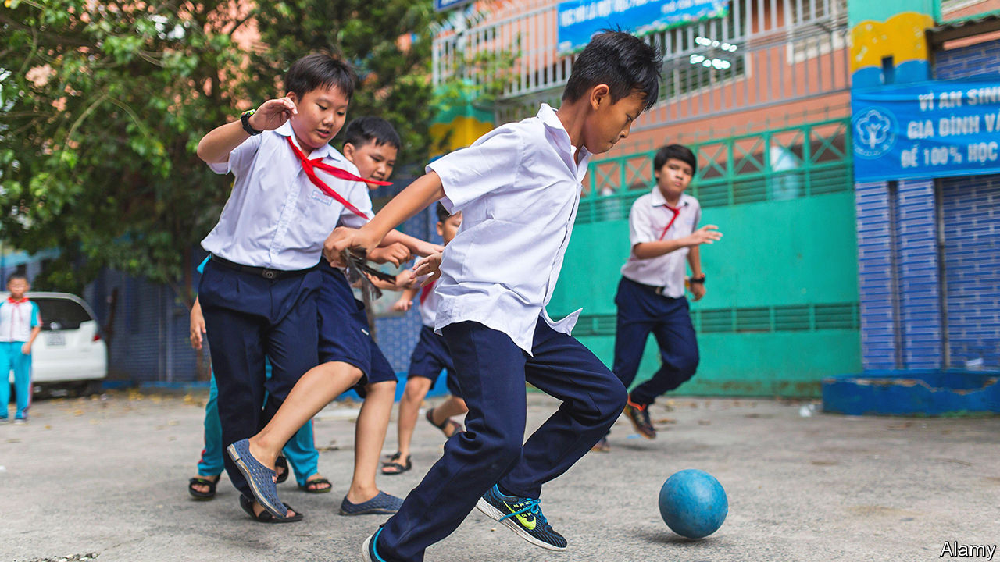
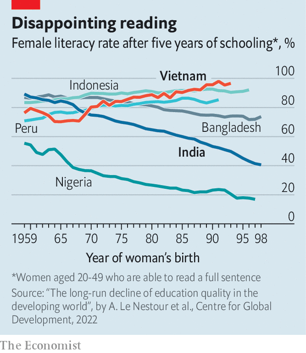

###### Best in class

# Why are Vietnam’s schools so good? 

##### It understands the value of education and manages its teachers well 

 

> Jun 29th 2023 

Ho Chi Minh, the founding father of Vietnam, was clear about the route to development. “For the sake of ten years’ benefit, we must plant trees. For the sake of a hundred years’ benefit, we must cultivate the people,” was a bromide he liked to trot out. Yet despite years of rapid economic growth, the country’s GDP per person is still only $3,760, lower than in its regional peers, Malaysia and Thailand, and barely enough to make the average Vietnamese feel well-nurtured. Still, Ho Chi Minh was alluding to a Chinese proverb extolling the benefits of education, and on that front Vietnam’s people can have few complaints.

Their children go through one of the best schooling systems in the world, a status reflected in outstanding performances in international assessments of reading, maths and science. The latest data from the World Bank show that, on aggregate learning scores, Vietnamese students outperform not only their counterparts in Malaysia and Thailand but also those in Britain and Canada, countries more than six times richer. Even in Vietnam itself, student scores do not exhibit the scale of inequality so common elsewhere between the genders and different regions. 

A child’s propensity to learn is the result of several factors—many of which begin at home with parents and the environment they grow up in. But that is not enough to explain Vietnam’s stellar performance. Its distinctive secret lies in the classroom: its children learn more at school, especially in the early years. 

In a study in 2020, Abhijeet Singh of the Stockholm School of Economics gauged the greater productivity of Vietnam’s schools by examining data from identical tests taken by students in Ethiopia, India, Peru and Vietnam. He showed that between the ages of five and eight Vietnamese children race ahead. One more year of education in Vietnam increases the probability that a child can solve a simple multiplication problem by 21 percentage points; in India the uplift is six points. 

 


Vietnamese schools, unlike those in other poor countries, have improved over time. A study published in 2022 by researchers at the Centre for Global Development, a think-tank based in Washington, DC, found that in 56 of 87 developing countries the quality of education had deteriorated since the 1960s (see chart). Vietnam is one of a small minority of countries where schools have consistently bucked this trend. 

The biggest reason is the calibre of its teachers. Not that they are necessarily better qualified; they are simply more effective at teaching. One study comparing Indian with Vietnamese students attributes much of the difference in scores in mathematical tests to a gulf in teaching quality.

Vietnam’s teachers do their job well because they are well-managed. They receive frequent training and are given the freedom to make classes more engaging. To tackle regional inequality, those posted to remote areas are paid more. Most important, teacher assessment is based on the performance of their students. Those whose pupils do well are rewarded through presitigious “teacher excellence” titles.

Besides such carrots, a big stick is the threat of running foul of the ruling Communist Party. The party apparatus is obsessed with education. This percolates down to school level, where many head teachers are party members. 

The obsession has other useful effects. Provinces are required to spend 20% of their budgets on education, which has helped regional equity. That the party pays such close and relentless attention also ensures that policies are adjusted to update curriculums and teaching standards. Society at large shares the fixation. Vietnam’s families are committed to education because of its ingrained Confucianism, suggests Ngo Quang Vinh, a social-sector officer at the Asian Development Bank. He says that even poorer parents fork out for extra private tutoring. In cities, many seek schools where teachers have won “excellence in teaching” titles.

All this has reaped rich rewards. As schools have improved, so has Vietnam’s economy. But growth is testing the education system, suggests Phung Duc Tung, the director of the Mekong Development Research Institute, a think-tank in the capital, Hanoi. Firms increasingly want workers with more sophisticated skills, such as team-management, that Vietnamese students are not trained for. Growth has also pulled in migrants to cities, overburdening urban schools. More and more teachers are forsaking education for higher-paying jobs in the private sector. To ensure Vietnam remains best-in- class, the government will have to tackle these trends. As Ho Chi Minh liked to remind people, cultivation requires constant attention. ■

