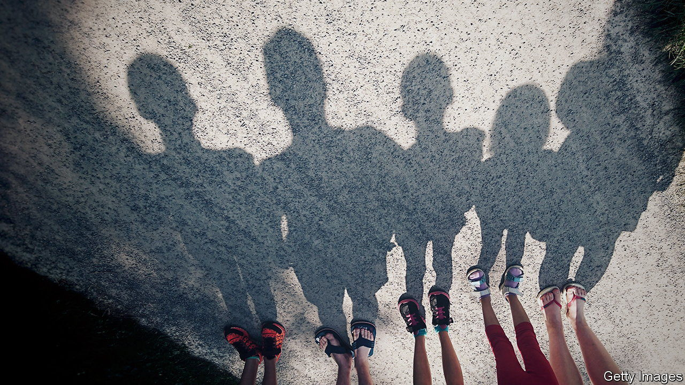
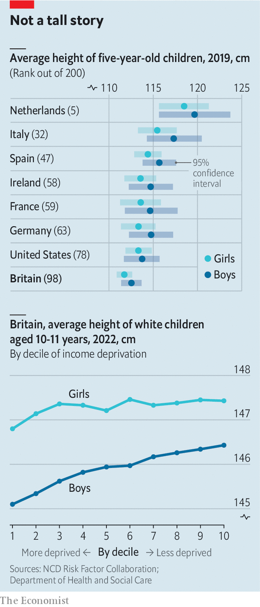

###### Britain’s badly fed kids

# Are young children in Britain getting smaller? 

##### Bad diets are the likeliest cause of problems 

 

> Jun 29th 2023 

A REPORT this week from the Food Foundation, a think-tank, notes the social cost of soaring food inflation: the poorest fifth of households would now need to spend half of their disposable income to eat a healthy diet. Instead, too many eat cheap, high-calorie but low-nutrition meals. That takes a toll. Years of poor diets lead to more obesity and affect children’s heights. 

 


A study in the in 2020 suggested British five-year-olds were already among the shortest in Europe (see left chart). That study, based on analysis of data up to 2017-18, indicated that average height started falling in 2014. Confirming that is not easy. Different factors could be at play, such as changing immigration trends: on average African and Caribbean children are taller than white children, while South Asians are smaller. Country comparisons may also be tricky, if ways of measuring differ. 

But deprivation clearly goes in hand with stunting. A comparison of 10- and 11-year-olds (all white, to set aside any ethnic difference) finds the average boy in the most deprived area of Britain is now 1.3cm shorter than one in the least deprived area. 

