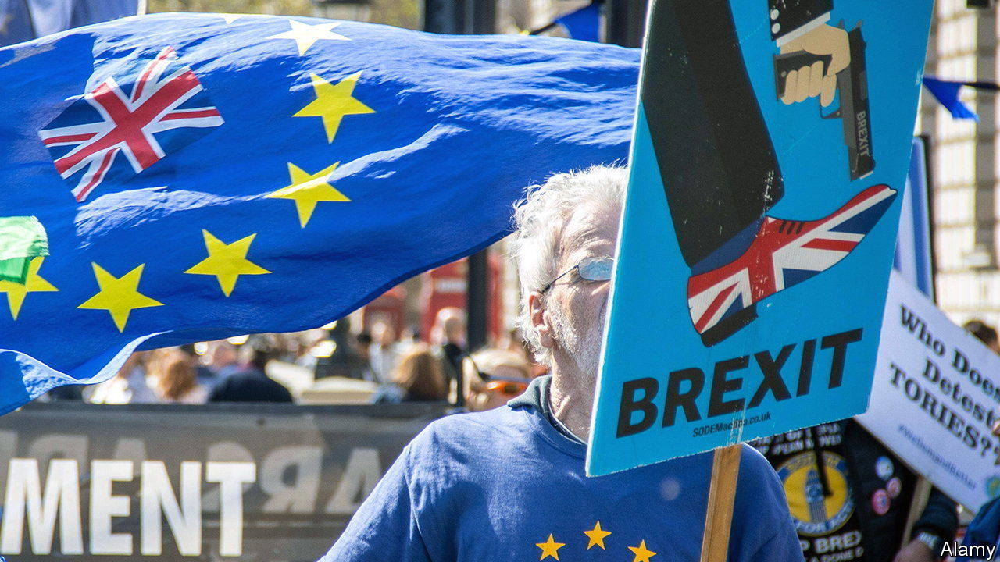

###### Buyers’ remorse

# As Britons grow more unhappy with Brexit, what happens next? 

##### Don’t expect anyone to talk of rejoining the EU 

 

> Jun 27th 2023 

POLITICS IS routinely dominated by the short run: in-party scraps; looming by-elections. But quietly shifting and longer-term trends risk being neglected. One such is the rise of disillusion with Brexit. Polls from YouGov, Ipsos and NatCen Social Research all find that sizeable majorities of Britons now regret the decision to leave the European Union. The latest numbers show a margin as wide as 60-40% for those wishing that Britain had remained in the EU, compared with the 52-48% vote to leave in June 2016. 

Had all of those with an opinion on Brexit voted seven years ago, the result would have been even closer. Still, the numbers suggest a steady shift. What explains it? Several factors, according to Sir John Curtice, of NatCen, who spoke at a recent conference of the UK in a Changing Europe think-tank. Demography is one: older people mostly backed leave while younger ones preferred remain, so the passage of time tilts against Brexit. Those who did not vote in 2016 now break strongly against leaving the EU. Remain supporters are almost all still convinced they were right. But the most significant change is that as many as 20% of those who backed leave in 2016 now say they would support remain instead.

Why? The obvious answer is disappointment with the outcome. Voters’ concerns have moved beyond Europe to focus on more short-term worries—the high cost of living, falling real wages, struggling public services and high immigration. Brexiteers like to argue that such ills were largely caused by covid-19 and the war in Ukraine. A few also argue, like Marxists of yore, that true Brexit has never been properly tried. Yet leaving the EU has clearly made at least some problems worse. Britain was one of the last G7 economies to recover to its pre-covid level of output; growth remains nugatory; most economists reckon extra barriers to trade have had damaging economic effects; inflation and interest rates are higher than in most other European countries; net migration is running at its highest level ever.

Most of the specific promises made by the Vote Leave campaign in 2016 have proved illusory, too. This goes beyond the notorious red-bus pledge of £350m ($445m) extra a week for the NHS. The campaign claimed that trade with the EU would go on much as before, red tape would be swiftly shredded and big new free-trade deals with America and others would be simple to deliver. The broadest promise, that there would be no downside to Brexit but only considerable upside, looks empty. When Nigel Farage, the former leader of the UK Independence Party, admits (as he did in May) that “Brexit has failed” and Sir Jacob Rees-Mogg, a Tory Brexiteer, is laughed at for citing the benefits of Brexit, rising disillusion seems less surprising.

This does not mean that there is growing demand to rejoin the EU. Europe is falling down the list of voters’ priorities and almost nobody wants to reopen such a bitterly divisive issue. Yet there is scope to soften the hard Brexit agreed to by Boris Johnson in December 2020. In February Rishi Sunak, the prime minister, won kudos for negotiating the Windsor framework. That resolved many practical problems over the border in the Irish Sea created by Mr Johnson’s decision to take Great Britain out of the EU’s single market and customs union but leave Northern Ireland in both. This week Britain and the EU signed a memorandum of understanding on regulatory co-operation over financial services, though it will do little to open up the EU market to London-based firms. As the chances of a Labour government after the next election rise, so do hopes that it may further improve relations with the EU.

Sir Keir Starmer, Labour’s leader, insists he will not rejoin the single market or customs union. David Lammy, the shadow foreign secretary, suggests the EU would not agree anyway unless the Tories changed their stance. But he also told a recent meeting of the EU-UK forum, a talking-shop in Brussels, that better relations with the EU were his “number one priority”. Labour figures have floated various ideas. These include more formal security and defence co-operation; a veterinary agreement to facilitate trade in food; full association with the EU’s Horizon and Copernicus scientific-research programmes; a mobility deal to reduce visa hassles for travelling musicians and others; and an enhanced agreement on financial and other services.

At least you have sovereignty

Three more suggestions for how thicker relations with the EU might be added to Mr Johnson’s notably thin trade and co-operation agreement (TCA) have appeared. In April the House of Lords EU committee published a report on how to improve ties in the political, diplomatic, security, climate-change and mobility fields. In May the UK trade and business commission, co-convened by Hilary Benn, former Labour chairman of the House of Commons Brexit committee, came up with 114 ideas for mitigating the damage to trade. And in late June the Tony Blair Institute, a think-tank, put forward its own shopping list of proposals for closer relations with the EU. 

The biggest obstacle lies in persuading the EU to agree to any such ideas. At the meeting of the EU-UK forum, Maros Sefcovic of the European Commission suggested that trade barriers were likely to get worse not better, and saw little hope for big changes during a five-year review of the TCA that is due in 2025-26. The commission thinks the review should be mainly about implementing the 2021 deal, not expanding it. The EU likes the existing arrangement, as it helps goods exports but does little for services, Britain’s strength. It is also wary of a non-member cherry-picking the benefits of its single market without signing up to associated obligations. 

There are two political lessons to draw from Brexit disillusion. One: it is no longer possible for the Tories to persuade voters who backed them in 2019 not to switch to Labour for fear of losing the advantages of Brexit—for these are so difficult to discern. The other: whoever wins the next election, the trend will be towards closer relations with the EU, not moving further away. The process may take longer than anti-Brexiteers hope, and it will always be a mistake to take EU assent to future changes for granted. Yet Brussels and national capitals will surely feel under strong pressure to be nicer to Britain, especially if Labour wins. The eventual destination is uncertain; but the direction of travel now looks settled.■


