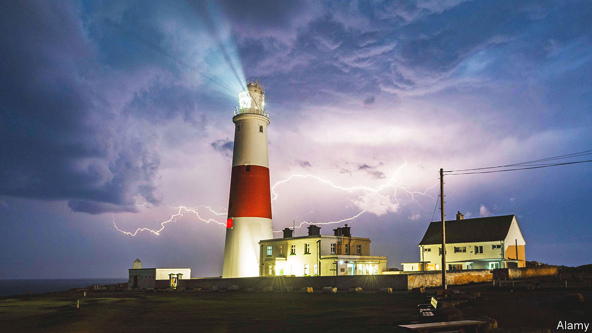
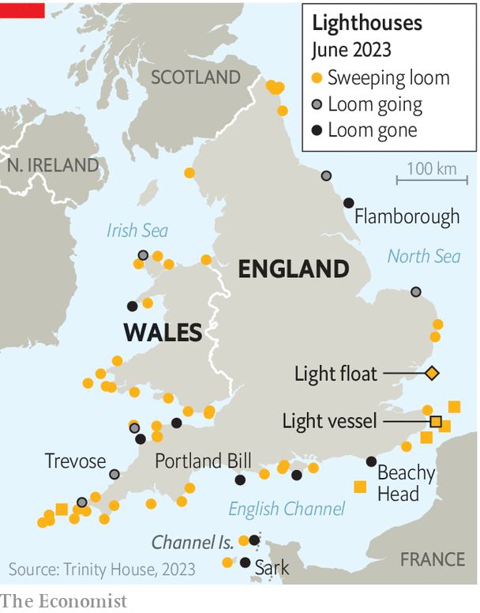

###### Navigation

# Lighthouse lights are losing their sweep 

##### Efficiency is gained. Poetry is lost 

 

> Jun 27th 2023 

If a child were to draw a lighthouse they would draw Trevose. It is perfect. Round white walls above; rocky cliffs below; stormy seas beyond. And best of all is its beam. As the sun goes down the beam begins: dark-light-dark-light, all night, every night. For 110 years, Trevose’s slowly turning beam has swept the sky, the sea, the land. And now it is stopping. On October 23rd Trevose’s sweeping beam will be removed. A simpler LED light will come in its place. It will go on and off. But the moving beam will be gone. 

 


Britain’s lighthouses are losing their sweep. Many of the great beams that swooped over the seas and shores of England for over a century, almost more metaphor than mere maritime aid, are being phased out. One by one their massive, slowly turning lenses are being removed; one by one simpler flashing LEDs will wink on and off instead. Many will stay (as they are too tricky to replace); but many have gone already. The sweeping lights of Beachy Head and Portland Bill have gone; so too has Sark; so too has Flamborough. 

It is astonishing that many of these lighthouses existed at all. Building 50-metre towers is hard; building them on ragged rocks in surging seas is “the most dangerous thing you can do”, says James Campbell, professor of architecture and construction history at the University of Cambridge. Early lighthouses variously fell down, burnt down, or were washed away like sandcastles in storms. Then in 1756 a Royal Society engineer called John Smeaton decided to do things differently: instead of building his foursquare to the sea he would copy the trunk of the English oak which withstood storms so well. A new style of lighthouse—tall, tapering, curved—started to grow around the English coast; today 66 are in use in England and Wales, many so slender that they sway, like trees, in high winds.

They are just some lights among many. Landlubbers will almost never notice, but thousands of lights gird coastlines: some red, some green, some white; some flashing, some turning, some still; a coastal Christmas display, telling sailors where to go. They may be pretty but their placement is precise, for they act as trigonometric tripwires for sailors: sail too far this way and these lights won’t line up; veer too far that way and that light will turn red. 

And above them all are the lighthouses, though their grandeur is almost an optical illusion: the great sweeping beam of Trevose comes from a tiny 35-watt bulb you can hold in the palm of your hand. Their brilliance—in every sense—lies in their Fresnel lenses, the lighthouses’ massive, slowly turning glass lenses (to picture their shape, imagine a pebble dropped into a pool, then its ripples frozen) which bounce light back and back and back again until it becomes a beam that travels nearly 40km out to sea. Each lens is vast—taller than a human and over three tonnes—but so delicately balanced on its bed of mercury that you can turn it—an elephant on ice—with the push from a single finger.

That mercury is why they have to go. Trinity House, which looks after the lighthouses of England and Wales, is trying to remove all mercury bearings from its properties; partly because it is poisonous and partly because a turning light has more that can go wrong. Lighthouses were not really intended to sweep anyway; the “loom” was only to provide a timed flash to let sailors know which light they were looking at. Each lighthouse, a maritime Morse, has its own pattern: Beachy Head flashes twice every 20 seconds; Trevose every seven-and-a-half. LEDs can do this without the drama. Take out the loom and you take out the poetry—but also, says Nigel Hare, head of navigational requirements at Trinity House, “a significant part of the risk” of their failing.

You also cut the cost. In 1996 William Nordhaus, an economist, compared how the cost of lighting had fallen since Babylonian times and found the answer: lots. An hour’s work today buys 350,000 times as much light as in ancient Babylon. Trinity House is Mr Nordhaus’s insight in nautical form: 40 years ago, it had 1,900 employees, including three lighthouse-keepers in every lighthouse; boatmen to bring them food and fuel and and pen-pushers to manage them. Today, it has 300. All British lighthouses are unmanned: open the doors of one and you are greeted by silence and the smell of engine oil alone. 

Now, in Trevose, the energy required to brighten the sea will fall once more. The great beam will still search over the waves for a few months more, but the lens is coming out; by November it will have gone. The beam will circle one last time—sky, sea, land—then it, and an era, will be over. ■


