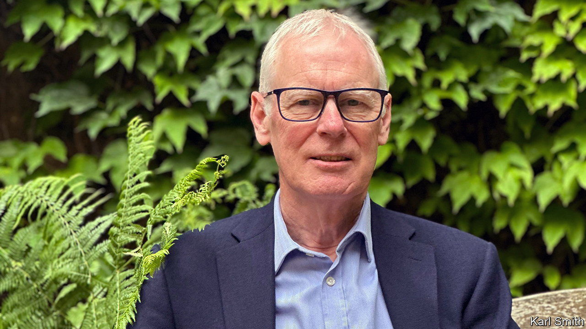

###### British intelligence

# The boss of Britain’s spies speaks 

##### Sir Simon Gass explains what his team got right—and wrong 

 

> Jun 29th 2023 

AS VLADIMIR PUTIN massed his forces on the Russia-Ukraine border in the winter of 2021, one man had the task of telling the prime minister what to expect next. Sir Simon Gass was the chair of the Joint Intelligence Committee (jic), a role he held for over four years until retiring on June 28th. His team had hotly debated the question, he tells . “We produced, in one month, twice as much product as we’d produced in a previous year.”

The forewarning of Russia’s invasion was an intelligence coup for both America and Britain: arguably the most striking one since spies revealed that Soviet missiles had been placed in Cuba in 1962. It was as much about assessment as raw material, suggests Sir Simon. Weeks before the attack, his team judged that an invasion was “highly likely”, a term which denotes 80-90% probability, in the language of intelligence analysis. France, Germany and other allies saw much of the same intel—though not every detail—but thought Mr Putin was bluffing. Sceptics “couldn’t get past [the idea] that he wouldn’t do something so stupid and destructive”, says Sir Simon. 

The jic is a curiosity. America has 17 intelligence agencies. Each one does in-house analysis, so assessments from over the Atlantic can be a cacophony: a recent report on the origins of covid-19 is filled with dissenting views of rival agencies. British spooks gather secrets but do not formally analyse them. Instead the jic, with a small team of analysts, convenes agencies and departments to hash out an agreed position in collegiate fashion.

The system failed disastrously in 2002-03 when the jic, under pressure from Downing Street, produced faulty assessments about Iraq’s weapons of mass destruction. That led to wholesale reforms, including professional training for analysts and more emphasis on dissenting views. The jic chair now tends to be someone at the end of their career who is thus in a stronger position to speak truth to power. Sir Simon says he occasionally had to deliver “pretty unwelcome” assessments to ministers. “I’ve never felt myself put under inappropriate pressure.”

One challenge for the jic is the rise of open-source intelligence, or osint. Consider Yevgeny Prigozhin’s march towards Moscow on June 24th. Russian military bloggers documented the insurrection in real time. Plane-tracking websites showed Mr Prigozhin’s subsequent exile to Belarus. Analysts are now using commercial satellite images to look for his troops’ encampments there. 

Is a jic still needed if ministers can get the bulk of their news from Twitter and Telegram? “The sheer quantity of high-class open source presents a problem for policymakers in its own right,” says Sir Simon. “They can’t read everything…even if all you’re doing is distilling it down into a story for them, that in itself is important.” Even open sources must be scrutinised by trained analysts. Technology is also helping to harness the deluge of data. A new cloud-based platform, index, lets users access analysis from within the government and beyond. It uses natural-language processing, a form of artificial intelligence, to summarise documents and extract key information. “We’re in the foothills of this,” says Sir Simon, “but more is coming.”

Britain’s pre-invasion intel was notable not only for its prescience, but also its public profile. America and Britain released highly classified material to expose Mr Putin’s plans. Is this a model for the future? Declassified secrets must be “a fair reflection of what’s happening on the ground”, warns Sir Simon, not just cherry-picked detail. They must also be used sparingly, only when the impact is “truly consequential”, as it was last year. “If you’re not careful, it rather cheapens the brand and loses the effect.” 

Not every judgment has been as successful as Ukraine. “We did not foresee, for example, the speed at which the Taliban took over in Afghanistan,” admits Sir Simon. “Having spoken to the Taliban,” he adds, “neither did they.” But an enduring lesson from these crises, he says, is that those weighing up intelligence, often ambiguous and fragmentary, need to have “analytical courage” in stating a conclusion. “Poor analysis tends to march the leader up the hill, and then leave them there to draw their own conclusion.” ■


