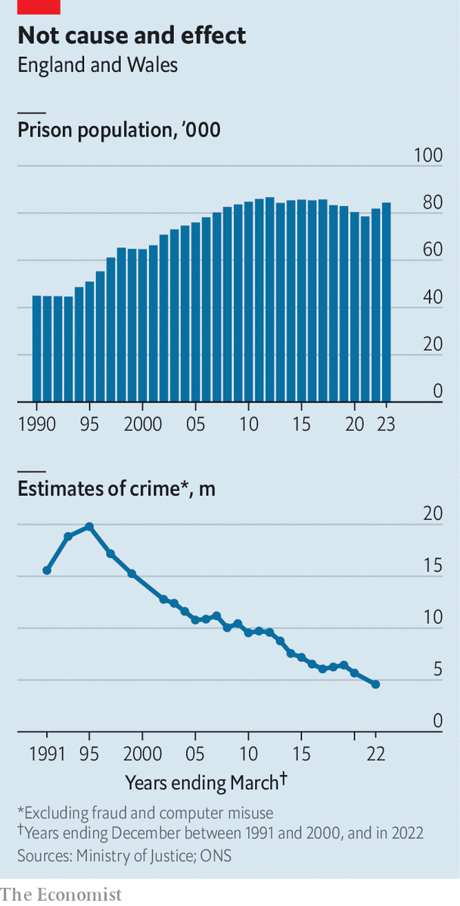

###### Crime and pointless punishment

# Why short prison sentences in England and Wales are a disaster 

##### They reveal deep flaws in the criminal-justice system 

 

> Jun 26th 2023 

THE THREE weeks Liam spent in prison after he rashly opened a can of beer in a shop and swigged from it cost him and the taxpayer vastly more than the £1.90 ($2.40) he had failed to pay. He stole while he was beset by mental-health problems and a failing relationship. Prison made his troubled life worse. Released, he found he had been kicked out of his flat, so had to move away from the relatives and friends on whom he relied. He lacked cash because universal credit, a benefit for those on low incomes, stops during prison sentences (new applications take a month to begin). All this made him feel desperate. Again, he stole a small amount of alcohol. This time, because he was on probation, he got seven weeks. In less than a year he went to prison four times. 

Short prison sentences are widely used in England and Wales to punish repeat perpetrators of minor crimes. More than half of those sentenced to prison every year get less than 12 months and most of those under six months. Yet, on almost every metric by which the criminal-justice system should be measured, short sentences fail. They are, says Pavan Dhaliwal, chief executive of Revolving Doors, a charity, a “hideously expensive policy failure”. 

First, and most worrying, they increase criminality. Over 60% of those sentenced to less than six months reoffend within a year of release. Direct comparisons are difficult, but for those given community sentences, which chiefly consist of unpaid work, the rate is considerably lower. This may be because less prolific offenders are more likely to get community sentences. But a study from the Ministry of Justice allowing for that difference has shown community sentences work better.

 


Short sentences also fail because they make prisons more chaotic. Too many are overcrowded, violent places in which men (96% of those locked up) get few chances to work, exercise or learn. Underfunding is one cause, but it is dwarfed by another: a vast increase in the prison population. Although crime has broadly fallen since the 1990s, imposing longer terms for serious offences means the incarcerated population has doubled, from around 40,000 to 85,000 (see chart). England and Wales jointly put away more people than any country in the EU: 142 people per 100,000. The EU average is 109. The growth looks set to continue. The Ministry of Justice expects the prison population to reach 98,500 by 2026. The expansion has not been matched by a commensurate increase in resources, cells or prison guards. 

Prisons nonetheless offer some hope of rehabilitation. Short sentences mess with that. As a share of those in prison at any time, short-termers are a small group, perhaps less than 5% of the total. But they cause excessive trouble. Their movement in and out of prisons creates churn, unsettling long-term inmates. The nature of repeat, petty offenders exacerbates this. Prisoners generally have a few characteristics in common, which point to the failures of the state as much as criminals’ morality. Around a quarter have spent some of their childhoods in care. They are much more likely to have a learning disability than most people, or to be illiterate, and they suffer mental illness at a higher rate.

Yet low-level repeat offenders are “the most chaotic people in the system,” says Andrew Neilson of the Howard League for Penal Reform. It is unhelpful to park them alongside those who have committed more serious crimes yet lead a more stable existence. “It uses up all the energy of the system when you bring in vulnerable people, often with addictions and mental-health problems, for a short time,” says Pia Sinha, a former prison governor and chief executive of the Prison Reform Trust. “You’re importing chaos.” Short terms are the main reason prisons have high staff turnover, she says. They are also the main way drugs get into prisons.

Short term failure

For prisoners themselves, short terms achieve little beyond making unhappy lives worse. Locking up nuisance-makers protects the public, but without tackling any of the problems that cause the bad behaviour. “Prison screws up your life on the outside and if you send someone away for a few months that isn’t enough time to rehabilitate them,” says Chris Atkins, author of “Time after Time”, a book about repeat offenders. He spent nine months in HMP Wandsworth , where he repeatedly saw fellow inmates leave and return. 

The harms are particularly grievous for women. Most female prisoners have committed minor crimes such as shoplifting. Many are mothers. When men are behind bars, their children usually remain living at home. But when women are locked up, their children often go into care or stay with relatives. Some 17,000 children are affected this way each year. They, in turn, are more likely to end up in the criminal-justice system themselves. 

Nor are short sentences a cheap way to mete out justice. Locking up people is vastly more expensive than community options. A year in prison, per inmate, costs the state £47,000: more than a pricey boarding school. A community sentence costs a fraction of that. Polls, meanwhile, suggest voters are less keen than is popularly supposed on prison terms for crimes such as theft. 

Some nonetheless believe short sentences are crucial. Civitas, a think-tank, argued in 2019 that a proposal by the then prisons minister to introduce a presumption against short sentences would mean that “mostly prolific criminals…[would be] free to continue victimising their neighbours.” Yet successive governments have agreed that short terms don’t work. And sentencing guidelines have long made clear that people should be jailed only when there is no suitable alternative. 

The problem is that many magistrates, who do most of the sentencing for minor crimes, do not favour community sentences, the main alternative. Overseen by the probation service, the use of such sentences appears to have fallen in recent years. Because the data are patchy, the reasons for this are not entirely clear (the number of offenders receiving short sentences has also fallen). It may be in part because the crimes that tend to lead to community sentences, such as theft, have decreased.

Some believe magistrates need more training on different types of punishment. Ms Sinha calls for greater use of pre-sentence reports. These, produced by the probation service, set out the likely causes of an offender’s behaviour and the risk they pose. They also offer sentencing recommendations, and so could encourage more magistrates to divert low-level offenders away from jail. But they take time to draw up. Amid an effort to speed up sentencing, their use has fallen.

Too often community sentences fail. Liam, the beer-stealer, was given four of them, the first when he was 17, before he first went to prison in his 30s. Courts routinely see offenders who have had dozens of convictions before they are jailed. In May, Justin Russell, the chief inspector of probation, told Parliament’s Home Affairs Committee that community sentences were failing to help people who are pointlessly sent to prison. “Typically, a street heroin user who is constantly shoplifting or committing minor, petty offences, will not get a community order; they will get a fine or a short prison sentence,” he said, describing this as a “gap in the market”. It is a big one: half of thefts are committed by someone addicted to drugs. 

Healthier options

The most effective help comes from thinking about health and welfare, as well as justice. Liam stopped offending after his fourth prison stint when he was referred to Liaison and Diversion, a service run by the NHS and the justice ministry. It identifies offenders with mental-health and drug-and-alcohol problems. It introduced him to someone who had escaped long entanglement with the law and gave him practical aid, including with housing. When he was first arrested, he says, he sensed the police knew he was deeply troubled, but didn’t know what to do.

Another initiative, Community Sentence Treatment Requirement Protocols, which requires treatment for offenders with mental-health problems and drug addiction, was launched by the NHS and the justice ministry in 2018. It is being rolled out across England: magistrates need to be made aware of it. Another solution would be to provide residential rehab for some drug-addicted offenders. This would be better, and in the long term cheaper, than jailing them. 

Yet the success of such alternatives also depends on a well-functioning probation service, which England and Wales currently lacks. Largely because of its part-privatisation in 2014—so disastrous it was reversed in 2021—the probation service is struggling with a vast shortage of experienced staff. Mr Russell said that of the 23 local probation areas that were inspected since the service had been renationalised, 13 were “inadequate”. 

The probation service’s failures reach deep. They affect how politicians talk about crime and sentencing. In January, it was revealed that overworked probation officers had classed a high-risk offender as “medium-risk”; but he went on to sexually assault and murder Zara Aleena, a young woman in London. Such cases deter politicians from promoting policies that could be seen as soft on crime, even when they are sensible in general. 

Sir Keir Starmer, Labour’s leader and a former director of public prosecutions, has a particular horror of being thus labelled. Yet people who work in prisons hope that Labour would make good on a manifesto pledge to create a “trauma-informed” criminal-justice system—meaning one that acknowledges that the roots of crime often lie in childhood and poverty. This approach is the only one that is likely to work. The next government would be wise to adopt it.■


