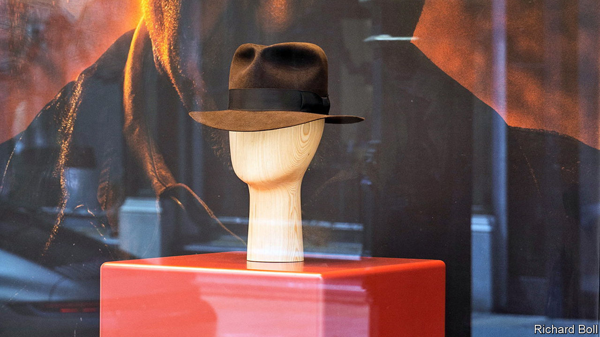

###### Traders of a lost art

# Indiana Jones and the fedora boom 

##### Indy’s latest caper proves a help to hatters 

 

> Jun 29th 2023 

In a summer crowded with blockbusters, Disney may sweat to recoup the $295m it reportedly spent making “”, the fifth and final Indiana Jones film, out on June 30th in America. But the movie is already a hit for a firm in another industry. Herbert Johnson, a 134-year-old London hatmaker, is fielding soaring demand for a certain fedora.

“It’s been just glorious,” says Michelle Poyer-Sleeman, the master hatter who designed the latest iteration of the Poet, the hat first donned by Harrison Ford in “Raiders of the Lost Ark” in 1981. The firm had to keep the product under its hat until a couple of weeks before the movie’s launch. But already the “Destiny Poet” has caused a seven-fold rise in Herbert Johnson’s revenue since June last year. A backlog of over 300 orders waits to be handmade in a workshop that hums with the sound of fans, steam and irons.

The boom marks a sharp turnaround for the firm. After the success of “Raiders” it provided Indy’s hats in the follow-ups, “Temple of Doom” (1984) and “Last Crusade” (1989). But a downturn in hat-wearing brought hard times. Venerable hatters such as Italy’s Borsalino went bust. Herbert Johnson was sold and for a while stopped making its hats in-house. For “Kingdom of the Crystal Skull”, Indy’s fourth adventure, in 2008, the producers went elsewhere.

After a rethink in 2016 the firm went back to handmaking and focused on the Poet, which today accounts for three-quarters of sales. The internet brought new customers, many of them American (and many women). Customers wait up to six months for their £495 ($630) rabbit-felt Poet, which comes with an optional “Raiders turn”, a 25-degree twist of the crown to match the jaunty angle at which Mr Ford wore his (supposedly to keep it on during stunts). The firm advises keeping it out of heavy rain and heat and to brush it only anticlockwise. Dr Jones would surely scoff.

Swaine, the 273-year-old luxury-goods firm that owns Herbert Johnson, hopes for success with other on-screen products. It sells a £520 umbrella of the sort twirled by Gene Kelly in “Singin’ in the Rain” and a £3,200 attaché case used by James Bond in “From Russia with Love” (minus the concealed knife). In March it opened a new flagship shop. Hat-wearing is making a comeback, says Ms Poyer-Sleeman, who spotted several clients at the “Dial of Destiny” premiere. There is also a “swing back to quality”, she says. People want something that will last, “and we’re in that niche.”■


