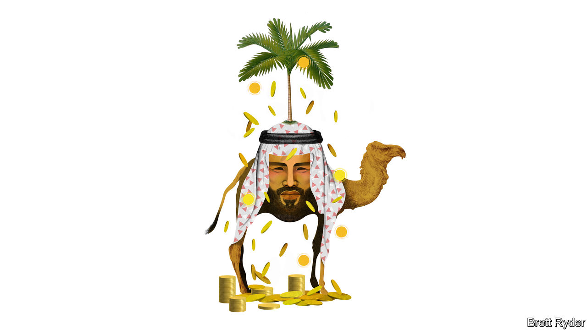

###### Schumpeter

# Meet the world’s most flirtatious sovereign-wealth fund 

##### But Saudi Arabia’s PIF is less promiscuous than it looks 

 

> Jun 29th 2023 

Your columnist was in Riyadh in 2016 when Muhammad bin Salman, wearing robes and sandals, announced his Vision 2030, aimed at ending what the crown prince described as the kingdom’s addiction to oil. Saudi Arabia’s de facto ruler talked of selling shares in Saudi Aramco, the world’s biggest oil company, to fund a giant sovereign-wealth fund (SWF), worth $2trn, to invest in diverse non-oil industries. He would be its chairman, benefactor and mastermind. It was heady stuff, even if some of it sounded unhinged in a hidebound autocracy like Saudi Arabia. The most striking thing occurred later when a palace official invited Schumpeter to a café. Young men and women sat without head coverings, flirting openly. The rule-breaking atmosphere was electric. 

Today, the Saudi SWF, called the Public Investment Fund (PIF), is becoming the goliath Prince Muhammad dreamed about. The value of its assets has ballooned to $700bn, it has over 1,400 employees and a rising global profile, and, like those youthful café-dwellers, it has discovered the joys of public flirtation. Whether revolutionising golf, buying Europe’s football glitterati, betting on star video-gaming companies, building an airline from scratch or turning Aston Martin electric, the pif cannot stop orchestrating one headline-grabbing deal after another. It has come “screaming onto the scene” with an “everything, everywhere, all-at-once investment approach”, says Robert Mogielnicki of the Arab Gulf States Institute, a think-tank based in Washington, DC. Yet it may not be as promiscuous as it sounds. Look carefully and there is more than adolescent impetuousness to its investment approach. 

It starts with the PIF’s mandate. Like many SWFs, one aim is to redirect the country’s oil wealth into global assets for long-term growth. But it is also required to nurture a diversified economy at home in case demand for oil drops. It has aggressive expansion plans. It wants to amass over $1trn in assets under management by 2025 and at least to double that by 2030, making it the biggest SWF on Earth. It is unlikely that much of that growth will come from investment returns, not least because over two-thirds of its assets are in Saudi Arabia. Instead it will require more public disbursements, such as the 4% of Aramco shares, at a value of almost $80bn, that it received in April. How much money is available will depend on oil prices, which are well below the highs of last year. 

It is not only reliant on oil. Mr Mogielnicki notes that the PIF’s asset values could increase if it attracts co-investors into its Saudi projects. That is where its domestic strategy dovetails with its foreign one. It has taken a 75% stake in four Saudi sports teams, which may attract more investment if they are privatised, pushing up their value. He believes that over time, co-investment could also increase the worth of some of its industrial and tourist megaprojects, such as Neom, which the PIF is aiming to turn into a desert-city Utopia. The kingdom needs visitors—both well-heeled tourists and deep-pocketed investors—to turn vision into reality. For that, the PIF needs to put Saudi Arabia on the map.

Its most eye-catching gambit in that pursuit is sport. Whether or not it pulls off the golfing megamerger of the century, it is already now a name to be reckoned with. Its purchase of Newcastle United, an English Premier League club, was a down-payment for a bigger ambition; to turn the kingdom into a football powerhouse. Luring players like Cristiano Ronaldo, who recently trousered a $200m salary to play for a Saudi team, is part of that strategy. Don’t be surprised if such influencers are used as character references to secure the rights to host the FIFA World Cup in 2030.

Such investment has led to accusations of “sportswashing”, ie, using prominent brand ambassadors to obscure appalling human-rights abuses, such as the murder in 2018 of Jamal Khashoggi, a Saudi-born columnist for the . Yet image laundering also has economic logic. Qatar showed with last year’s World Cup the value of what Max Castelli of ubs, a bank, calls the “prestige element” of hosting big events, regardless of financial returns. Sport costs the PIF relatively little. Yet it provides a lot of bang for buck in the global market for attention. 

The PIF is making other strategic investments that attract less hullabaloo, but also have domestic ramifications. Two of note are gaming and clean energy. In February the PIF became the biggest foreign shareholder in Nintendo, a Japanese gaming company, to add to a collection of assets including Activision Blizzard and Electronic Arts. It hopes to turn Neom into a gaming-development hub. As for decarbonisation, one of its biggest foreign investments is in Lucid, a California-based electric-vehicle (EV) maker. On June 26th Lucid won a contract to provide electric motors and battery systems to Aston Martin, a British luxury carmaker, in which the PIF is also a big shareholder. Unsurprisingly, Lucid is building its first overseas factory in Saudi Arabia.

The PIF’s EV investment illustrates both its dreams and a less silver-lined reality. Some of its biggest bets have seriously underperformed. That includes Lucid, venture-capital investments via SoftBank’s Vision Fund, and its stake in Uber, a ride-hailing firm. At home, its record is also tarnished. Saudi National Bank, one of its biggest holdings, lost a fortune in March on an ill-timed investment in Credit Suisse, a Swiss bank. Megaprojects such as Neom have become so grandiose, they risk looking farcical (and Neom is under human-rights scrutiny over treatment of the Howeitat tribe that lived on the land). If investors are seduced, it will be by the promise of returns, not by the razzle-dazzle of Potemkin villages. 

Lifting the veil 

Yet one big thing that the PIF has in its favour is its openness. According to Diego Lopez, boss of Global SWF, a data gatherer, no sovereign fund advertises its ambitions so publicly. That no doubt is a way of enhancing Prince Muhammad’s reputation for boldness. It also puts the PIF under extra pressure to make sure his vision does not all go horribly wrong. ■


