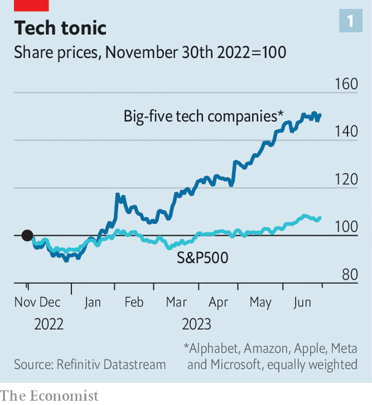
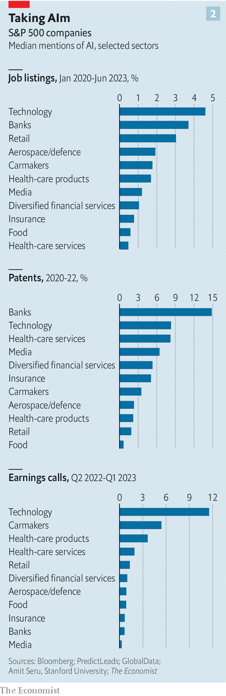

###### ChatGPT Inc

# Our early-adopters index examines how corporate America is deploying AI 

##### Companies of all stripes are using the technology 

 

> Jun 25th 2023 

Technology stocks are having a bumper year. Despite a recent wobble, the share price of the Big Five—Alphabet, Amazon, Apple, Meta and Microsoft—has jumped by 60% since January, when measured in an equally weighted basket. The price of shares in one big chipmaker, Nvidia, has tripled and in another, AMD, almost doubled. Their price-to-earnings ratios (which measure how much the markets think a company is worth relative to its profits) are ten times that of the median firm in the s&amp;p 500.

The main reason for the surge is the promise of artificial intelligence (AI). Since the launch in November of Chatgpt, an AI-powered chatbot, investors have grown ever more excited about a new wave of technology that can create human-like content, from poems and video footage to lines of code. This “generative AI” relies on large language models which are trained on big chunks of the internet. Many think the technology could reshape whole industries, and have as much impact on business and society as smartphones or cloud computing. Firms that can make the best use of the technology, the thinking goes, will be able to expand profit margins and gain market share.

 


Corporate bosses are at pains to demonstrate how they are adopting AI. On April 4th Jamie Dimon, JPMorgan Chase’s boss, said his bank had 600 machine-learning engineers and had put AI to work on more than 300 different internal applications. David Ricks, the boss of Eli Lilly, has said that the pharmaceutical giant has more than 100 projects on the go using ai. 

Company case studies reveal only part of the picture. To get a broader sense of which companies and industries are adopting ai examined data on all the firms in the s&amp;p 500. We looked at five measures: the share of issued patents that mention AI; venture-capital (VC) activity targeting AI firms; acquisitions of AI firms; job listings citing AI; and mentions of the technology on earnings calls. Because other types of ai could bring benefits for business, our analysis captures activity for all AI, not just the generative wave. The results show that even beyond tech firms the interest in AI is growing fast. Moreover, clear leaders and laggards are already emerging.

 


AI expertise already seems to be spreading (see chart). About two-thirds of the firms in our universe have placed a job ad mentioning AI skills in the past three years, says PredictLeads, a research firm. Of those that did, today 5.3% of their listed vacancies mention ai, up from a three-year average of 2.5%. In some industries the rise is more dramatic. In retail firms that share has jumped from 3% to 11%, while among chipmakers that proportion grew from 9% to 19%.

The number of AI-related patents being registered trended upwards between 2020 and 2022, according to data provided by Amit Seru of Stanford University. PitchBook, another research firm, concludes that in 2023 some 25% of venture deals by s&amp;p 500 firms involved ai startups, up from 19% in 2021. GlobalData, also a research firm, finds that about half the firms scrutinised have talked about AI in earnings calls since 2021, and that in the first quarter of this year the number of times AI was mentioned in the earnings calls of America Inc more than doubled compared with the previous quarter. Roughly half have been granted a patent relating to the technology between 2020 and 2022.

The use of generative ai may eventually become even more common than other sorts of ai. That is because it is good at lots of tasks essential to running a firm. A report by McKinsey, a consultancy, argues that three-quarters of the expected value created by generative AI will come in four business functions—research and development, software engineering, marketing and customer service. To some extent, all these operations are at the core of most big businesses. Moreover, any large company with internal databases used to guide employees could find a use for an AI-powered chatbot. Morgan Stanley, a bank, is building an AI assistant that will help its wealth managers find and summarise answers from a huge internal database. SLB, an oil-services company, has built a similar assistant to help service engineers.

While the adoption of ai is happening in many firms, some are more enthusiastic than others. Ranking all the companies using each metric and then taking an average produces a simple scoring system. Those at the top seem to be winning over investors. Since the start of the year, the median share price of the top 100 has risen by 11%; for the lowest-scoring quintile it has not moved at all.

The top spots are unsurprisingly dominated by Silicon Valley. On a broad definition, the s&amp;p 500 contains 82 tech firms. Almost 50 of them make the top 100. Nvidia is the highest-scoring firm. According to data from PredictLeads, over the past three years a third of its job listings have mentioned AI. In the past year the firm has mentioned AI in its earnings calls almost 200 times, more than any other company. Other high-ranking tech firms include the cloud-computing giants—Alphabet (3rd), Microsoft (12th) and Amazon (34th). They sell access to a range of AI tools, from services that help train sophisticated models to software that allows the use of ai without having to write reams of code. 

Beyond tech, two types of firms seem to be adopting ai the quickest. One is data-intensive industries, such as insurers, financial-services firms and pharmaceutical companies. They account for about a quarter of our top 100. These firms tend to have lots of structured datasets, such as loan books or patient files, which makes it easier to use AI, notes Ali Ghodsi of Databricks, a database firm. Around a tenth of JPMorgan Chase’s current job listings mention AI. The firm recently filed a patent for Indexgpt, an AI-infused chatbot that gives investment advice. Health-care firms like Gilead Sciences and Moderna use AI to discover new drugs. Others, such as Abbott and Align Technology, are building AI-powered medical devices. America’s Food and Drug Administration approved 97 such machines last year, up from 26 in 2017. 

A second group is industries that are already being disrupted by technology, including carmaking, telecoms, media and retail. Thirteen firms from these industries make the high-scoring 100, including Ford, General Motors and Tesla. The rise of electric vehicles and the prospect of self-driving cars has encouraged vehicle manufacturers to invest in technology. In March Ford established Latitude AI, a self-driving car subsidiary that might one day rival gm’s Cruise. In April Elon Musk told analysts that Tesla was buying specialised AI chips and was “very focused” on improving their AI capabilities in an effort to improve his firm’s self-driving efforts.

Retailers are using AI to bolster their core business. Nike, a sportswear giant, filed an application for a patent in 2021 for a system that can generate three-dimensional computer models of trainers. Christian Kleinerman of Snowflake, a database provider, notes that retailers are also taking advantage of the growth of e-commerce by collecting more data on customers. That allows more accurate targeting of marketing campaigns. Some may take personalisation a step further. In 2021 Procter &amp; Gamble, a consumer-goods giant, applied for a patent for an AI-based system which analyses users’ skin and hair conditions based on photos, and recommends products to treat them.

One source of variation in ai use across industries may be a result of the type of work undertaken. A working paper led by Andrea Eisfeldt of the University of California looked at how exposed firms are to ai. The researchers assessed which tasks took place in a firm and how well Chatgpt could perform them. The most exposed were tech firms, largely because AI chatbots are good at coding. Those industries least exposed, such as agriculture and construction, tended to rely on manual labour.

Clear leaders and laggards are emerging within industries, too. About 70 firms in the s&amp;p 500 show no sign on any of our metrics of focusing on AI. That includes firms in AI-heavy industries, such as insurers. The mass of smaller firms not included in the s&amp;p 500 may be even less keen. One distinguishing factor within industries may be investment. For the top 100 firms in our ranking, the median r&amp;d expenditure as a share of revenue was 11%. For those in the lowest 100 it was zero.

Vlad Lukic of BCG, a consultancy, notes that there is even a lot of variation within companies. He recalls visiting two divisions of the same medium-sized multinational. One had no experience working with ai. The other was advanced; it had been using a pilot version of the technology from Openai, the startup behind ChatGPT, for two years.

Among early adopters, many non-tech companies’ AI use is growing more sophisticated. Mr Seru’s data reveal that about 80 non-tech firms have had ai-related patents issued which were cited by another patent, suggesting that they have some technological value. Some 45 non-tech companies in the s&amp;p 500 have recently placed ads which mention model training, including Boeing, United Health and State Street. That suggests they may be building their own models rather than using off-the-shelf technology from the likes of Openai. The advantage of this approach is that it can produce more-accurate ai, giving a greater edge over rivals.

However, a shift to in-house training hints at one of the risks: security. In May Samsung discovered that staff had uploaded sensitive code to Chatgpt. The concern is that this information may be stored on external servers of the firms which run the models, such as Microsoft and Alphabet. Now Samsung is said to be training its own models. The firm also joined the growing list of companies that have banned or limited the use of Chatgpt, which includes Apple and JPMorgan Chase. 

Other risks abound. Model-makers, including Openai, are being sued for violating copyright laws over their use of internet data to train their models. Some large corporations think that they could be left liable if they use Openai’s technology. Moreover, models are prone to make up information. In one incident a New York lawyer used Chatgpt to write a motion. The chatbot included fictional case-law and the lawyer was fined by the court. 

But all this must be weighed against the potential benefits, which could be vast. Waves of technology frequently turn industries on their head. As generative ai diffuses into the economy, it is not hard to imagine it doing the same thing. Mr Lukic says that the biggest risk for companies may be falling behind. Judged by the scramble in America Inc for all things AI, many bosses and investors would agree. ■


