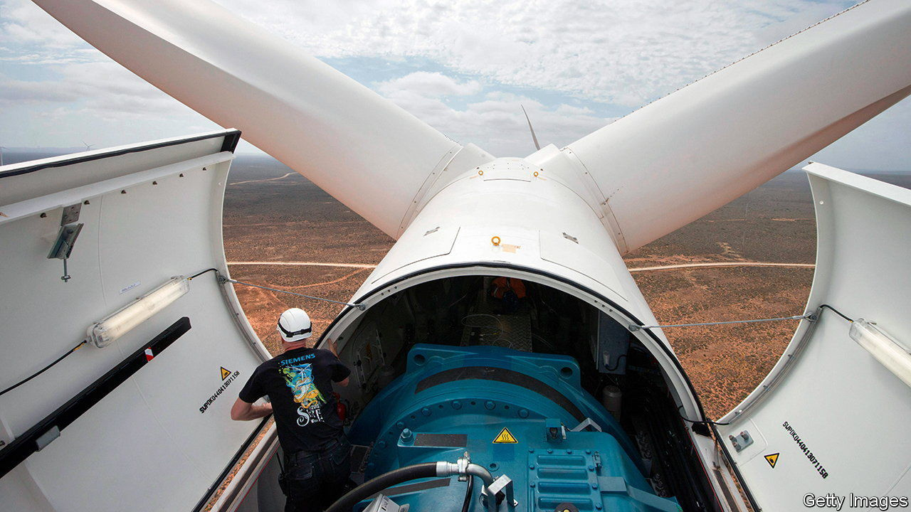
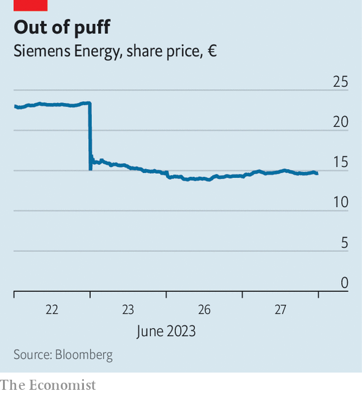

###### Gone with the wind

# Siemens’s wind-turbine business is blown off course 

##### Can it get the blades turning again? 

 

> Jun 29th 2023 

Christian Bruch always said that the turnaround of Siemens Energy would not be easy, but “this setback is more severe than I thought possible”. In a call with analysts on June 23rd, after the company dumped its profit guidance for the year, the boss of Siemens Energy, a spin-off in 2020 of the gas and power business of Siemens, an engineering behemoth, said that “too much has been swept under the carpet”. He admitted that Siemens Gamesa, its maker of wind turbines, will make big losses this year and will take longer than expected to become profitable.

 


The reaction to the announcement by Siemens Energy, a company with 92,000 employees and sales of €30bn ($32.8bn) last year, was brutal. Its share price fell by over a third (see chart), wiping off nearly €7bn in market capitalisation. “The market reacted so strongly because Mr Bruch can’t tell how bad the problem is and how much it will cost to fix it,” says Felix Schröder of Union Investment, a fund manager. Siemens Energy says it will cost “in excess of €1bn” to fix Gamesa’s problems; Jefferies, a brokerage, puts it at €2bn. 

Siemens Energy has three sets of problems, says Andre Kukhnin of Credit Suisse, a bank. One is that the integration of Siemens’s offshore-wind business and the onshore operations of Gamesa, a Spanish firm, was not well managed after they joined forces in 2017. Siemens Energy held a majority stake until recently taking full control of Gamesa, in part to get the turbine troubles finally under control.

Another is that Gamesa, like other manufacturers of wind turbines, has been hard hit by supply-chain disruptions, inflation, and a lack of components and raw material such as steel. This has raised costs which it cannot pass on to customers. Their contracts predate these inflationary trends, and do not include provisions to charge more. It is also affected by ruinous competition for public tenders from rivals such as GE Renewable Energy, Nordex and Vestas. A third sort of troubles are specific to Gamesa, relating to below-par performance of onshore turbines, in particular with their blades and bearings. 

Whether Gamesa’s problems are fixable at all is the big question, says Mr Kukhnin. Mr Bruch was parachuted in from Siemens Energy’s gas business, where he did a good job. But his credibility is now at stake, as he seems to have underestimated badly the problems at Gamesa. Shareholders are particularly upset that he spent €4bn in December buying the remaining shares of Gamesa, which is now dragging down Siemens Energy’s three other business units: the gas arm, a division that provides grid technologies and a maker of technology to decarbonise industrial processes.

Investors are waiting nervously for the next quarterly results, which will be unveiled on August 7th. They hope that the company will provide more clarity on the scope of losses in the wind business by then. Siemens Energy has a €102bn order-book backlog (including €17bn-worth for Gamesa) and three of the four pillars of its business are in good health. Within the next six to 12 months it will become apparent whether Gamesa can be fixed, says Mr Kukhnin—and whether, as a result, Mr Bruch will stay in his job. ■


