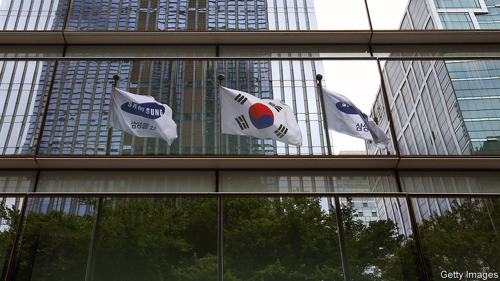

###### Too close for comfort

# South Korea’s government and business are over-close 

##### A court case reveals just how cosy 

 

> Jun 29th 2023 

Lee kun-hee embarked on a world tour in 1993 to take stock of Samsung, the firm he inherited from his father. Finding its televisions and other electronics languishing on shelves, he decided to remake Samsung’s image. “Change everything but your wife and your children,” he told employees. One thing that didn’t change, according to a ruling by the International Centre for Settlement of Investment Disputes (icsid), is the close relationship between such , family-run conglomerates that form the backbone of South Korea’s economy, and the government.

On June 20th the World Bank’s arbitration forum ruled that South Korea’s government had left Elliott Investment Management, an American hedge fund, out of pocket by improperly meddling in a merger between two units of Samsung. The deal in 2015 between Samsung c&amp;t and Cheil Industries was seen as an attempt to ensure a smooth succession between Mr Lee and his son, Lee Jae-yong. Elliott, which owned a 7% stake in Samsung c&amp;t, objected to the valuation of its shares and launched a proxy battle, which it lost after South Korea’s National Pension Service (nps), which held stakes in both firms, backed the deal. 

Yet in 2016 Moon Hyung-pyo, the health minister at the time of the merger and by then the head of the nps, was indicted for pressing the pension service to approve the deal. This triggered a series of investigations into corrupt dealings between Samsung and the government which revealed that the younger Mr Lee had bribed the then president, Park Geun-hye, to aid his succession. Ms Park was impeached; both ended up in jail (and both were subsequently pardoned). 

Elliott filed suit in 2018 with the icsid, claiming that the government’s actions violated its free-trade agreement with America, and sought $770m in compensation. The government claimed that Elliott’s hedging strategy, which involved buying Cheil swaps after the merger went through, meant that it had made a profit of $1.9m. Despite the court finding in its favour, Elliott says that it was awarded only $108m, including interest and legal costs. 

Instead of quietly paying up, on June 27th the Ministry of Justice petitioned the court to deduct from the amount it owed a sum previously paid to Elliott from Samsung related to the merger. Continuing to make life hard for a foreign investor seems at odds with the spirit of the country’s capital-market reforms, which are designed to attract investors and end the “Korean discount” that plagues its companies. Such meddling—in other ongoing cases the government is accused of exerting undue influence on the business dealings of foreign firms—in part explains the discount.

The entire affair may also upset ordinary South Koreans. Aside from the drain on the public purse from the court case, it is a reminder that the original merger cut the value of the country’s pension fund by $300m, by some estimates. Park Sang-in of Seoul National University says the drama highlights how the “relationship between the government and the  will cost the taxpayers money”. ■


