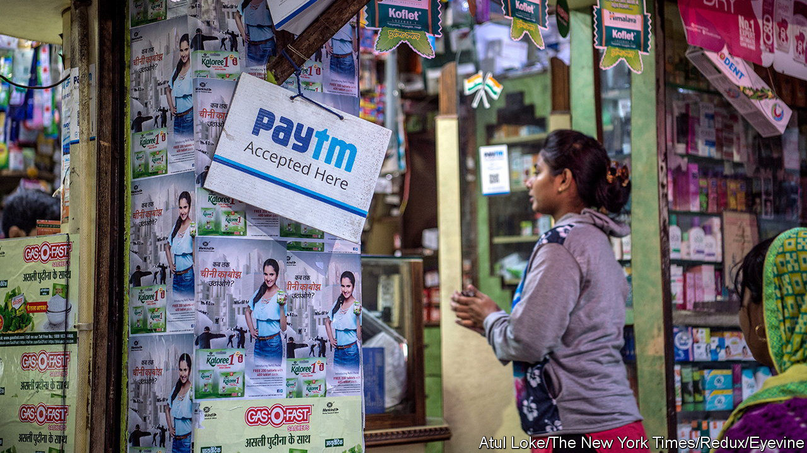
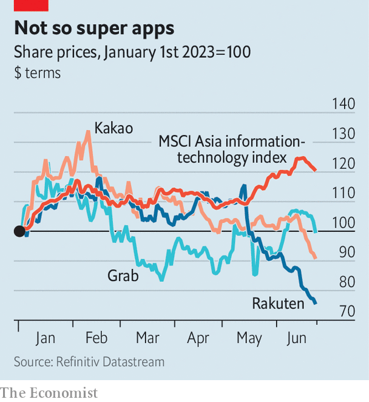

###### Super traps

# Why Asia’s super-app companies are stuck in a rut 

##### Consumer-tech darlings are struggling to grow rapidly while becoming profitable 

 

> Jun 29th 2023 

American technology barons occasionally bemoan the lack in the West of “super-apps”, multifaceted online platforms offering a variety of different services. But the global interest in the business model belies the difficulties facing existing super-apps in Asia.

 


Their recent performance has disappointed (see chart). Collectively, the market capitalisation of Singapore’s Sea and Grab, South Korea’s Coupang and Kakao, Japan’s Rakuten, and the parent company of India’s Paytm has declined by around 60% since the end of 2021. None of the firms is the same; they each make money from a blend of mobile gaming, social media, e-commerce, ride-sharing and financial payments. What they have in common is an aspiration to bundle together a variety of services which complement one another on one app. They had hoped hoping to emulate Chinese companies, such as Tencent’s WeChat and Alibaba’s Alipay, which pioneered the business model.

But the newer Asian super-apps have been put under huge pressure by a rapidly changing environment. Funding, which was once cheap and plentiful, has dried up, making ambitious growth plans harder to finance. James Lloyd at Citigroup, a bank, notes that China’s super-apps started with a core of profitable and engaging businesses (e-commerce for Alipay and social media in the case of WeChat), which other services were built around. Outside China, few firms have balanced both significant scale and earnings in a similar way.

Kakao, a South Korean firm, most closely fits the bill. Unlike most Asian would-be super-apps, it has been reliably profitable. Yet its share price has declined by 8% this year. Because the company is dominant on its home turf, it is running out of room for further domestic growth. Its ride-hailing arm has a market share in South Korea of as much as 90%, by some estimates. The firm wants to raise the international share of its revenues from 10% today to 30% by 2025—but such global expansion comes at a cost. 

At other firms the funding squeeze has inspired ambitions for profitability, which inevitably comes at the expense of previous plans for rapid expansion. GoTo, an Indonesian super-app, created from the merger of Gojek, a ride-hailing company, and Tokopedia, an e-commerce firm, was expected to appoint a former banker, Patrick Walujo, as CEO at its shareholder meeting on June 30th, after we published this. Mr Walujo has stressed that his aim is to make the company profitable.

One Asian consumer-tech firm has bucked this year’s trend. The share price of Paytm, a would-be Indian super-app based around digital payments, has rallied by around 60%. The stock is still less than half of its all-time high, reached shortly after it floated in November 2021, and the firm has yet to make a profit. Nonetheless, its rising share price may reflect something companies elsewhere in Asia lack: a single, large and growing domestic market to work with. Whether that potential for scale proves enough for a more sustainable future for Paytm has yet to be seen. 

The idea of a company using a single platform to offer a variety of services to consumers has an intuitive appeal. But after more than a decade of discussion about the coming dominance of super-apps, many of the Asian firms are still struggling to find a balance between size and profitability. With no end in sight to higher funding costs, a speedy recovery for these one-time darlings of tech investors is hard to foresee. ■


