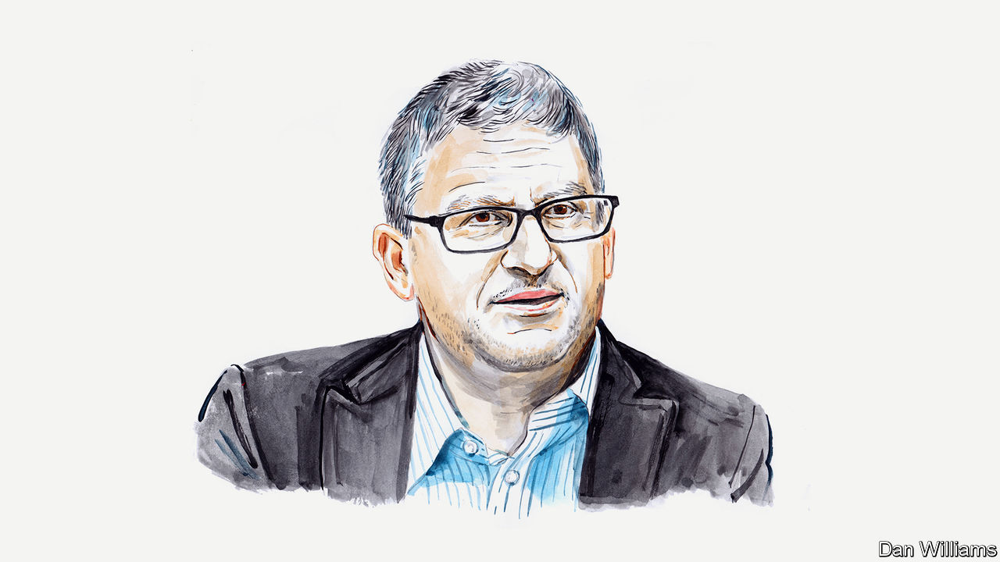

###### Russia

# Mark Galeotti on Vladimir Putin’s self-inflicted wounds 

##### A patronage-based system that worked in normal times has come undone in war, says the political scientist 

 

> Jun 27th 2023 

THERE IS A certain karmic justice to the brief mutiny staged in Russia by Yevgeny Prigozhin and his Wagner mercenary group. The most serious challenge to Vladimir Putin’s 23-year reign came as a direct result of the way he has structured his regime—and from a man who owed his wealth and power to the president’s patronage. It has starkly highlighted the growing weaknesses of Mr Putin’s system of power, leaving him more vulnerable than ever.

Mr Putin’s Russia is a peculiar hybrid: an almost medieval court perched atop a modern, bureaucratic state. In this “adhocracy”, power is defined less by one’s formal role than by proximity to the monarch. Mr Putin’s favour is the real currency at this level, albeit one whose value and distribution varies day by day. This court is managed by the age-old tactics of divide and rule. Rival individuals and institutions with deliberately overlapping responsibilities and antagonistic interests are pitted against each other. Like an emperor overseeing gladiatorial games, Mr Putin stands apart, the arbiter who decides everyone’s fate.

What worked relatively well in politics has proven disastrous when transplanted onto the battlefield. Wagner was only one of several separate Russian armies never successfully brought under the control of the regular armed forces, even after Valery Gerasimov, the chief of the general staff, was brought in to manage the war in January.

Each of these armies had its own political agenda. Chechen leader Ramzan Kadyrov, for example, was eager to claim that his troops were uniquely loyal to Mr Putin, even as he manoeuvred to keep them as far from the fighting as possible, even if that meant countermanding orders from General Gerasimov. Mr Prigozhin likewise needed to demonstrate Wagner’s value, and apparently had promised that he would secure for Mr Putin the city of Bakhmut, the scene of some of the most vicious fighting in Ukraine, in time for the May 9th Victory Day celebrations.

Mr Prigozhin, a man who holds grudges with passion and determination, had a feud with Sergei Shoigu, Russia’s defence minister, that dated back to 2018, when the military sat back and allowed American forces to hammer a Wagner column in Syria. As it became clear that Bakhmut would not be taken in time, Mr Prigozhin stepped up his attacks on Messrs Shoigu and Gerasimov, characterising them as venal incompetents.

Such public rows erupt from time to time among Russia’s top brass, even if Mr Prigozhin brought an unusually high level of invective. In Mr Putin’s system, it is the monarch’s job to bring matters under control before they prove destabilising. Yet despite growing concerns within the elite, Mr Putin failed either to appreciate the danger or to act in time. He neither addressed Mr Prigozhin’s points of dispute nor removed him from the head of one of the most effective fighting forces in the Russian lines.

Instead, Mr Putin half-heartedly went along with Mr Shoigu’s subtler countermove, a demand that all mercenaries sign a contract directly with the defence ministry. This would have deprived Wagner of its autonomy and thus Mr Prigozhin of his greatest asset. Faced with a choice of insurrection or emasculation, he mutinied. He did not seek to topple the Russian leader but rather desperately hoped that a show of force would persuade his patron to turn against Mr Shoigu instead.

This failed, but Mr Prigozhin may nevertheless have made the downfall of the regime all the more likely and imminent. One of Mr Putin’s least publicised characteristics is his unwillingness to make tough decisions. When there are no easy choices, he temporises, and often ends up making up his mind late. The range of intractable dilemmas faced since the invasion of Ukraine has sometimes seemed to paralyse him. While his failure to handle the Shoigu-Prigozhin rivalry before it metastasised is the starkest example of this, there are many more, from how to mobilise the next wave of reservists to how to deal with the sale of Yandex, a technology giant.

Mr Putin may have weathered this crisis, but he is left weaker than before. His rule has, to a considerable degree, rested on three legs: his personal authority and legitimacy; the depth of Russia’s financial reserves and his capacity to throw money at problems; and, as a final backstop, his control over the security forces.

His legitimacy has been damaged on all three counts. Dubious opinion polls showing sky-high approval ratings notwithstanding, there is clearly dissatisfaction among both the public and the elite. The sight of Mr Prigozhin and his men being applauded as they withdrew from Rostov-on-Don speaks to a recalcitrant population who did not see them as the “traitors” Mr Putin claimed they were. 

For now, Russia’s financial reserves remain seemingly healthy. Nevertheless, some $300bn in the West is blocked, and the need to cover the war’s crippling costs limits the options for buying loyalty. 

Finally, the security forces have again proven to be less than reliable. They apparently failed to anticipate the mutiny and then largely sat on the fence, siding neither with nor against Wagner. Many of them are growing tired of a commander-in-chief who seems so willing to see tens of thousands of his subjects lay down their lives in the name of an unclear strategy.

None of this means that Mr Putin will lose power imminently. However, this crisis will leave him less able to cope with the next one. Having created an elite of ruthless opportunists who supported him less out of conviction than self-interest, he must now fear the day when enough of them conclude that the risk of moving against him is outweighed by the danger of leaving him in power.■

_______________


