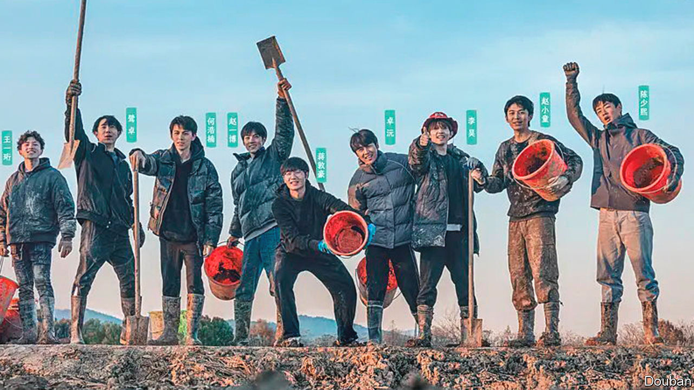

###### Planting seeds

# A Chinese reality-TV show about farming doubles as propaganda 

##### Young city dwellers are being told to toughen up 

 

> Jun 29th 2023 

A young man drives a harvester through a rice field. Slow down, a farmer chides him. But he zooms on—then gets stuck in the mud. Welcome to “Become a Farmer”, the hit reality-TV programme on iQIYI, a Netflix-like Chinese service. The show transplants ten preppy actors and musicians from the city to the countryside in Zhejiang province, where they must live together and try their luck at farming.

The 20-something men (pictured) arrive wheeling giant suitcases, only to find what one calls “inhuman” living conditions, an outdoor toilet and endless mud. Audiences are entertained as they work things out and embrace the task at hand. (The group has six months to turn a profit from about ten hectares of farmland.) But this is also propaganda. Rural revitalisation is a pet project of China’s leader, Xi Jinping. 

Mr Xi, of course, is not the first Chinese leader to elevate rural life. Mao Zedong sent millions of city dwellers to the countryside during the vicious Cultural Revolution of 1966-76. A young Mr Xi was one of them. At first he couldn’t take it and ran back to Beijing. But he was arrested and eventually returned to the village of Liangjiahe. There, according to Communist Party mythology, he learned the virtues of hard work. 

Today Mr Xi exhorts young Chinese to show “responsibility and grit”—an apparent dig at their own fragility—and to focus on collective goals. “Become a Farmer” embraces these messages. “When you see me again, I’ll be a real tough man,” says a star in the show’s trailer. Indeed, he is soon seen mucking in with his teammates, who support each other. “It’s always right to rely on the crowd,” says one.

Other government priorities, such as food security, are reflected in the show, too. Episodes remind viewers that China depends on imports. “Every piece of grain, every grain of rice, is hard to come by,” says the narrator in the premiere. Mr Xi and other leaders have long called for Chinese rice bowls to be filled with locally grown crops.

In recent years, millions of Chinese have joined the “new farmer” movement, according to the government. Many are young graduates who grew tired of the rat race or couldn’t find jobs (the unemployment rate for people aged 16 to 24 in cities is over 20%). The state, which supports the newbies, hopes their skills will lead to increased production. On the show, stars gush over cool machines and high-tech methods. “I think the farmers are great,” says one. 

The series aims to revive audiences’ love for the soil and nature, said a producer earlier this year. But the political messages of “Become a Farmer” are about as subtle as its product placement (the men engage in manual labour all day but drink only a zero-calorie beverage). Young people need to “abandon arrogance and pampering”, says Mr Xi. The government wants them to learn from the peasants—again. 


