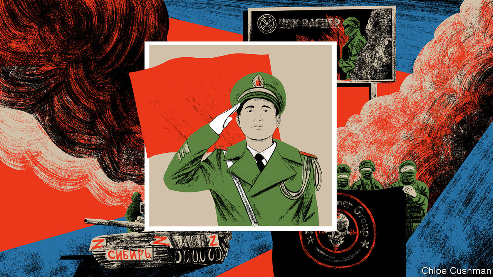

###### Chaguan

# How China sees Yevgeny Prigozhin’s mutiny 

##### To officials in Beijing, Russian woes prove Mao’s adage: the party must command the gun 

 

> Jun 29th 2023 

What lessons might China’s leaders learn from the recent Wagnerian drama in Russia? To hear scholars in Beijing tell it, China is not the country in need of lessons. Instead, it is for Russia to study China’s good example. Specifically, Vladimir Putin should learn from the wisdom of China’s Communist Party founders, who imposed strict, top-down political control over armed fighters from the earliest days of the revolution. They cite Chairman Mao Zedong’s dictum: “The party commands the gun, the gun must never be allowed to command the party.”

That tone of complacency might surprise some in the West. Logic would suggest that turbulence in Russia should provoke a crisis of self-doubt in the corridors of Chinese power. After all, just days before Mr Putin’s invasion of Ukraine, the Russian leader secured a written agreement offering friendship “without limits” from his Chinese counterpart, Xi Jinping. Even as Russian troops and mercenaries commit atrocities in Ukraine, China’s diplomats and propagandists have stuck to an unvarying script: namely, that the war is the fault of West, which pushed Russia into a corner by expanding the NATO alliance, and is being prolonged with weapons supplied for the profit of American arms dealers. They have hewed to those pro-Russian talking points even as they undermine China’s image in many Western capitals, notably in Europe.

Spurning all calls to condemn the invasion, Mr Xi has stood by Mr Putin personally. On a state visit to Moscow in March, China’s leader paused at the Kremlin’s doors and allowed cameras to record him calling Mr Putin his “dear friend”, before telling him: “Right now there are changes, the likes of which we haven’t seen for 100 years, and we should drive those changes together.”

Today, Mr Xi’s bet on Mr Putin looks riskier than before. Yet if outsiders expect to hear Chinese leaders fretting openly about backing a loser, they fail to grasp the nature of the two leaders’ bond. The rulers of China and Russia are united, powerfully, by contempt for the West and its liberal, democratic norms. Their words reveal a shared conviction that an older, bleaker world order—based on balancing the interests of individual states, with special deference paid to great powers—is coming back. Each country brings very different tools and techniques to that fight. In China, officials and scholars agree, semi-publicly, that Russia can be a reckless and sometimes alarming friend. But they also call this struggle for dominance a long one. What matters is that the West should be driven from the global centre-stage in the end.

In the past few days, censors and propaganda chiefs allowed the Chinese public to receive relatively unfiltered reports about the Wagner Group’s mutiny. While official media issued careful reports calling the crisis an internal affair of Russia, online news outlets and commentators were less cautious. Censors let them repost and debate video statements by the mercenary group’s founder, Yevgeny Prigozhin, alleging corruption in Russia’s high command. Netizens compared him to sundry Chinese rebels from antiquity (An Lushan, a treacherous eighth-century general, was a popular choice). Such relative openness may signal China giving itself room for manoeuvre, should Mr Putin’s woes continue. Most simply, it seems to show a lack of panic at the top in Beijing.

China’s confidence should be enhanced by recent events, suggests Zhou Bo, a retired senior colonel in the People’s Liberation Army (PLA) now at the Centre for International Security and Strategy at Tsinghua University. He recalls how Mao imposed party cells and commissars on the Red Army when it was a band of ragtag guerrillas, and praises the modern PLA for maintaining this “fine” tradition. “Maybe what happened in Russia just proves to China’s leadership that what we do is right,” says Mr Zhou. It suited Russia to use mercenaries to project power overseas, or the Wagner Group would have been reined in sooner, he ventures, just as it suited America to use armed contractors from firms like Blackwater in Iraq, or Britain’s East India Company to build an empire with for-profit troops. But such outsourcing would never be tolerated in China. Nor would the PLA ever recruit convicts from prison as the Wagner Group did, “no matter how brave”, he says. 

China does use private security companies to guard its nationals working abroad, concedes Mr Zhou, a former PLA liaison officer to international anti-piracy patrols off the Horn of Africa. But, he adds, this is because the Belt and Road Initiative, a vast infrastructure scheme, takes Chinese firms to dangerous places.

Good friends, different business models

China is not averse to using civilians to perform ambiguous, quasi-military tasks. Fishermen aboard large, steel-hulled ships are sometimes called up as a state-backed “maritime militia” to bully China’s neighbours. But when projecting power abroad, China’s preference is typically for order, says Alessandro Arduino of King’s College London, author of a forthcoming book, “Money for Mayhem: Mercenaries, Private Military Companies, Drones, and the Future of War”. Perhaps 20 Chinese private security companies are active overseas. In addition to protecting Chinese companies and investments in Africa and elsewhere, they are often “brand ambassadors” for China’s high-tech population controls, selling facial-recognition cameras, drones and other surveillance kit, he reports. Many Chinese guards are unarmed, hiring locals with guns as needed. In contrast, Russian private military companies like the Wagner Group actively profit from chaos and killing. “Insecurity is their business model,” says Mr Arduino of the Russians. 

Stability-obsessed China might sound an unlikely supporter of Mr Putin’s reckless, murderous adventure in Ukraine, then. But China’s goals are larger than this conflict. If the war drags on and if the endgame finds the West weary, divided and weakened, as China still hopes will happen, party leaders in Beijing will forgive a bit of Russian chaos on the way. In the meantime, PLA commanders can expect fresh lectures about absolute loyalty to Mr Xi. ■


