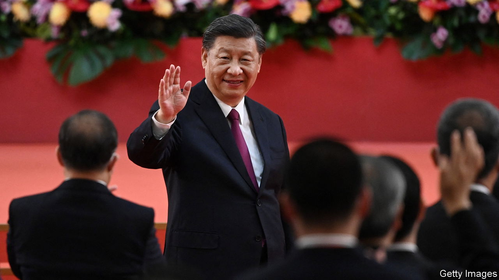

###### Nonne intellegis?

# To understand Xi Jinping, it helps to be steeped in the classics 

##### China’s leader has invented a phrase—and an image 

 

> Jun 29th 2023 

Take four Chinese characters, all of them in everyday use. Put them in a certain order and, lo, they become a phrase that looks like classical Chinese—the kind of language used by the literati of yore. The idea they convey could be expressed just as succinctly in colloquial Chinese, but the classical style has gravitas. And it is a phrase loved by Xi Jinping, China’s leader, so all must follow suit. 

More than any of his predecessors, Mr Xi likes to spice up his speeches with quotations from classical literature, especially poetry and philosophy. It fits one of his stated missions: instilling “cultural self-confidence” (alongside confidence in the political system). And it helps to buff up his image. In Chinese history, rulers were expected to be erudite. Two volumes have been published providing explanations of Mr Xi’s classical aphorisms. 

Mr Xi’s four-character phrase is not among the more colourful of his classicisms. It is , which he uses to mean “the main affairs of state” or “national priorities”. Unlike other phrases that he bandies around, it has no obvious origin in a well-known text. It is as if a Western leader, when presenting a big idea, were to concoct a Latin term to describe it. The grandiosity of Mr Xi’s phrase makes it stand out, which is clearly what he wants. 

Since Mr Xi’s first public use of , during a trip in 2020 to the province of Shaanxi, it has taken the country by storm. Officials pepper their speeches with it. Articles about it keep appearing in state media (the phrase is usually adorned with attention-drawing quotation marks). Chinese academics write papers on the topic. Communist Party members discuss the term at meetings. It has spawned a book industry: “What is Guozhidazhe?” is the title of one work, published last year, that provides the answer in 156 pages.

Why should such a banal-sounding phrase get such a billing? It is because , as used by Mr Xi, is a catch-all that really means “my lofty goals”. The term is applied to everything from “food security” (see next story) to “political security” (keeping the party in charge) and fulfilling the “Chinese dream” (making China a global power and unifying it with Taiwan). Mr Xi says officials must always “cherish guozhidazhe”. It is a way of reminding them who is boss. When they use the term, it is often in conjunction with other phrases expressing loyalty to Mr Xi. 

Experts in China have tried to show that  has links with the classical canon, even if it is not a phrase associated with one of the literary giants. One such scholar is Chen Chengzha of Shanghai University of Finance and Economics. He points to the “Tao Te Ching”, a core text of Taoist philosophy that was written over two millennia ago (Mr Xi likes to quote from it). This mystical work says there are four great things in the universe ( could be translated as “the country’s great things”). One of them is the ruler. The flattery is obvious. 

Engineering an image

Some cynics in China wonder whether Mr Xi is really as learned as he makes himself out to be. Much of his education was disrupted by the tumultuous Cultural Revolution. He attended one of the country’s most prestigious universities, Tsinghua, at a time when little was taught there except Marxism and Maoism, and classical literature was scorned. Ostensibly, Mr Xi’s degree was in chemical engineering. Later, while working as a provincial leader, he got a doctorate from Tsinghua. The English title of his thesis was “A Tentative Study on China’s Rural Marketisation”. 

No such scepticism surfaces in the official media. In 1969, when a teenager, Mr Xi is said to have hauled “heavy suitcases full of books” when he was sent to the countryside to do farm work. The collections of his classical references purport to show his familiarity with a broad array of writers, from Confucius to Su Shi, an 11th-century poet. He has supposedly read numerous works by Shakespeare, or so the public is told. Xinhua, a government news agency, describes his reading list as “going on and on”. It is surprising, perhaps, that he has much time left for . ■


