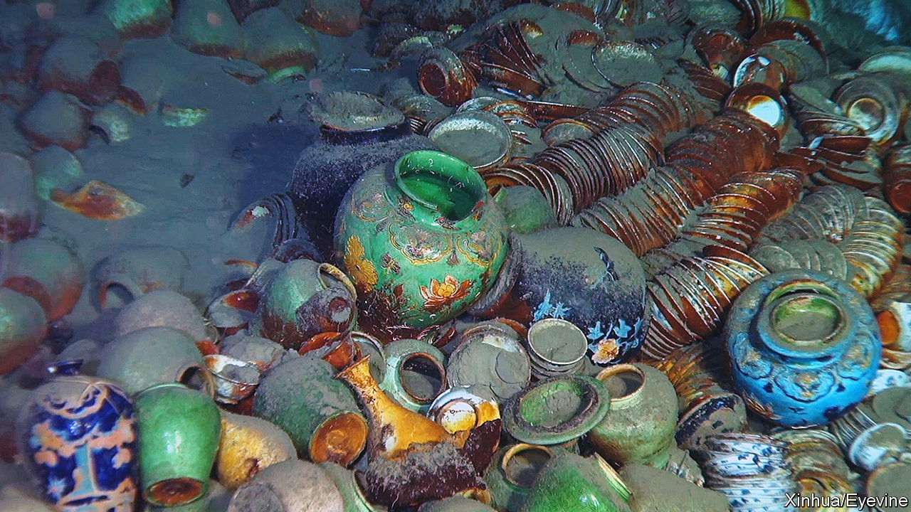
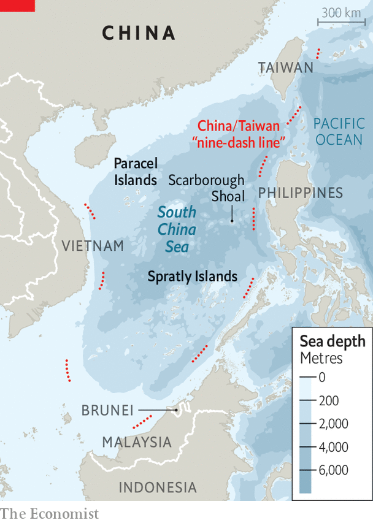
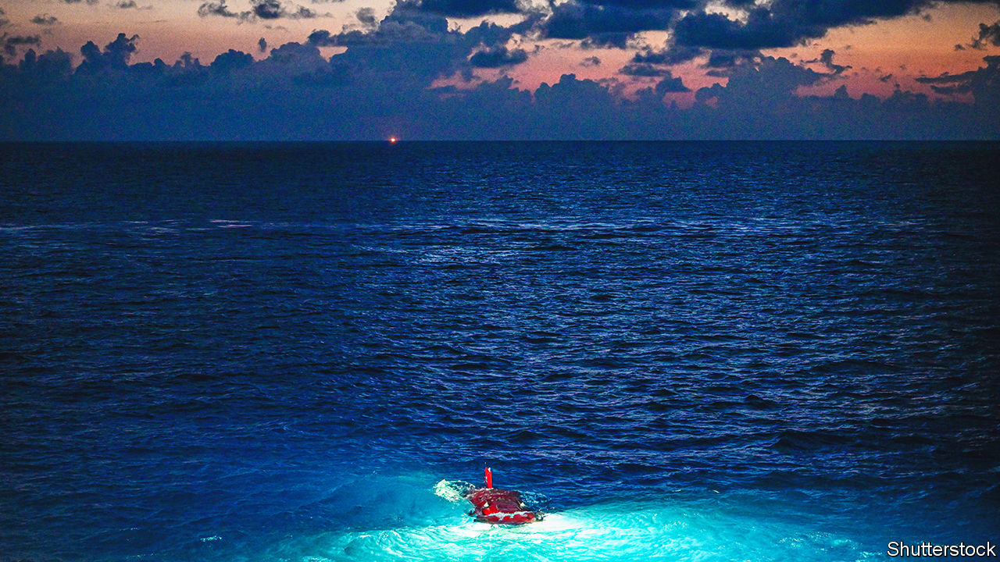

###### Bringing up the past

# Why China is so keen to salvage shipwrecks in the South China Sea 

##### The discoveries, it hopes, will enhance its dubious territorial claims 

 

> Jun 29th 2023 

Deep under the South China Sea, below the reach of sunlight, lies treasure. Last year Chinese researchers found two rotting shipwrecks some 1,500 metres down and 20km apart. One contains thousands of porcelain cups and vases, their bright blue-and-white glazes half-covered in silt. The other holds timber. The two wrecks offer a glimpse of global trade during the Ming Dynasty (1368-1644), when porcelain fired in the imperial kilns of southern China was shipped to buyers as far away as Europe. The timber was probably headed in the other direction, perhaps towards Chinese shipyards. The discoveries are of interest, however, not just to scholars.

 


Officials in Beijing say the wrecks “confirm historical facts that Chinese ancestors developed, used and travelled to and from the South China Sea”. That may not sound like a geopolitical statement, but such claims are the soft side of China’s push to control nearly the entire body of water. Larger than the Mediterranean, the sea is still a crucial trade route and home to valuable fish stocks and energy reserves. Seven countries have claims to part of it. But China’s is by far the most expansive. Its maps feature a “nine-dash line” that stretches over 700 nautical miles from its coastline. China asserts sovereignty over the vast area within (see map).

Much of this task falls to China’s navy and coastguard, which have long tried to bully its maritime neighbours. But Chinese officials are also compiling a (rather dubious) historical case. They point to ancient Chinese maps and texts that refer to southern seas. The wrecks add another layer to their argument. By China’s logic, the remains of old Chinese ships mark territory which the country once controlled—and, therefore, which it still should.

There is plenty for salvagers to find in the South China Sea. A portion of it, near the Spratly Islands, is called Dangerous Ground due to its poorly charted rocks, reefs and shoals. Dreams of sunken riches have lured commercial treasure-hunters. One called Mike Hatcher, a Briton, led an expedition in 1985 that found the wreck of the , an 18th-century Dutch East India Company ship that was carrying Chinese porcelain and gold. The “Nanking cargo”, as it became known, raised more than $20m at auction in Amsterdam. 

Two Chinese porcelain experts were sent to the auction to buy some of the items, which China considered its property. But, with only $30,000 at their disposal, they walked away empty-handed. A year later China’s national museum created an underwater-archaeology centre and the state began investing heavily in the field.

Today China dominates the wreck-finding business. Near the Paracel Islands, which are also claimed by Vietnam, Chinese researchers have found at least ten wrecks—proof, they say, that China had “continuously managed” the area for centuries. Conveniently, the Chinese seem to find only their own wrecks in waters they claim. They don’t collaborate with foreign archaeologists and are intolerant of other expeditions. In 2012 a Chinese ship chased away one led by a French archaeologist working with the National Museum of the Philippines near the Scarborough Shoal. The territory is claimed by China, Taiwan and the Philippines. China accused the expedition of trying to destroy evidence that the area had been discovered by China. 

For years China’s archaeologists stayed in shallow, sunlit waters, where wrecks are easier to spot and scuba divers can help with excavations. Since 2018, though, they have also been looking in the deep sea (anywhere below 200 metres), where less light and increasing pressure mean better technology is needed. Sonar pulses are used to probe the sea floor. Submarines inspect promising sites. The Ming-era discoveries are indicative of China’s ability to reach down deeper.

China’s advances in underwater archaeology have been impressive. In 2007 it lifted an 800-year-old ship called the  (originally discovered by a British team in 1987) out of the sea and into a custom-made saltwater tank on land. The research submarine that discovered the Ming-era wrecks, called the  (or ), holds three people and can withstand the pressure at depths of up to 4,500 metres. It has two robotic arms that can pick up delicate artefacts, as well as a cluster of cameras that allow researchers to create digital models of wrecks. Its manufacturer, the state-owned China Shipbuilding Industry Corporation (CSIC), boasts that 95% of the sub’s components were made in China.

 


It is no coincidence that CSIC also makes warships. Much of what China is doing in the field of underwater archaeology has military and strategic uses. Exhaustive surveys of the South China Sea help China’s navy navigate the waters. Vessels that rely on sonar, such as naval submarines, use information collected about the sea’s temperature, currents, saltiness and the seabed, says Brent Sadler, an American former naval officer now at the Heritage Foundation, a think-tank in America. In 2021 an American nuclear-powered submarine crashed into an undersea ridge in the South China Sea.

Deep-sea expertise also helps China bring other treasures to the surface. The  has aided efforts to tap large oil and gas fields in the South China Sea. And it has been used to prospect for valuable minerals—such as cobalt, copper, manganese and nickel—in the seabed. That helps explain why China wants to control the body of water—and why it forcibly obstructs the efforts of other countries to fish and explore for hydrocarbons and minerals. China has ignored a ruling from 2016 by a tribunal at The Hague that struck down most of its territorial claims.

Yet China’s historical case is as brittle as salvaged porcelain, say experts. Just because a ship was carrying cargo to or from China, that hardly means it was marking territory under Chinese rule. The nine-dash line seems to have emerged in the 1940s—it would have made little sense to Ming emperors, let alone traders. Many of the thousands of ships lying beneath the South China Sea are not even Chinese. Some were owned by individuals and private firms, says Tansen Sen of New York University Shanghai. Their crews might have hailed from across the Indian Ocean and spoken Arabic, Persian or Malay.

In other words, the South China Sea has a rich, multicultural history. China is best equipped to explore it. No one in the region can match its capability to find and excavate ships in the deep sea. “From a scholarly point of view, they are doing something that’s very important, because others can’t do it right,” says Mr Sen. But the country most able to reveal the sea’s fascinating past is also the one most likely to misrepresent it. ■


