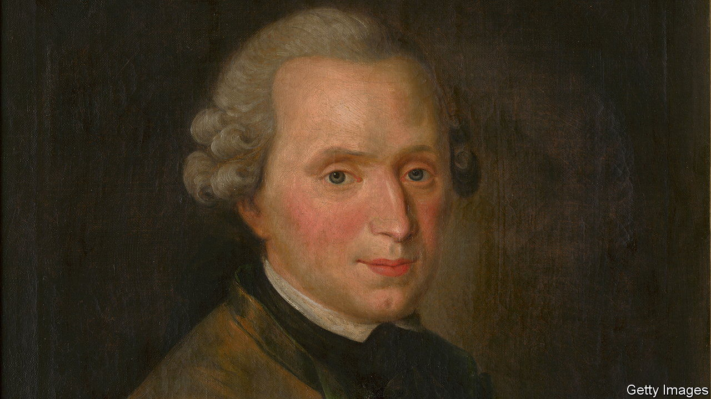

###### Rethinking German history

# Seeing Germany’s past through a “global lens” revises it 

##### So claims David Blackbourn in “Germany in the World”. He is largely vindicated 

 

> Jun 29th 2023 

By David Blackbourn. 

The  of 1618 to 1648 killed up to 7m soldiers and civilians. Parts of the German lands over which Europe’s armies fought lost more than half their populations. If there was a consolation it was the flight of some extraordinary Germans from the horror, among them Samuel Hartlib and Athanasius Kircher.

Hartlib, a Calvinist, settled in London in 1630 where his interests in “mathematics, physics, optics, chemistry, botany, natural history, landscape gardens, pearls, beehives, public health, the mechanical arts and communication” earned him the sobriquet “the Great Intelligencer of Europe”. His admirers included John Milton and , a diarist who called him the “Master of Innumerable Curiosities”. Some 400 correspondents helped spread his theories across the continent. 

Kirchner, a Catholic scholar, narrowly escaped being drowned in the Rhine and hanged by Protestant soldiers. After various teaching posts, he arrived in Rome and established himself as one of the foremost scientists of the age. He published dozens of books, sharing his insights and findings through a global network of over 760 scholars. In such ways, argues David Blackbourn in his all-embracing history of Germany’s relationship with the outside world, the German diaspora had profound effects on the intellectual life and institutions of a rapidly globalising world.

Later, Germans could take pride in their unique contributions to European culture through science, literature and, perhaps above all, philosophy and music in the 18th and 19th centuries. German ideas about education were hugely influential. The kindergarten, the gymnasium and the university in its modern form were all invented by Germans and copied abroad.

Professor Blackbourn, a historian at Vanderbilt University in Tennessee, demolishes the idea that a divided Germany was so wrapped up in its own affairs that it lacked a “world history” like those of England, Spain, Portugal, France and the Netherlands. In fact, Germans were both ubiquitous and prominent in the expanding empires of the seafaring nations as soldiers, ship’s gunners, merchants, doctors, scientists, missionaries and settlers.

As the author says, in the 300 years after 1500 Germans helped shape those empires (for better and worse: they were active in the slave trade) and connected Central Europe with that wider world. Germans were inclined to see their attitudes to colonised peoples as gentler than those of the traditional empire-building powers. But behind their enthusiasm for ethnography, exemplified by , lurked a more sinister impulse. 

The idea of racial differences was not new, but in the late 18th century Germans systematised thinking about race.  epitomised Enlightenment ideals, yet the philosopher defined race as a “class distinction between animals of one and the same line of descent…unfailingly transmitted by inheritance”. He and his associates, such as Johann Friedrich Blumenbach, an amiable natural scientist, did not mean to propose a racial hierarchy. However others, such as the popularising academic Christoph Meiners, soon used pseudo-science to justify racist, dehumanising views of black people and Jews.

The rise of German nationalism in the first half of the 19th century—and its apotheosis in the formation of a Prussian-dominated German Reich in 1871—brought many of these themes together. A widespread urge to make up for lost time in acquiring an empire was driven by more than a wish to secure raw materials and markets. The public also saw colonies as outlets for Germany’s energy and superior culture. Meanwhile the defeat of France in 1871 demonstrated and fostered German military prowess. The country’s role in the world, argued ’s foreign minister, Bernhard von Bülow, would no longer be defined by writers and thinkers but by the exercise of national power. Germany would have its “place in the sun”.

Like the bullish von Bülow, most Germans in 1900 looked forward to the new century with confidence and optimism, writes Professor Blackbourn. Yet “the German century became synonymous instead with military aggression and Nazi dictatorship, above all with the Holocaust.” Only from the ruins of the Third Reich and the creation of NATO and the European Union, then the reunification of the country, did a new form of nationhood emerge.

In this century, Germany’s infinitely more benign relationship with the world has been marked by its manufacturing exports and generous welcome of refugees (though its economic ties with Russia and China have proved worrisome, and public opinion on immigration is souring). After Russia’s , Germany pledged to play a more assertive role in upholding Europe’s security.

Professor Blackbourn believes that viewing Germany through a “global lens” casts familiar landmarks of the past in a fresh light and lets new features emerge. He is largely vindicated. His story is rich in characters both engaging and repulsive, obscure and notorious. It flags a bit when it arrives at the  and the claim to a novel perspective is weaker. All the same, readers of this book will never see Germany in quite the same way again. ■


