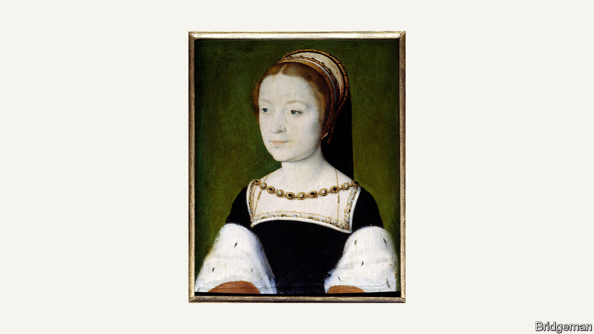

###### The art of theft

# The amazing tale of one of the world’s most prolific art thieves 

##### Stéphane Breitwieser stole well over 200 works—with a total value of more than $1bn 

 

> Jun 29th 2023 

By Michael Finkel. 

HE CALLED THE sensation a : a blow to the heart. When he stood in front of an artwork, Stéphane Breitwieser felt exhilarated. A tingling sensation would flood his body, starting in his hands, and before long he would get to work on the screws or seals that kept him from the object of his desire. Once liberated, the item would usually be sequestered inside his coat, down his trousers or in his girlfriend’s handbag. Mr Breitwieser would then transport his loot back to the attic of his mother’s house in Mulhouse, in eastern France, where he still lived.

That covetous compulsion struck him a lot. Between 1994 and 2001 he stole well over 200 items from museums in seven countries; Anne-Catherine Kleinklaus, his girlfriend, often kept watch. Though his preference was for Flemish goods or art of the late Renaissance—such as Corneille de Lyon’s portrait of Madeleine de France (pictured)—Mr Breitwieser’s tastes ranged widely. As well as pieces by Boucher, Jan Brueghel the Elder, Cranach, and Watteau, his collection included  sculptures, tapestries, altarpieces, musical instruments, tobacco boxes and weaponry. Experts value the haul at somewhere between $1bn and $2bn.

As Michael Finkel recounts in “The Art Thief”, Mr Breitwieser was an extraordinary criminal, and not just because he was extremely prolific. (He managed, on average, a theft every 12 days for seven years.) His heists did not involve a squadron of marauders working under the cover of night. He did not prepare sophisticated plans months in advance. His art-stealing epiphanies “emerge from the spot where spontaneity and simplicity meet”, Mr Finkel writes. His larcenous philosophy was: “Don’t complicate things.”

Mr Breitwieser would walk into a museum or auction house, work out the security weaknesses and take advantage of opportunities presented to him. He knew how to slice deftly through the silicon glue that held display cases together and how to wriggle a painting out of its frame. It was important to behave normally while the deed was being done: lingering too long at a particular spot, or running out of a museum, would be bound to arouse suspicion. Sometimes he and Ms Kleinklaus would take a guided tour or stay for lunch after they swooped. This provided cover, for surely “a thief would never purposely remain inside a museum with stolen loot”, nor “pause a heist to dine”.

His motives were as unusual as his methods. Most thieves pinch artworks for money: they hope to sell them to a corrupt dealer, extort payment from a museum or insurance firm or take the piece underground to use as collateral in dodgy deals (trafficking art is one of the most ). Mr Breitwieser claimed he purloined only pieces he liked. In his telling he experienced Stendhal syndrome, a condition characterised by an intense physical response to beautiful art. Museums were lousy places to appreciate a work, he thought. He preferred to admire it from the velvet-draped four-poster bed in his mother’s attic.

Eventually museum officials and police grasped what was happening. Mr Breitwieser got sloppy. He was caught stealing a painting, then a gold-plated bugle. In 2002 he confessed to taking scores of objects. (Many had been dumped in a canal, probably by his mother, while he was in custody; she claimed to have burned his collection of paintings.) Mr Breitwieser was fined and sentenced to four years in prison. His mother spent a few months behind bars, Ms Kleinklaus a single night.

The author’s account of the skulduggery is thrilling; the description of the subsequent investigation less so. Mr Finkel is largely sympathetic to his subject, whom he interviewed at length, suggesting that the trauma of Mr Breitwieser’s parents’ divorce and his anti-social tendencies may have contributed to his behaviour. But he was also selfish in his pursuit of beauty, Mr Finkel argues. “Works of communal heritage, often suffused with spiritual significance and a sense of place, should be open and accessible to all,” he admonishes. Mr Breitwieser’s and Ms Kleinklaus’s actions were a “cancer on this public good”.

Mr Breitwieser was responsible for the needless destruction of priceless artworks; at the same time, and in his own eccentric way, he emerges from this astonishing tale as a tragic figure. After serving his sentence, he considered launching a career as a security consultant, but his light fingers took over once again. He lost his girlfriend and fell out with his mother. His passion for thieving became all-consuming. “I was a master of the universe,” Mr Breitwieser says. “Now I’m nothing.” ■


