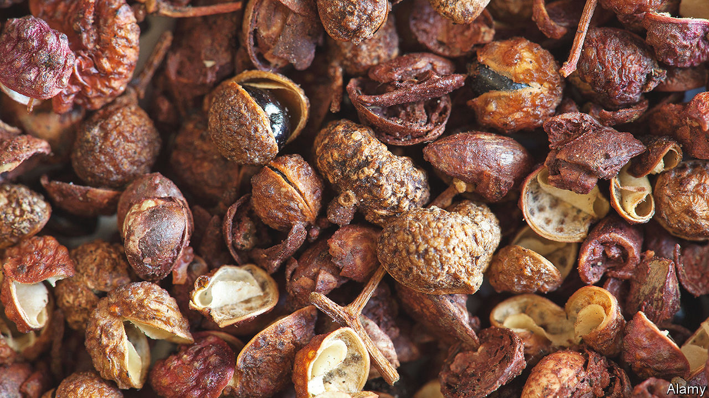

###### World in a dish

# The curious, anaesthetising charm of Sichuan peppers 

##### Like some other adventurous foods, they expand your sense of what eating can do to you 

 

> Jun 29th 2023 

“POLYSEMOUS” describes a word with several meanings, such as “run”, “set”, or, in the kitchen, “pepper”. That term encompasses the entire  family, from vegetal green bell peppers to searing little Thai chillies. It includes dried, powdered  berries, known as black and white pepper, as well as one of the strangest and most addictive spices in the world: , more commonly known as Sichuan pepper.

Whereas ordinary peppercorns grow on vines, Sichuan peppers are berries of the prickly-ash tree and part of the citrus family. They come in red and green varieties; the red has an earthily floral taste, where the green is more astringent. Their most pronounced feature, however, is not their flavour but their effect on the mouth: they contain a chemical called hydroxy-alpha-sanshool, which induces a tingling numbness in the lips and tongue, a bit like being subjected to a long but mild electric shock.

As its English name suggests, the pepper is indispensable to the , a province in south-west China. Together with dried chillies it forms the flavour profile known as , a term made up of the characters for “numbing” and “spicy”. Anyone who has had the eye-watering, nose-running pleasure of eating —poached fish in a sea of seething, peppery chilli oil—knows this sensation. ,  dishes, a Sichuan speciality, tend to be oversweetened and bland; the real version sings, the zingy pepper set off by the mellow kick of black vinegar.

Less traditionally, dry-fried and then crushed with salt, Sichuan pepper can be a bracing topping for popcorn. Toasted and mixed with cumin and fennel seeds, dried chillies, anise, sugar and salt, it makes a spice rub that enlivens stir-fried potatoes. The lemony intensity pairs well with the austere richness of  and the buttery blank slate of shortbread.

A few peppercorns go a long way. Just as inexperienced barbecue cooks often ignite so much wood that they char their meat, pepper novices risk making diners’ heads vibrate for hours. Yet even when used in moderation, they remain, like  or coriander, a divisive ingredient. Detractors wonder why anyone would want to anaesthetise their mouths while eating. There is no answer, really—no disputing tastes, as the maxim goes. 

Sichuan peppercorns, however, are just one of an array of foods prized by gastronauts for the sensations they induce. The appeal of foie gras is partly its lush richness. Unripe guava, which often shows up on Thai tables, has a tannic, mouth-drying quality that balances fiery foods perfectly. Some cannot get enough of the jolting burn chillies produce; for others, the pain outweighs any pleasure. In “Love in the Time of Cholera”, one of Gabriel García Márquez’s characters munches asparagus for the resulting aroma of his urine. 

To sample any of these items is to expand your understanding of what food can do to you. They add more dimensions to the concept of taste. Inevitably, some prefer the familiar. Their loss. ■


